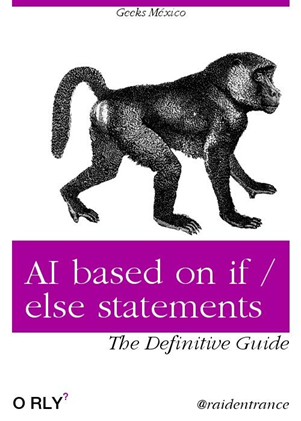
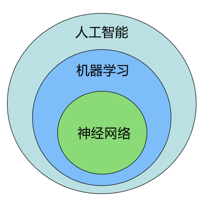

# Introduction to Data Science Part1.1: Intro

>写在前面，我做别字挺多的，没有钱情人proof，希望大家看得时候，发挥想象力，脑部掉这些错别字。不过也许大家学习完这个课程以后就可以写一个模型自动纠正做别字了。

## 什么事数据科学，和人工智能机器学习有什么关系？

在我们开始学习具体的东西之前，我们先讨论一下现在最流行的几个词：**数据科学，人工智能，机器学习，神经网络**，（对，我们还要学习神经网络，不过是假节课）

1. **数据科学-Data Science-**，就是研究数据得科学，废话。他是通过研究数据发现有用的规律，从而解决一些问题。它范围很广包括了很多方面，比如收集数据、存储数据、处理数据、统计数据等等。比如你出去发传单填问卷，这也是数据科学的一部分。数据科学设计的领域也很广，例如显然计算机技术，比如数据库、存储集群、甚至研究硬盘，些都属于数据科学研究，当然数学，尤其是统计学，数学建模也是数据科学需要用到的技术。
2. **人工智能-AI-**，这个也是最近很流行的一个词。人工智能就是用机器来实现人们觉得挺智能的事情，这个也是一个很宽泛的概念。比如空调自动控制房间的温度，到了24度停机，28度开机这种简单的if-else也算是一种人工智能。古时候的人工智能基本都是这种方式实现的。现在依然有很多人工智能的系统采用if-else来实现，这种叫专家系统，这些都不是机器学习，这些属于基于规则的AI（Rule based）。而机器学习，不是基于任何人类指定的规则的，这些规则是通过机器从数据中自己发现的。
   
   
   
3. **机器学习-machine learning-** 机器学（ML）习是实现人工智能的一种方式，也是数据科学中重要的一种玩法。举个例子，如果你和电脑对话，rule based的方式可能就是写`if （人对电脑说hello） then 电脑回复（hello）`。如果ML的方是给电脑很多人类的对话，电脑会自动发现当别人对他说hello的时候他要回复hello。机器学习其实我认为很多时候就是统计学，各种各样的传统的和最新的deep learning其实都可以认为是一种统计学，就是发现数据中的规律。
4. **神经网络-artificial neural network-**这个很流行啦，还有什么deep learning啥的，这个我们以后再将，但是这里就是告诉你，神经网络只是类实现ML的算法，和什么线性回归啥的一个级别。

我们今天讲的数据科学主要focus的是机器学习这个类型，数据科学中的获取数据存储数据我们基本上都不讲，但是还会讲一些基本的数据预处理和数据可视化，这些事不管你做什么只要是数据科学都离不开的，但是这里我们都只是讲入门，剩下的大家可以自己去自学，我会给出一些资料的。

## 我们怎么学？

很简单我们的目标是完成一些数学建模的工作，所以我会给出很多基于数据的数据建模的problem，有些很简单，有些超级简单，也有一些是实际问题，需要综合运用各种技巧。然后我我们解决这些问题的方法主要是各种数学模型，实现方法是Matlab。因为大家在这门课前半部分都学了Matllab，所以我们救一Matlab为主，数学建模使用Matlab的也很多。但是我要告诉大家的是Matlab，其实并不是最合适的工具，这下面的所有例子除了matlab我都会使用python在做一遍，当然在别的讲里面，这里就不多说了。

Matlab大家都有吧，需要除了基本Matlab还需要大家装一些工具箱，如Curve fiting， statistic and machine learning这些，这些装起来估计也不便宜。

人后是我我们要学习哪些内容：
1. 简单的回归模型
2. 简单时间序列的回归模型
3. 分类模型
4. 聚类模型
5. 人工神经网络

ok any way let's get started.

