# Introduction to Data Science Part1.1: Basic Regression

## 什么是回归
**回归是一种统计学方法，用于找到两个或多个变量之间的关系**。回归中有两种变量一种是independent variable，另一个dependent variable。正如他们名字说的那样，dependent variable是依赖independent variable的。回归一般是用于预测的，就是给出independent variable回归模型可以给出一个dependent variable的预测值。基础的回归模型除了直接给出预测值，他还能给出这两个变量的关系，你能看出，当某个变量增加的时候增加的时候，dependent variable是增加还是减少，影响有多大。但是这个并不表示因果关系（causality）。例如通过分析发现7-10岁的小孩中，脚越大，智商越高。你说这个脚和脑子有啥关系？后来通过更加理性的分析发现，7-10随得下海中，脚越大，年龄也越大，所以智商就高。这也是运用机器学习方法需要注意的一些问题。最后，回归一般给出的结果是连续的，如果一个模型给出的结果是有限离散的，可能就是分类和聚类问题了。

虽然回归是一个机器学习方法，但是一些机器学习的基本概念，我们在后面慢慢的引入。

## 简单线性回归

### 基本概念

我们先看个简单的例子：


>测16名成年女子的身高与腿长所得数据如下：


|    身高    |    143    |    145    |    146    |    147    |    149    |    150    |    153    |    154    |    155    |    156    |    157    |    158    |    159    |    160    |    162    |    164    |
|------------|-----------|-----------|-----------|-----------|-----------|-----------|-----------|-----------|-----------|-----------|-----------|-----------|-----------|-----------|-----------|-----------|
|    腿长    |    88     |    85     |    88     |    91     |    92     |    93     |    93     |    95     |    96     |    98     |    97     |    96     |    98     |    99     |    100    |    102    |

以身高x为横坐标，以腿长y为纵坐标将这些数据点（xi，yi）在平面直角坐标系上标出. 

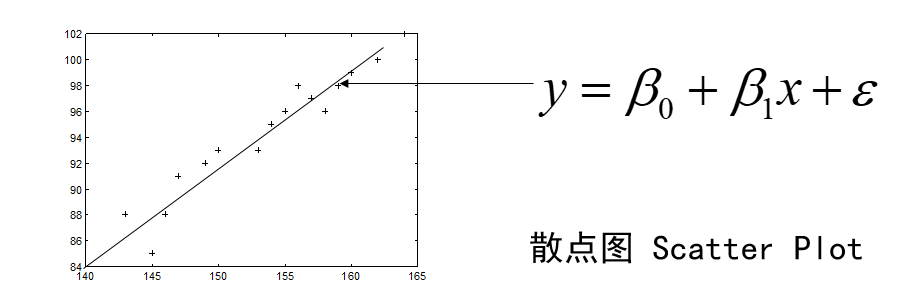

我们可以看到这里的一个散点图（Scatter Plot），你们在做数据科学的时候最常用的一个图应该就是散点图了，它可以在一个图吧所有的观测数据显示出来他的每个周就是观测数据得一个变量，我们一般吧independent variable称为$x$,而dependent variable称为$y$。可以看到有个明显的关系，就是升身高越高的姐姐腿也越长。所以很显然的，我们可以拟合（fit）1条直线，这个是我们中学就学过的。

我们看一下这个图中的直线：
$$
\hat{y}=\beta_0+\beta_1x \tag{1}
$$
这就是一个回归模型我们介绍一下其中的几个概念，首先是independent variable：$x$，然后试dependent variable：$y$。我们就是用已知的$x$去预测未知的$y$。然后还有一个就是我们模型的参数 $\beta$，只有确定了参数才是一个真正的模型。然后还有个一很重要的就是 $\hat{y}$，我们读错“y hat”这个一般表示预测值。

然后我们卡一下发现这个散点图的点，有很多没有落在这条直线上，这是因为下面这个公式：
$$
y=\beta_0+\beta_1x+\epsilon \tag{2}
$$
这个公式里面的$\epsilon$表示一个误差。这个公式表示 $y$也就是我们的观测值，也叫做“ground truth”，是在这个模型上增加了一个误差的，我们的模型是我们认为的一个关系，观测值符合这个模型，但是由于观测或者获取数据有误差导致了观测值不在这个模型上。这也就是说一个回归模型放映的是：
$$
\hat{y}= E(Y|X)=f(X,\beta)

\tag{3}
$$
上面的公式是说，预测值 $\hat y$表示的是一个期望值，表示在给出$x$的情况下$y$的期望值。为回魔的模型之不是是一个函数，是independent variable $x$和参数$\beta$ 的函数，不过对于一个确定的模型 $\beta$是确定的。

我们首先讲的是线性回归，那什么是线性回归呢？

**线性回归是一个回归模型，他是参数$\beta$的线性函数**，注意不是要求independent variable $x$的闲心函数，下面都是线性回归模型：
$$
\hat{y}=\beta_0+\beta_1x \tag{4}
\\
\hat{y}=\beta_0+\beta_1x+\beta_2x^2+\beta_3x^3
\\
\hat{y}=\beta_0+\beta_1x_1+\beta_2x_2+\beta_3x_3
$$
不管你的$x$在模型函数中是不是线性，假设你有$\sin(x)$，那把整个$\sin(x)$看成一个新的independent variable就行。

**那我们是怎么确定这些参数$\beta$的呢？**

这里就要说回归模型建立的方法了，一般我们都是使用的**Ordinary least squares（OLS）**这个方法。这个方法其实大家都知道就是我们中学时候学过的最小二乘法。

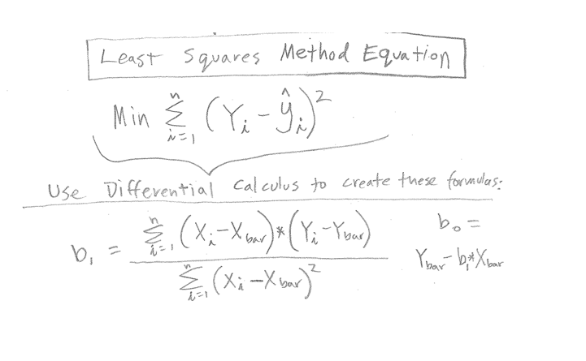

我们要做的就是最小化我们模型预测的结果与我们观测数据的误差。误差怎么表示呢？就如上图和下面这个公式。
$$
E=\sum_{i=1}^n(y_i-\hat{y_i})^2 \tag{5}
$$
我们只要最小化观测的$y$和预测的$\hat{y}$的差的平方和就行。

要注意的是这整发有几个假设，我们后面慢慢说，这里就说一个，这个误差是由于我们对$y$的观测，和$y$本身的噪声造成的，和$x$是没有关系的。你看我们预测的时候$\hat{y_i}=f(x_i)$，这个$x_i$和我们观测样本$(y_i,x_i)$是同一个。也就是说$x$的观测是没有误差准确的。

## Matlab中的简单线性回归

### 基本的拟合

>Exp 1：首先我们看看这个数据：

|    Weekly $ Ad Expense (x)    |    Weekly $ Sales (y)    |
|-------------------------------|--------------------------|
|    63,566                     |    651,334               |
|    50,762                     |    527,670               |
|    50,941                     |    523,751               |
|    17,597                     |    175,467               |
|    33,029                     |    377,978               |
|    58,543                     |    520,100               |
|    60,492                     |    620,856               |
|    59,686                     |    593,739               |
|    16,432                     |    181,949               |
|    17,262                     |    184,644               |
|    39,118                     |    379,374               |
|    36,078                     |    238,688               |
|    42,113                     |    410,066               |
|    50,562                     |    413,541               |
|    38,240                     |    340,242               |
|    59,870                     |    582,843               |

这是一个公司每周的广告费支出和每周销量的数据和每周销售额的数据，我们想通过广告费支出来预测销售额，那什么是dependent variable什么食independent variable都知道了吧。我们首先在matlab上把这个数据导入，然后画个图。

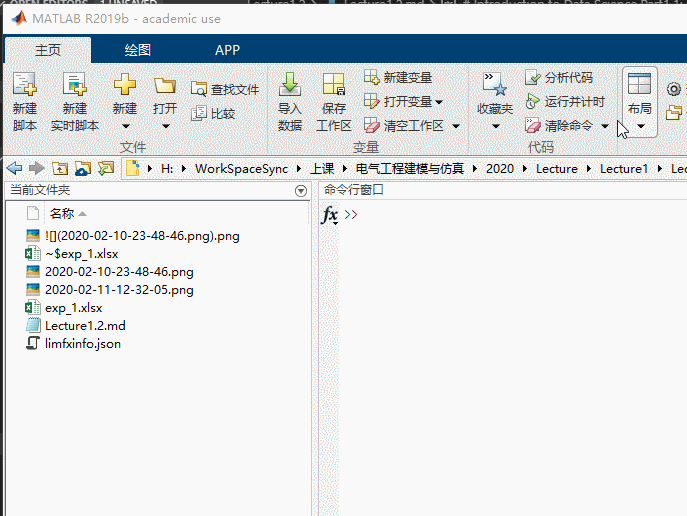

按照这个图里面的，我们首先吧当前工作目录换到我们存放数据的目录，然后再数据excel文件上右键，导入数据，我们可以把表头改成x，y这样我门后面好操作一些，然后再创建一个实时较笨，调用`scatter`散点图命令画出一个图像，可以看到再右侧就出现了一个图片，这个用起来很方便，下面是实际的代码。
```matlab
scatter(exp1.x,exp1.y)
```
然后我们可以看出这些点的分布满足广告投入越大，销售额也越多（这个有点假哈，广告不得要几天才有效吗😂）

我们点击“新建实时脚本”按钮，是是脚本可以边敲代码便执行，这个和python的jupyter notebook很象挺方便的。

```matlab
%% get a glance of the data
scatter(exp1.x,exp1.y)
hold on

%% fit a line
[model,gof,output]=fit(exp1.x,exp1.y,"poly1")
plot(model,exp1.x,exp1.y)

%% let's look at the result
hold off
% this shows the goodness of the fit
gof
% let's plot the residuals
scatter(exp1.x,output.residuals)
histogram(output.residuals,10)
% this residual plot is better looking
plot(model,exp1.x,exp1.y,"residuals")
```
上面这个代码其实很容易理解吧。首先我们调用`fit`方法得到一个模型，送进去的参数分辨是x,y,还有一个`"poly1"`的字符串。这个是说我们用一个independent variable的一阶的多项式就行拟合，就是一条直线了。fit方法返回的是一个元组，第一个model就是我们的线性回归的模型，第二个gof是goodness of fit的意思表示了我们的模型的性能我们等下解读一下，随后一个output是一些输出，其中最主要的就是residuals。

>这里讲一下code section这个概念，如果你打两个注释符号`%%`，那么再这个之后下一个`%%`之前，里面的代码就是一个section，你可以按<kbd>ctrl</kbd>+<kbd>enter</kbd>或者<kbd>ctrl</kbd>+<kbd>shift</kbd>+<kbd>enter</kbd>来执行一个section里面的代码，结果会在右边的窗口显示出来如下面的图：  
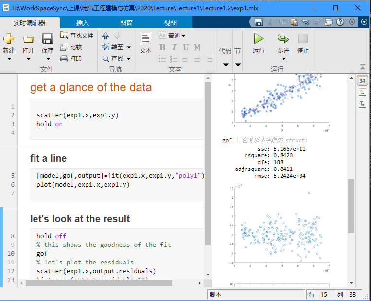

我们首先看看模型，我们可以运行`plot(model,exp1.x,exp1.y)`把模型和之前数据的散点画在一起：  
  
可以看到效果还是很好的。**那这个模型怎么用能？**我们先把model打印出来，直接输入`model`运行,得到下面的代码：
```
model = 
     Linear model Poly1:
     model(x) = p1*x + p2
     Coefficients (with 95% confidence bounds):
       p1 =       8.242  (7.728, 8.755)
       p2 =   3.686e+04  (1.477e+04, 5.894e+04)
```
解释一下`model(x) = p1*x + p2`这个就是你的模型的公式，p1,p2是你模型的参数，他的值分别是 `p1 = 8.242, p2 = 3.686e+04`。要完成一次预测只要把x带进去就行，和上面说的一样，执行`y_hat=model(x)`就行。

**我们再看看如何评估这个模型**  
首先我们打印这个`gof`对象：
```
gof = 
           sse: 5.1667e+11
       rsquare: 0.8420
           dfe: 188
    adjrsquare: 0.8411
          rmse: 5.2424e+04
```
这里可以看到几个数字，最重要的就是rsquare，和adjrsquare，这个代表了你模型解释观测数据的能力，两个数字差不多，如果你只有一个independent variable两个是一回事，如果你有多个变量你关注的因该是adjrsquare（adjusted r square），因为当变量增多的时候rsquare一定会减少，adjrsquare是只考虑significant的变量，这个我们就在这里不多说了。**这个adjrsquare是越接近1越好。**我们在下面的公式和图里面可以看到这个rsquare是怎么算的：  
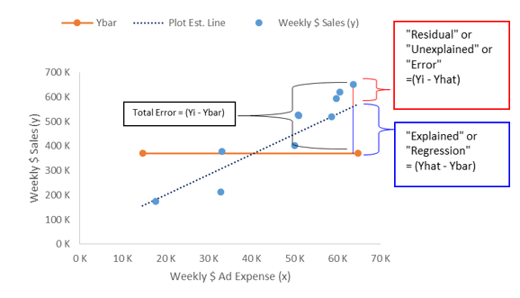  
$$
R^2=\frac{SST-SSR}{SSR} \tag{6}
\\
SST=\sum(y_i-\bar{y}^2)
\\
SSR=\sum(y_i-\hat{y}^2)
$$
可以看出来SST是这个模型不存在是，所有的点的平方和，$\bar{y}$是这也样板的平均值。而SSR是模型与观测数据差的平方求和，就是模型没有解释的部分，所以（SST-SSR）/SST就是模型解释了的比例，月接近1越好。

好的最后我们在看以一下我们要关注的residuals，也就是模型的残差就是$y_i-\hat{y_i}$，我们把它plot出来：
```matlab
scatter(exp1.x,output.residuals) 
%%plot(model,exp1.x,exp1.y,"residuals"),这个可能看的更清楚
histogram(output.residuals,10)
```
我们反变化出了残差的散点图和残差的直方图：  
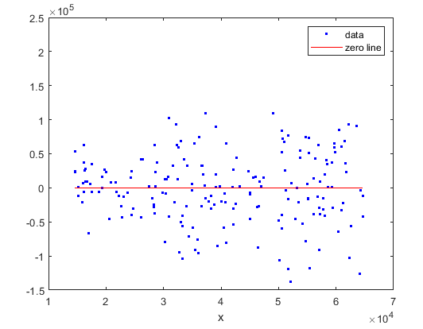  
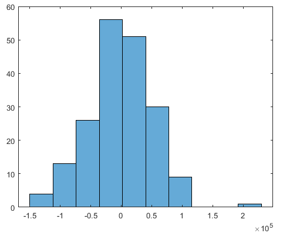

首先，我们说以下，**一个回归模型是一个好的模型的话，他的残差应该改是平均值为0的一个正太分布，同时残差的分布不应该随着x的变化而变化**。

我们再看看我们的残差，体重有一条红线zero line，可以看到参擦汗在两边分布的还比较均匀，品均值应该是0附近，而且器分布也没有岁x变化而变化。  
再看看后面的直方图，残差确实也好象是平均值为0的一个正态分布，说明我们的模型还挺好。

下图这几个残差图就不是特别合适：

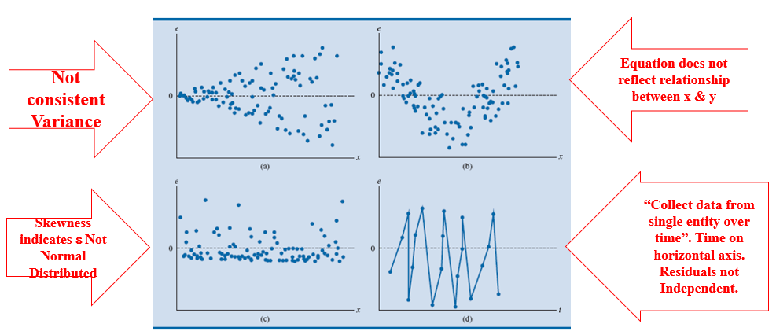

### Cure fitting工具箱

我们在看一个例子
>exp2 下面是一个气温和电费单的表格（不完整，完整的参考附件），请根据气温预测电费。  

|    Temperature X    |    Energy Expense Y    |
|---------------------|------------------------|
|    46               |    $236                |
|    52               |    $304                |
|    55               |    $164                |
|    46               |    $214                |
|    47               |    $210                |
|    50               |    $508                |
|    36               |    $295                |

很简单对不对，我们导入数据，然后你们知道代码怎么写对吧：
```matlab
%%get a glance of the data
scatter(exp2.x,exp2.y)

%%fit a line
[model,gof,output]=fit(exp2.x,exp2.y,"poly2")
plot(model,exp2.x,exp2.y)

%%let's look at the result
% this shows the goodness of the fit
gof
% let's plot the residuals
scatter(exp2.x,output.residuals)
histogram(output.residuals,10)
% this residual plot is better looking
plot(model,exp2.x,exp2.y,"residuals")

%%
model
gof
```
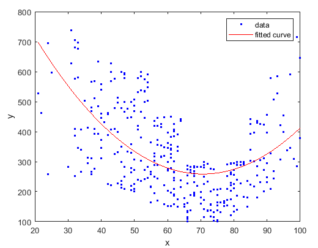

可以看到一模一样，我们唯一就是把"ploy1"才成了"poly2"，就是用2词多项式拟合。为啥是2次呢？我们看到扎个餐点图他的趋势是两边搞中间底，所以就用了二次。

好我们这次再换一个玩法。我们在matlab命令行里面输入`cftool(exp2.x,exp2.y)`cure fitting toolbox。然后如下面的操作：  
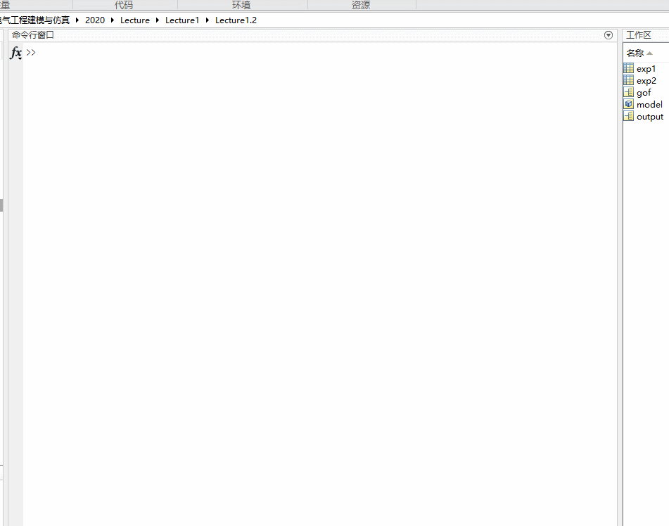  
可以看到，我们在这个工具箱里面可以选择x，y数据，然后可以选择fit的类型，有很多种，我们现在还是选择多项式，在Degree里面可以选多项式的阶数。

这里还有个选项叫Robust。我们平时误差用的是square error，这样会让偏差比较大的点误差更大，也就是说它的权重会比较大。如果我们的模型里面有一些异常点，偏差很大，那么就会让我们的模型偏向这些异常点。Robust就是用来处理这个问题的。例如你可以开启LAR，他就还用绝对值误差，而不是平方，这样异常点的影响就少了，在我们这个例子中没有什么骗得特别远的点，所以Robust开不开都一样。

注意你会发现，随着degree的增加，也就是参数的增加，我们发现adjrsquare一直在减少，但是曲线也变得很扭曲。我们想一下，天冷了开暖气，天热了开空调，基本就是这种关系，不会是什么扭曲的关系，所以后面曲线扭曲了，虽然可以更好地逼近这些数据，但是并不能表示更接近真实的情况，这是因为我们的模型开始拟合我们数据中的噪声了，这个也就是我们说的**过拟合**，这是我们要避免的，所以不能一味的追求rsquare小，还要考虑实际的关系以及尽量的让模型简单。

## 多变量回归

之前我们讲了一个independent variable的情况，那如果有多个x怎么办，
如下面的例子：

>exp3 这是一群人年收入，高中毕业以后受教育的年数，和信用卡账单，我们想通过前两个来预测他一年花多少钱。

| Annual   Income     x1 | # Years   Post-High School Education     x2 | Annual Credit   Card Charges     y |
|------------------------|---------------------------------------------|------------------------------------|
| $39,400                | 5                                           | $10,120.45                         |
| $68,200                | 4                                           | $15,289.80                         |
| $43,000                | 6                                           | $5,937.19                          |
| $53,600                | 2                                           | $0.00                              |
| $53,500                | 4                                           | $13,569.89                         |
| $60,800                | 2                                           | $3,889.79                          |
| $74,900                | 1                                           | $7,715.47                          |
我们还是老方法
```matlab
%% get a glance of the data
scatter3(exp3.x1,exp3.x2,exp3.y)
plotmatrix(exp3.Variables)

%% fit a surface
[model,gof,output]=fit([exp3.x1,exp3.x2],exp3.y,"poly33")
plot(model,[exp3.x1,exp3.x2],exp3.y)

%% let's look at the result
% this shows the goodness of the fit
gof
% let's plot the residuals
scatter(exp3.x1,output.residuals)
scatter(exp3.x2,output.residuals)
histogram(output.residuals,10)

model
gof
```
首先我们还是把图画出来看看，这个叫做exploratory data analysis，探索新数据分析，看看大概数据是啥样。可以看到除了散点图我还画了一个图`plotmatrix(exp3.Variables)`，这个可以把表格里面所有变量两辆话在一个散点图中，如下面  ：
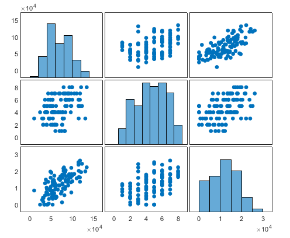  
这个图是对角线对真的，大的xy周分别是变量，对角线就是自身对自身没必要画散点图，就给出了分布的直方图。我们关心的是那两个变量之间有关系。可以看到x1，和y有比较明显的正相关，你们希望看到的是independent variabl和dependent variable之间有相关而independent variabl之间最好没有，这样说明每个变脸都是独立有作用的。如果independent variabl站之间强有相关则可以去掉某个变量。我们便量少可以不管，当independent variable多的时候尽量选择和Y关联大的之间没关系的变量。

再看fit模型，我们只关注有什么变化，首先是fit里面"ploy33"，因为我们有2个independent variable，所以我们对两个都采用3次多项式，你也可以尝试别的不同的玩法。你可以看到这个residual的plot我们也有两个。

## 更多变量回归
我们之前一直在用fit，fit是curve fitting toolbox里面的玩意，用起来虽然简单但是还是功能比较悠闲的，比如independent variable超过2个就不能用了，怎么办呢，我们还有statistic and machine learing toolbox。其中有东西叫做fitlm，应该是fit linear model的意思我们开看看他。

>exp4 这个是年龄，血压，是否吸烟和未来10年发生中风的概率的关系，现在让你预测一个人是否未来会发生中风。

| Age x1 | Blood Pressure x2 | Smoker x3 | % Risk of Stroke   over Next 10 Years Y |
|--------|-------------------|-----------|-----------------------------------------|
| 63     | 129               | No        | 7                                       |
| 75     | 99                | No        | 15                                      |
| 80     | 121               | No        | 31                                      |
| 82     | 125               | No        | 17                                      |
| 60     | 134               | No        | 14                                      |
| 79     | 205               | Yes       | 48                                      |
| 79     | 120               | Yes       | 36                                      |

我们看下面一个代码：
```matlab
%% transform yes/no to 1/0
[index,~,isSmoker]=unique(exp4.x3)
isSmoker=isSmoker-1

%% fit a simple 1 degree polynomial model
ft=fitlm([exp4.x1,exp4.x2,isSmoker],exp4.y)

%% you can specify the order of the polimonial model
T=[1 0 0 0;...
    0 1 0 0;...
    0 0 1 0;...
    1 1 0 0;...
    1 2 0 0;...
    3 0 0 0;...
    0 0 0 0]
ft=fitlm([exp4.x1,exp4.x2,isSmoker],exp4.y,T)
```
首先，我们要把表格里面的yes/no变成1/0，这样才能用计算，非常简单用`unique`函数，大家不懂可以查查，出来以后吗默认是吧不同种类的字符串变成了从1开始的数字，我们未来方便剪掉1，这样抽烟就是1，不抽是0。这个是一个很基础的数据预处理，当然如果你的一个数据有很多种类型，直接的用1，2，3...这种编码其实是不合适的，可以使用one hot编码，这个大家自己去研究，下次可也会讲。

预处理之后只要用`fitlm`指定independent variable和dependent variable就行。可以看到他的给出的模型是：
```
ft = 
线性回归模型:
    y ~ 1 + x1 + x2 + x3

估计系数:
                   Estimate       SE        tStat       pValue  
                   ________    ________    _______    __________

    (Intercept)    -72.508       15.092    -4.8043    0.00010793
    x1             0.83483      0.16446     5.0761    5.7719e-05
    x2             0.22801     0.048995     4.6539    0.00015295
    x3              10.607       3.2056     3.3089     0.0035044


观测值数目: 24，误差自由度: 20
均方根误差: 6.53
R 方: 0.824，调整 R 方 0.798
F 统计量(常量模型): 31.3，p 值 = 9.43e-08
```
居然是中文的真不习惯，可以看到`y~`那一串就是模型的公式，然后那个estimate就是系数。`R 方: 0.824，调整 R 方 0.798`就是我们之前说的rsquare和adjrsquare。这次多了个东西，就是pValue，这个表示这个参数是否在统计学上significant。这里一时半会解释不清，挺复杂，你就认为这个数字小于0.05这个参数对应的independent variable就是有意义的，要是比这个大，就代表可以忽略掉他，你再做个模型就不要加这个变量了。

这里再说一点，就是你看这个模型的参数，isSmoker的系数最大时10多，说明只要吸烟你中风的概率比别人搞10%，这也是我们从模型中可以总结出来的规律。

到这里你要说，这个虽然是实现了多边恋的回归，但是是一次多项式呀，怎么变成更高次的呢？，简单如下面这个代码：
```matlab
%% you can specify the order of the polimonial model
T=[1 0 0 0;...
    0 1 0 0;...
    0 0 1 0;...
    1 1 0 0;...
    1 2 0 0;...
    3 0 0 0;...
    0 0 0 0]
ft=fitlm([exp4.x1,exp4.x2,isSmoker],exp4.y,T)
```
就是加一个参数叫Terms Matrix，这个用来指明你模型中的阶数，很好理解，每一行就对应一项，而每一列对应每个independent variable的阶数，如第一行 1 0 0 0，对应的就是${x_1}^1*{x_2}^0*{x_3}^1$，最后一个0是必须的不知道为啥。那么底5航1 2 0 0对应的就是${x_1}^1*{x_2}^2*{x_3}^0$。你不用吧每一行都写完，你要用几个就写几行，上面这个模型结果如下：
```
ft = 
线性回归模型:
    y ~ x3 + x1*x2 + x1:(x2^2) + x1^3 + 1

估计系数:
                    Estimate          SE         tStat       pValue  
                   ___________    __________    ________    _________

    x1                -0.23256        1.3909     -0.1672      0.86919
    x2                 0.12519       0.42139     0.29709         0.77
    x3                  10.643        3.4187      3.1132    0.0063233
    x1:x2          -0.00095897     0.0080442    -0.11921       0.9065
    x1:x2^2         7.4576e-06    2.4488e-05     0.30454      0.76441
    x1^3            6.8769e-05    7.5166e-05     0.91491      0.37304
    (Intercept)         -9.332        87.015    -0.10725      0.91585


观测值数目: 24，误差自由度: 17
均方根误差: 6.9
R 方: 0.833，调整 R 方 0.774
F 统计量(常量模型): 14.1，p 值 = 8.89e-06
```
可以看到这个rsquare增加了，但是adjrsquare没有，所以我们增加了个个模型的复杂度，但是并没有增加什么有意义的项，你看有好几个pValue都很大。

这里你又要问了，这里只能用多项式拟合，我像自定义一个模型的公式可以吗？当然是可以，我以前教过你的对吧。只要线性回归你总能把你的模型携程$af(X)+bg(X)...$这种形式对吧。  
例如: `ft=fitlm([sin(exp4.x1),exp4.x2,isSmoker],exp4.y)`

## 非线性回归

之前讲了线性回归，再讲一下非线性回归。当你有一个工具规则建立的公式的时候，这个公式不满足线性回归的时候就需要使用非线性回归了。

如下面这个例子：

>在化学动力学反应过程中，建立了一个反应速度和反应物含量的数学模型，形式为：
$$
y=\frac{\beta_4x_2-\cfrac{x_3}{\beta_5}}{1+\beta_1x_1+\beta_2x_2+\beta_3x_3}
$$
现在测到一组参考数据，求模型参数$\beta_1..\beta_5$
| x1 氢 | x2 戊烷 | x3 异构戊烷 | y 反应速率    |
|-----|-----|-----|-------|
| 470 | 300 | 10  | 8.55  |
| 285 | 80  | 10  | 3.79  |
| 470 | 300 | 120 | 4.82  |
| 470 | 80  | 120 | 0.02  |
| 470 | 80  | 10  | 2.75  |
| 100 | 190 | 10  | 14.39 |
| 100 | 80  | 65  | 2.54  |
| 470 | 190 | 65  | 4.35  |
| 100 | 300 | 54  | 13    |
| 100 | 300 | 120 | 8.5   |
| 100 | 80  | 120 | 0.05  |
| 285 | 300 | 10  | 11.32 |
| 285 | 190 | 120 | 3.13  |

我们需要用一个函数和前面的很象叫`fitnlm` fit non-linear-model。
代码如下：
```matlab
%%define your model equation using a anonymous function
f=@(B,X) (B(4)*X(:,2)-X(:,3)/B(5))./(1+B(1)*X(:,1)+B(2)*X(:,2)+B(3)*X(:,3))

%% feed the data and the function to the fit
%this is the initial value
B0=[0.1 0.1 0.1 0.1 0.1]
model=fitnlm(exp5,f,B0)

%% make prediction
y=model.predict([470 300 10])
```

可以看到我们用了`@(B,X) ...`这个匿名函数的语法定义我们的一个模型公式，B时参数，X时independent variable，都是向量。这里要注意的时，后面fit的时候是吧整个样板矩阵全部送进去的，这里这里要去对应的一列，比如X(:,2)就是把X矩阵的第二列所有行取出来，这个函数的返回值就是我们样本的所有的y，就是数据表里面Y那一列。

然后fit的时候需要给一个参数的初值。因为非线性回归不想线性回归一样有现成公式可以借，线性回归的损失函数是一个凸函数可以直接算，这个非线性回归的损失函数不知道是个啥，只能通过如梯度下降之类的优化算法，所以需要一个迭代的初值，这个就不多讲了。

这个fit方法输入的数据是一个table，我们导入的数据，它自动把最后一列作为dependent variable了，我们对于赢得处理数据就行。当让你可以用矩阵的语法把这个传进去`fitnlm(X,Y,f,B0)`这种。

当你得到模型以后可以看到输出是：
```
model = 
非线性回归模型:
    y ~ (B4*x2 - x3/B5)/(1 + B1*x1 + B2*x2 + B3*x3)

估计系数:
          Estimate       SE       tStat     pValue 
          ________    ________    ______    _______

    B1    0.062776    0.043562    1.4411    0.18753
    B2    0.040048    0.030885    1.2967    0.23089
    B3     0.11242    0.075158    1.4957    0.17309
    B4      1.2526     0.86702    1.4447    0.18654
    B5      1.1914     0.83671    1.4239     0.1923


观测值数目: 13，误差自由度: 8
均方根误差: 0.193
R 方: 0.999，调整 R 方 0.998
F 统计量(零模型): 3.91e+03，p 值 = 2.54e-13
```
预测也很简单就是：`y=model.predict([470 300 10])`

### Logistics Regression
这个只用来做一个分类的，2分类具体地说。他主要是给出一个输入下属于属于某个输出的概率。比如学习10个小时，你挂科的概率。
例如下面这个例子：
>exp6 下面是学习小时数和考试是否通过的一个采样数据

| Hours | 0.50 | 0.75 | 1.00 | 1.25 | 1.50 | 1.75 | 1.75 | 2.00 | 2.25 | 2.50 | 2.75 | 3.00 | 3.25 | 3.50 | 4.00 | 4.25 | 4.50 | 4.75 | 5.00 | 5.50 |
|-------|------|------|------|------|------|------|------|------|------|------|------|------|------|------|------|------|------|------|------|------|
| Pass  | 0    | 0    | 0    | 0    | 0    | 0    | 1    | 0    | 1    | 0    | 1    | 0    | 1    | 0    | 1    | 1    | 1    | 1    | 1    | 1    |

试着给出个模型输入学习时间给出通过的概率

这就是一个logistic regression问题，他不是你和一个曲线，应该属于拟合一个概率分布，适合前面完全不同的问题，但是也很简单：

```matlab
%% exploratory
data=exp6.'
scatter(data(:,1),data(:,2))
hold on

%% fit
B=mnrfit(data(:,1),data(:,2)+1)

%% predict
f=@(B,x) 1./(1+exp((B(1)+B(2)*x)))
X=linspace(0,6,100)
plot(X,f(B,X))
```
简单解释一下，那个mnrfit是Multinomial logistic regression的意思。Multinomial的意思是，除了分成0-1这两种，他可以分很多类，甚至还支持有顺序的分类，具体的你可以按<kbd>f1</kbd>来看帮助。  
然后要注意的是他的分类要求y是 categorical 类型的数据，一般是可以自动转换，但是要求要么是字符串，或者是正整数。我们的y是0-1所以要加上1变成1-2就可以了。  
最后这个函数返回的不是模型，而实一个系数，第一个是截距，第二个是x的系数，你看下面的公式就明白了：
$$
p=\frac{1}{1+e^{-(\beta_0+\beta_1x)}}
$$
但是要注意这里matlab给出来的是把负号带进去了的，所以要用
$$
p=\frac{1}{1+e^{\beta_0+\beta_1x}}
$$
这个公式。

如果你有k个分类，那么每个分类的截距就是mnrfit返回的B前面k列。后面剩下的几列就是你有多个independent variabl，就是那几个x的系数。

这个例子告诉我们，不哈好学习就肯定考不及格。

## 时间序列与ARIMA模型

刚才我们都是用几个independent variable x来与的dependent variable y。x和y都属于一次观测。如果我们只有一个变量就是y本身，然后不停的观测y的一个序列，然后我们想要预测未来的y值怎么玩呢？例如我们有一支股票他几个月以来每一天的收盘价，我们想预测明天的股票价格。

首先我们定义一下这个模型。对于一个随机事件，我们每个一段时间观测一次，或者每隔一段时间按顺序发生的一个随机事件，我们叫他随机序列。对于第t次观测值，我叫做$y_t$，前一次就叫做$y_{t-1}$，前一次的钱一次叫做$y_{t-2}$，那么$y_{t-k}$能够理解了吧。

我们首先搞个简单的模型叫线性自回归模型（auto=regressive model）
$$
y_t=c+\sum_{i=1}^{k}\beta_i*y_{t-i}+\epsilon
$$

这个能看懂吧，就是下一个y的观测值=之前k次的观测值的线性组合+上一个随机的误差。这个模型你想想你用我们之前学的知识可以做吧。

ok我们现在学一个更加复杂也是实际中用的更多的一个模型叫做ARIMA（auto-regeressive integrated moving average）。我这不是数学、也不是统计学课，我不将太复杂，但是我觉得基本的远离还是要熟悉一下：

一个ARIMA模型的表达式是(我移动了一下你们看着简单点)：

$$
(1-L)^dy_t=c+\sum_{i=1}^{p}\beta_iL^i(1-L)^dy_t+\left(1+\sum_{i=1}^{q}\theta_iL^i\right)\epsilon_t
$$

先讲几个算子：
1. lag算子：超简单就是$L^iy_t=y_{t-i}$
2. d差分算子：$(1-L)^dy_t$ y的d阶差分，d=1是 就是$y_t-y_{t-1}$，d是2的时候就是$(y_t-y_{t-1})-(y_{t-1}-y_{t-1})$，简单吧。

为什么这个重要呢就是因为，ARIMA模型中的AR之前介绍过了，I是integrated的意思，就是这个模型是加起来用的，他预测的是$(1-L)^Dy_t$，并不直接是y。

吗MA是什么意思呢？Moving Average的意思就是后面$\left(1+\sum_{i=1}^{q}\theta_iL^i\right)\epsilon_t$这一项代表模型预测与实际观测误差的一个线性组合。

为什么搞得这么纠结，当然是应为这样一般情况下更准一些，一本模型越复杂拟合的越好，你要记住的是p，d，q这3个超参数(我们后面会讲什么是超参数)。

好的我们做个例子，如我们
>exp7 这里给出谷歌5个月的股价，我们来预测看看。

```matlab
%%fit the model
parcorr(exp7.price)
Mdl = arima(2,1,2);
model=estimate(Mdl,exp7.price(1:90))

%% forcast
[pred,ymse]=forecast(model,15,exp7.price(1:90))

% just plot
h1 = plot(exp7.price,'Color',[.7,.7,.7])
hold on
h2 = plot(91:105,pred,'b','LineWidth',2)
h3= plot(91:105,pred + 1.96*sqrt(ymse),'r:',...
		'LineWidth',2);
plot(91:105,pred - 1.96*sqrt(ymse),'r:',...
		'LineWidth',2);

legend([h1 h2 h3],'Observed','Forecast',...
		'95% Confidence Interval','Location','NorthWest');
hold off

```
首先我们先用parcorr这个函数看看，当前股价和过去几天的股价有没有什么关系，可以看到t-1和体关系很明显，后面的就不是很明显了，所以我们模型的p可以选1-2就够了，d一般都是选1，q的话和p选差不多一本也不错，其实p可以通过调用autocorr看在哪里cutoff来判断，不过这个数据不是很好参考意义不大。  
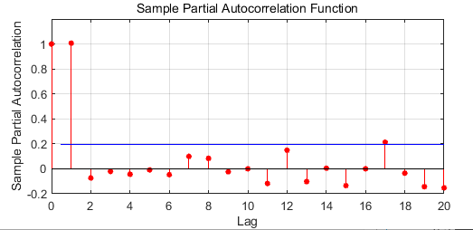  
然后我们调用estimate来fit我们的模型。我这里要吐个槽，matlab不同工具箱，差不多的东西风格差异很大，这好蠢。我们用1-90填的数据来预测，再用forecast来预测，我们直接预测之后15天的股价走势。看看预测的还是挺准的。这个forecast返回两个东西，一个是预测值，实际上是一个期望值，还有一个是这个期望值对应的variance，然后你可以通过*1.96得到95%的置信区间，就是这个模型给出的分布，95%的概率在这+-1.96 * variance范围内。  
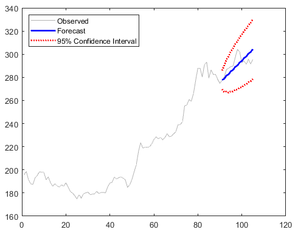

## 总结

ok各种简单的回归我们都学完了总结一下：
1. 首先如果可以把数据plot出来看看是什么规律，这个叫做exploratory data analysis，探索新分析
2. 然后根据前面探索的结果选择采用什么样的模型公式，一般情况下，简单的线性回归，多项式就可以了，如果你想不出来更好的就用这个原则。
3. 然后调用fit函数fit你的样本，得到一个模型。
4. 看看模型的adjrsqure，plot出来残差图，没啥问题的话就ok了。
5. 用模型的predict方法来预测吧。