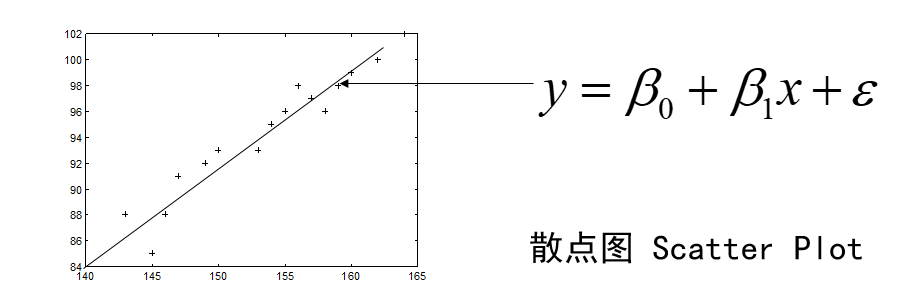
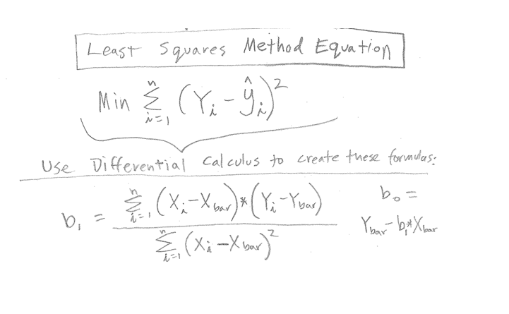

# Introduction to Data Science Part1.2: Basic definitions

## 什么是回归
**回归是一种统计学方法，用于找到两个或多个变量之间的关系**。回归中有两种变量一种是independent variable，另一个dependent variable。正如他们名字说的那样，dependent variable是依赖independent variable的。回归一般是用于预测的，就是给出independent variable回归模型可以给出一个dependent variable的预测值。基础的回归模型除了直接给出预测值，他还能给出这两个变量的关系，你能看出，当某个变量增加的时候增加的时候，dependent variable是增加还是减少，影响有多大。但是这个并不表示因果关系（causality）。例如通过分析发现7-10岁的小孩中，脚越大，智商越高。你说这个脚和脑子有啥关系？后来通过更加理性的分析发现，7-10随得下海中，脚越大，年龄也越大，所以智商就高。这也是运用机器学习方法需要注意的一些问题。最后，回归一般给出的结果是连续的，如果一个模型给出的结果是有限离散的，可能就是分类和聚类问题了。

虽然回归是一个机器学习方法，但是一些机器学习的基本概念，我们在后面慢慢的引入。

## 简单线性回归

### 基本概念

我们先看个简单的例子：

>测16名成年女子的身高与腿长所得数据如下：

|    身高    |    143    |    145    |    146    |    147    |    149    |    150    |    153    |    154    |    155    |    156    |    157    |    158    |    159    |    160    |    162    |    164    |
|------------|-----------|-----------|-----------|-----------|-----------|-----------|-----------|-----------|-----------|-----------|-----------|-----------|-----------|-----------|-----------|-----------|
|    腿长    |    88     |    85     |    88     |    91     |    92     |    93     |    93     |    95     |    96     |    98     |    97     |    96     |    98     |    99     |    100    |    102    |

以身高x为横坐标，以腿长y为纵坐标将这些数据点（xi，yi）在平面直角坐标系上标出. 

我们可以看到这里的一个散点图（Scatter Plot），你们在做数据科学的时候最常用的一个图应该就是散点图了，它可以在一个图吧所有的观测数据显示出来他的每个周就是观测数据得一个变量，我们一般吧independent variable称为$x$,而dependent variable称为$y$。可以看到有个明显的关系，就是升身高越高的姐姐腿也越长。所以很显然的，我们可以拟合（fit）1条直线，这个是我们中学就学过的。

我们看一下这个图中的直线：
$$
\hat{y}=\beta_0+\beta_1x \tag{1}
$$
这就是一个回归模型我们介绍一下其中的几个概念，首先是independent variable：$x$，然后试dependent variable：$y$。我们就是用已知的$x$去预测未知的$y$。然后还有一个就是我们模型的参数 $\beta$，只有确定了参数才是一个真正的模型。然后还有个一很重要的就是 $\hat{y}$，我们读错“y hat”这个一般表示预测值。

然后我们卡一下发现这个散点图的点，有很多没有落在这条直线上，这是因为下面这个公式：
$$
y=\beta_0+\beta_1x+\epsilon \tag{2}
$$
这个公式里面的$\epsilon$表示一个误差。这个公式表示 $y$也就是我们的观测值，也叫做“ground truth”，是在这个模型上增加了一个误差的，我们的模型是我们认为的一个关系，观测值符合这个模型，但是由于观测或者获取数据有误差导致了观测值不在这个模型上。这也就是说一个回归模型放映的是：
$$
\hat{y}= E(Y|X)=f(X,\beta)

\tag{3}
$$
上面的公式是说，预测值 $\hat y$表示的是一个期望值，表示在给出$x$的情况下$y$的期望值。为回魔的模型之不是是一个函数，是independent variable $x$和参数$\beta$ 的函数，不过对于一个确定的模型 $\beta$是确定的。

我们首先讲的是线性回归，那什么是线性回归呢？

**线性回归是一个回归模型，他是参数$\beta$的线性函数**，注意不是要求independent variable $x$的线性函数，下面都是线性回归模型：
$$
\hat{y}=\beta_0+\beta_1x \tag{4}
\\
\hat{y}=\beta_0+\beta_1x+\beta_2x^2+\beta_3x^3
\\
\hat{y}=\beta_0+\beta_1x_1+\beta_2x_2+\beta_3x_3
$$
不管你的$x$在模型函数中是不是线性，假设你有$\sin(x)$，那把整个$\sin(x)$看成一个新的independent variable就行。

**那我们是怎么确定这些参数$\beta$的呢？**

这里就要说回归模型建立的方法了，一般我们都是使用的**Ordinary least squares（OLS）**这个方法。这个方法其实大家都知道就是我们中学时候学过的最小二乘法。

我们要做的就是最小化我们模型预测的结果与我们观测数据的误差。误差怎么表示呢？就如上图和下面这个公式。
$$
E=\sum_{i=1}^n(y_i-\hat{y_i})^2 \tag{5}
$$
我们只要最小化观测的$y$和预测的$\hat{y}$的差的平方和就行。

要注意的是这整发有几个假设，我们后面慢慢说，这里就说一个，这个误差是由于我们对$y$的观测，和$y$本身的噪声造成的，和$x$是没有关系的。你看我们预测的时候$\hat{y_i}=f(x_i)$，这个$x_i$和我们观测样本$(y_i,x_i)$是同一个。也就是说$x$的观测是没有误差准确的。

