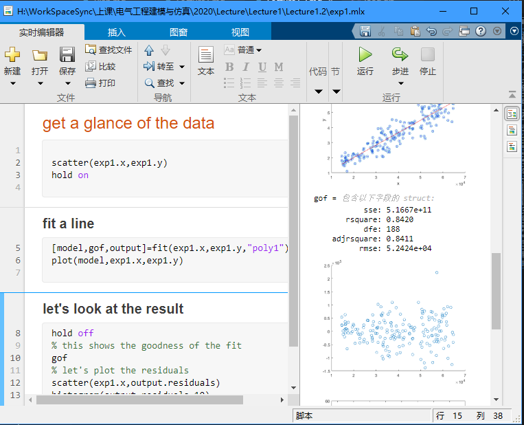

## 数据科学入门1.3：简单线性回归

## Introduction to Data Science Part1.3: Basic Regression 

## Matlab中的简单线性回归

### 基本的拟合

>Exp 1：首先我们看看这个数据：

|    Weekly $ Ad Expense (x)    |    Weekly $ Sales (y)    |
|-------------------------------|--------------------------|
|    63,566                     |    651,334               |
|    50,762                     |    527,670               |
|    50,941                     |    523,751               |
|    17,597                     |    175,467               |
|    33,029                     |    377,978               |
|    58,543                     |    520,100               |
|    60,492                     |    620,856               |
|    59,686                     |    593,739               |
|    16,432                     |    181,949               |
|    17,262                     |    184,644               |
|    39,118                     |    379,374               |
|    36,078                     |    238,688               |
|    42,113                     |    410,066               |
|    50,562                     |    413,541               |
|    38,240                     |    340,242               |
|    59,870                     |    582,843               |

这是一个公司每周的广告费支出和每周销量的数据和每周销售额的数据，我们想通过广告费支出来预测销售额，那什么是dependent variable什么食independent variable都知道了吧。我们首先在matlab上把这个数据导入，然后画个图。


按照这个图里面的，我们首先吧当前工作目录换到我们存放数据的目录，然后再数据excel文件上右键，导入数据，我们可以把表头改成x，y这样我门后面好操作一些，然后再创建一个实时较笨，调用 `scatter` 散点图命令画出一个图像，可以看到再右侧就出现了一个图片，这个用起来很方便，下面是实际的代码。

```matlab
scatter(exp1.x,exp1.y)
```

然后我们可以看出这些点的分布满足广告投入越大，销售额也越多（这个有点假哈，广告不得要几天才有效吗😂）

我们点击“新建实时脚本”按钮，是是脚本可以边敲代码便执行，这个和python的jupyter notebook很象挺方便的。

```matlab
%% get a glance of the data
scatter(exp1.x,exp1.y)
hold on

%% fit a line
[model,gof,output]=fit(exp1.x,exp1.y,"poly1")
plot(model,exp1.x,exp1.y)

%% let's look at the result
hold off
% this shows the goodness of the fit
gof
% let's plot the residuals
scatter(exp1.x,output.residuals)
histogram(output.residuals,10)
% this residual plot is better looking
plot(model,exp1.x,exp1.y,"residuals")
```

上面这个代码其实很容易理解吧。首先我们调用 `fit` 方法得到一个模型，送进去的参数分辨是x,y,还有一个 `"poly1"` 的字符串。这个是说我们用一个independent variable的一阶的多项式就行拟合，就是一条直线了。fit方法返回的是一个元组，第一个model就是我们的线性回归的模型，第二个gof是goodness of fit的意思表示了我们的模型的性能我们等下解读一下，随后一个output是一些输出，其中最主要的就是residuals。

>这里讲一下code section这个概念，如果你打两个注释符号 `%%` ，那么再这个之后下一个 `%%` 之前，里面的代码就是一个section，你可以按<kbd>ctrl</kbd>+<kbd>enter</kbd>或者<kbd>ctrl</kbd>+<kbd>shift</kbd>+<kbd>enter</kbd>来执行一个section里面的代码，结果会在右边的窗口显示出来如下面的图：  



我们首先看看模型，我们可以运行 `plot(model,exp1.x,exp1.y)` 把模型和之前数据的散点画在一起：  

  

可以看到效果还是很好的。 **那这个模型怎么用能？** 我们先把model打印出来，直接输入 `model` 运行,得到下面的代码：

```
model = 
     Linear model Poly1:
     model(x) = p1*x + p2
     Coefficients (with 95% confidence bounds):
       p1 =       8.242  (7.728, 8.755)
       p2 =   3.686e+04  (1.477e+04, 5.894e+04)
```

解释一下 `model(x) = p1*x + p2` 这个就是你的模型的公式，p1,p2是你模型的参数，他的值分别是 `p1 = 8.242, p2 = 3.686e+04` 。要完成一次预测只要把x带进去就行，和上面说的一样，执行 `y_hat=model(x)` 就行。

**我们再看看如何评估这个模型**  

首先我们打印这个 `gof` 对象：

```
gof = 
           sse: 5.1667e+11
       rsquare: 0.8420
           dfe: 188
    adjrsquare: 0.8411
          rmse: 5.2424e+04
```

这里可以看到几个数字，最重要的就是rsquare，和adjrsquare，这个代表了你模型解释观测数据的能力，两个数字差不多，如果你只有一个independent variable两个是一回事，如果你有多个变量你关注的因该是adjrsquare（adjusted r square），因为当变量增多的时候rsquare一定会减少，adjrsquare是只考虑significant的变量，这个我们就在这里不多说了。 **这个adjrsquare是越接近1越好。** 我们在下面的公式和图里面可以看到这个rsquare是怎么算的：  

  

$$
R^2=\frac{SST-SSR}{SSR} \tag{6}
\\
SST=\sum(y_i-\bar{y}^2)
\\
SSR=\sum(y_i-\hat{y}^2)
$$

可以看出来SST是这个模型不存在时，所有的点的平方和， $\bar{y}$ 是这也样板的平均值。而SSR是模型与观测数据差的平方求和，就是模型没有解释的部分，所以（SST-SSR）/SST就是模型解释了的比例，月接近1越好。

好的最后我们在看以一下我们要关注的residuals，也就是模型的残差就是 $y_i-\hat{y_i}$ ，我们把它plot出来：

```matlab
scatter(exp1.x,output.residuals) 
%%plot(model,exp1.x,exp1.y,"residuals"),这个可能看的更清楚
histogram(output.residuals,10)
```

我们分别化出了残差的散点图和残差的直方图：  

  


首先，我们说以下， **一个回归模型是一个好的模型的话，他的残差应该改是平均值为0的一个正太分布，同时残差的分布不应该随着x的变化而变化** 。

我们再看看我们的残差，体重有一条红线zero line，可以看到参擦汗在两边分布的还比较均匀，品均值应该是0附近，而且器分布也没有岁x变化而变化。  
再看看后面的直方图，残差确实也好象是平均值为0的一个正态分布，说明我们的模型还挺好。

下图这几个残差图就不是特别合适：


### Cure fitting工具箱

我们在看一个例子
>exp2 下面是一个气温和电费单的表格（不完整，完整的参考附件），请根据气温预测电费。  

|    Temperature X    |    Energy Expense Y    |
|---------------------|------------------------|
|    46               |    $236                |
|    52               |    $304                |
|    55               |    $164                |
|    46               |    $214                |
|    47               |    $210                |
|    50               |    $508                |
|    36               |    $295                |

很简单对不对，我们导入数据，然后你们知道代码怎么写对吧：

```matlab
%%get a glance of the data
scatter(exp2.x,exp2.y)

%%fit a line
[model,gof,output]=fit(exp2.x,exp2.y,"poly2")
plot(model,exp2.x,exp2.y)

%%let's look at the result
% this shows the goodness of the fit
gof
% let's plot the residuals
scatter(exp2.x,output.residuals)
histogram(output.residuals,10)
% this residual plot is better looking
plot(model,exp2.x,exp2.y,"residuals")

%%
model
gof
```


可以看到一模一样，我们唯一就是把"ploy1"才成了"poly2"，就是用2词多项式拟合。为啥是2次呢？我们看到扎个餐点图他的趋势是两边搞中间底，所以就用了二次。

好我们这次再换一个玩法。我们在matlab命令行里面输入 `cftool(exp2.x,exp2.y)` cure fitting toolbox。然后如下面的操作：  

  

可以看到，我们在这个工具箱里面可以选择x，y数据，然后可以选择fit的类型，有很多种，我们现在还是选择多项式，在Degree里面可以选多项式的阶数。

这里还有个选项叫Robust。我们平时误差用的是square error，这样会让偏差比较大的点误差更大，也就是说它的权重会比较大。如果我们的模型里面有一些异常点，偏差很大，那么就会让我们的模型偏向这些异常点。Robust就是用来处理这个问题的。例如你可以开启LAR，他就还用绝对值误差，而不是平方，这样异常点的影响就少了，在我们这个例子中没有什么骗得特别远的点，所以Robust开不开都一样。

注意你会发现，随着degree的增加，也就是参数的增加，我们发现adjrsquare一直在减少，但是曲线也变得很扭曲。我们想一下，天冷了开暖气，天热了开空调，基本就是这种关系，不会是什么扭曲的关系，所以后面曲线扭曲了，虽然可以更好地逼近这些数据，但是并不能表示更接近真实的情况，这是因为我们的模型开始拟合我们数据中的噪声了，这个也就是我们说的 **过拟合** ，这是我们要避免的，所以不能一味的追求rsquare小，还要考虑实际的关系以及尽量的让模型简单。
