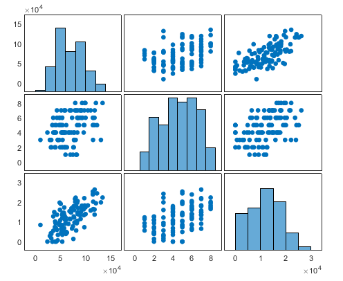

# Introduction to Data Science Part1.4:  Multi variable Regression 

## 多变量回归

之前我们讲了一个independent variable的情况，那如果有多个x怎么办，
如下面的例子：

>exp3 这是一群人年收入，高中毕业以后受教育的年数，和信用卡账单，我们想通过前两个来预测他一年花多少钱。

| Annual   Income     x1 | # Years   Post-High School Education     x2 | Annual Credit   Card Charges     y |
|------------------------|---------------------------------------------|------------------------------------|
| $39,400                | 5                                           | $10,120.45                         |
| $68,200                | 4                                           | $15,289.80                         |
| $43,000                | 6                                           | $5,937.19                          |
| $53,600                | 2                                           | $0.00                              |
| $53,500                | 4                                           | $13,569.89                         |
| $60,800                | 2                                           | $3,889.79                          |
| $74,900                | 1                                           | $7,715.47                          |
我们还是老方法
```matlab
%% get a glance of the data
scatter3(exp3.x1,exp3.x2,exp3.y)
plotmatrix(exp3.Variables)

%% fit a surface
[model,gof,output]=fit([exp3.x1,exp3.x2],exp3.y,"poly33")
plot(model,[exp3.x1,exp3.x2],exp3.y)

%% let's look at the result
% this shows the goodness of the fit
gof
% let's plot the residuals
scatter(exp3.x1,output.residuals)
scatter(exp3.x2,output.residuals)
histogram(output.residuals,10)

model
gof
```
首先我们还是把图画出来看看，这个叫做exploratory data analysis，探索新数据分析，看看大概数据是啥样。可以看到除了散点图我还画了一个图`plotmatrix(exp3.Variables)`，这个可以把表格里面所有变量两辆话在一个散点图中，如下面  ：
  
这个图是对角线对真的，大的xy周分别是变量，对角线就是自身对自身没必要画散点图，就给出了分布的直方图。我们关心的是那两个变量之间有关系。可以看到x1，和y有比较明显的正相关，你们希望看到的是independent variabl和dependent variable之间有相关而independent variabl之间最好没有，这样说明每个变脸都是独立有作用的。如果independent variabl站之间强有相关则可以去掉某个变量。我们便量少可以不管，当independent variable多的时候尽量选择和Y关联大的之间没关系的变量。

再看fit模型，我们只关注有什么变化，首先是fit里面"ploy33"，因为我们有2个independent variable，所以我们对两个都采用3次多项式，你也可以尝试别的不同的玩法。你可以看到这个residual的plot我们也有两个。

## 更多变量回归
我们之前一直在用fit，fit是curve fitting toolbox里面的玩意，用起来虽然简单但是还是功能比较悠闲的，比如independent variable超过2个就不能用了，怎么办呢，我们还有statistic and machine learing toolbox。其中有东西叫做fitlm，应该是fit linear model的意思我们开看看他。

>exp4 这个是年龄，血压，是否吸烟和未来10年发生中风的概率的关系，现在让你预测一个人是否未来会发生中风。

| Age x1 | Blood Pressure x2 | Smoker x3 | % Risk of Stroke   over Next 10 Years Y |
|--------|-------------------|-----------|-----------------------------------------|
| 63     | 129               | No        | 7                                       |
| 75     | 99                | No        | 15                                      |
| 80     | 121               | No        | 31                                      |
| 82     | 125               | No        | 17                                      |
| 60     | 134               | No        | 14                                      |
| 79     | 205               | Yes       | 48                                      |
| 79     | 120               | Yes       | 36                                      |

我们看下面一个代码：
```matlab
%% transform yes/no to 1/0
[index,~,isSmoker]=unique(exp4.x3)
isSmoker=isSmoker-1

%% fit a simple 1 degree polynomial model
ft=fitlm([exp4.x1,exp4.x2,isSmoker],exp4.y)

%% you can specify the order of the polimonial model
T=[1 0 0 0;...
    0 1 0 0;...
    0 0 1 0;...
    1 1 0 0;...
    1 2 0 0;...
    3 0 0 0;...
    0 0 0 0]
ft=fitlm([exp4.x1,exp4.x2,isSmoker],exp4.y,T)
```
首先，我们要把表格里面的yes/no变成1/0，这样才能用计算，非常简单用`unique`函数，大家不懂可以查查，出来以后吗默认是吧不同种类的字符串变成了从1开始的数字，我们未来方便剪掉1，这样抽烟就是1，不抽是0。这个是一个很基础的数据预处理，当然如果你的一个数据有很多种类型，直接的用1，2，3...这种编码其实是不合适的，可以使用one hot编码，这个大家自己去研究，下次可也会讲。

预处理之后只要用`fitlm`指定independent variable和dependent variable就行。可以看到他的给出的模型是：
```
ft = 
线性回归模型:
    y ~ 1 + x1 + x2 + x3

估计系数:
                   Estimate       SE        tStat       pValue  
                   ________    ________    _______    __________

    (Intercept)    -72.508       15.092    -4.8043    0.00010793
    x1             0.83483      0.16446     5.0761    5.7719e-05
    x2             0.22801     0.048995     4.6539    0.00015295
    x3              10.607       3.2056     3.3089     0.0035044


观测值数目: 24，误差自由度: 20
均方根误差: 6.53
R 方: 0.824，调整 R 方 0.798
F 统计量(常量模型): 31.3，p 值 = 9.43e-08
```
居然是中文的真不习惯，可以看到`y~`那一串就是模型的公式，然后那个estimate就是系数。`R 方: 0.824，调整 R 方 0.798`就是我们之前说的rsquare和adjrsquare。这次多了个东西，就是pValue，这个表示这个参数是否在统计学上significant。这里一时半会解释不清，挺复杂，你就认为这个数字小于0.05这个参数对应的independent variable就是有意义的，要是比这个大，就代表可以忽略掉他，你再做个模型就不要加这个变量了。

这里再说一点，就是你看这个模型的参数，isSmoker的系数最大时10多，说明只要吸烟你中风的概率比别人搞10%，这也是我们从模型中可以总结出来的规律。

到这里你要说，这个虽然是实现了多变量的回归，但是是一次多项式呀，怎么变成更高次的呢？，简单如下面这个代码：
```matlab
%% you can specify the order of the polimonial model
T=[1 0 0 0;...
    0 1 0 0;...
    0 0 1 0;...
    1 1 0 0;...
    1 2 0 0;...
    3 0 0 0;...
    0 0 0 0]
ft=fitlm([exp4.x1,exp4.x2,isSmoker],exp4.y,T)
```
就是加一个参数叫Terms Matrix，这个用来指明你模型中的阶数，很好理解，每一行就对应一项，而每一列对应每个independent variable的阶数，如第一行 1 0 0 0，对应的就是${x_1}^1*{x_2}^0*{x_3}^1$，最后一个0是必须的不知道为啥。那么底5航1 2 0 0对应的就是${x_1}^1*{x_2}^2*{x_3}^0$。你不用吧每一行都写完，你要用几个就写几行，上面这个模型结果如下：
```
ft = 
线性回归模型:
    y ~ x3 + x1*x2 + x1:(x2^2) + x1^3 + 1

估计系数:
                    Estimate          SE         tStat       pValue  
                   ___________    __________    ________    _________

    x1                -0.23256        1.3909     -0.1672      0.86919
    x2                 0.12519       0.42139     0.29709         0.77
    x3                  10.643        3.4187      3.1132    0.0063233
    x1:x2          -0.00095897     0.0080442    -0.11921       0.9065
    x1:x2^2         7.4576e-06    2.4488e-05     0.30454      0.76441
    x1^3            6.8769e-05    7.5166e-05     0.91491      0.37304
    (Intercept)         -9.332        87.015    -0.10725      0.91585


观测值数目: 24，误差自由度: 17
均方根误差: 6.9
R 方: 0.833，调整 R 方 0.774
F 统计量(常量模型): 14.1，p 值 = 8.89e-06
```
可以看到这个rsquare增加了，但是adjrsquare没有，所以我们增加了个个模型的复杂度，但是并没有增加什么有意义的项，你看有好几个pValue都很大。

这里你又要问了，这里只能用多项式拟合，我像自定义一个模型的公式可以吗？当然是可以，我以前教过你的对吧。只要线性回归你总能把你的模型携程$af(X)+bg(X)...$这种形式对吧。  
例如: `ft=fitlm([sin(exp4.x1),exp4.x2,isSmoker],exp4.y)`