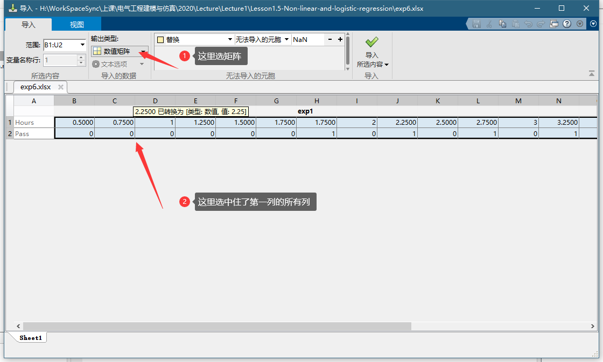
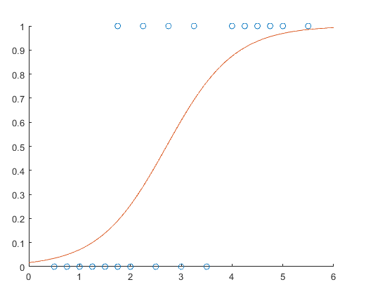

#  数据科学介绍1.5：非线性回归和logistic 回归

## Introduction to Data Science Part1.5: Non-linear regression and logistic regression

## 非线性回归

之前讲了线性回归，再讲一下非线性回归。当你建立的模型有一个根据规则建立的公式的时候，如果这个公式不满足线性回归的时候就需要使用非线性回归了。

如下面这个例子：

>exp 5在化学动力学反应过程中，建立了一个反应速度和反应物含量的数学模型，形式为：

$$
y=\frac{\beta_4x_2-\cfrac{x_3}{\beta_5}}{1+\beta_1x_1+\beta_2x_2+\beta_3x_3}
$$

现在测到一组参考数据，求模型参数 $\beta_1..\beta_5$

| x1 氢 | x2 戊烷 | x3 异构戊烷 | y 反应速率    |
|-----|-----|-----|-------|
| 470 | 300 | 10  | 8.55  |
| 285 | 80  | 10  | 3.79  |
| 470 | 300 | 120 | 4.82  |
| 470 | 80  | 120 | 0.02  |
| 470 | 80  | 10  | 2.75  |
| 100 | 190 | 10  | 14.39 |
| 100 | 80  | 65  | 2.54  |
| 470 | 190 | 65  | 4.35  |
| 100 | 300 | 54  | 13    |
| 100 | 300 | 120 | 8.5   |
| 100 | 80  | 120 | 0.05  |
| 285 | 300 | 10  | 11.32 |
| 285 | 190 | 120 | 3.13  |

我们需要用一个函数和前面的很象，叫 `fitnlm` fit non-linear-model。
代码如下：

```matlab
%%define your model equation using a anonymous function
f=@(B,X) (B(4)*X(:,2)-X(:,3)/B(5))./(1+B(1)*X(:,1)+B(2)*X(:,2)+B(3)*X(:,3))

%% feed the data and the function to the fit
%this is the initial value
B0=[0.1 0.1 0.1 0.1 0.1]
model=fitnlm(exp5,f,B0)

%% make prediction
y=model.predict([470 300 10])
```

可以看到我们用了 `@(B,X) ...` 这个匿名函数的语法定义我们的一个模型公式，B时参数，X时independent variable，都是向量。这里要注意的时，后面fit的时候是吧整个样板矩阵全部送进去的，这里这里要去对应的一列，比如X(:,2)就是把X矩阵的第二列所有行取出来，这个函数的返回值就是我们样本的所有的y，就是数据表里面Y那一列。

然后fit的时候需要给一个参数的初值。因为非线性回归不想线性回归一样有现成公式可以借，线性回归的损失函数是一个凸函数可以直接算，这个非线性回归的损失函数不知道是个啥，只能通过如梯度下降之类的优化算法，所以需要一个迭代的初值，这个就不多讲了。

这个fit方法输入的数据是一个table，我们导入的数据，它自动把最后一列作为dependent variable了，我们对于赢得处理数据就行。当让你可以用矩阵的语法把这个传进去 `fitnlm(X,Y,f,B0)` 这种。

当你得到模型以后可以看到输出是：

```
model = 
非线性回归模型:
    y ~ (B4*x2 - x3/B5)/(1 + B1*x1 + B2*x2 + B3*x3)

估计系数:
          Estimate       SE       tStat     pValue 
          ________    ________    ______    _______

    B1    0.062776    0.043562    1.4411    0.18753
    B2    0.040048    0.030885    1.2967    0.23089
    B3     0.11242    0.075158    1.4957    0.17309
    B4      1.2526     0.86702    1.4447    0.18654
    B5      1.1914     0.83671    1.4239     0.1923


观测值数目: 13，误差自由度: 8
均方根误差: 0.193
R 方: 0.999，调整 R 方 0.998
F 统计量(零模型): 3.91e+03，p 值 = 2.54e-13
```

预测也很简单就是： `y=model.predict([470 300 10])`

可以看到这个模型的rsuqare非常接近于1。为什么呢？（虽然有可能这个题的数据时候来根据模型生成的）在有些情况下，你可以通过某些物理和化学规律建立一个模型的公式，这个时候通过数据找到一以组符合这个规律和实验数据的模型肯定时最准的。所以等你建立模型的时候，可以根据已知的规律建立模型公式的话，一定比用一个多项式这种通用的模型效果好。但是这种情况非常少。

### Logistics Regression

Logistics Regression这个只用来做一个分类的，2分类具体地说。他主要是给出一个输入下属于属于某个输出的概率。比如学习10个小时，你挂科的概率。他输出的是一个概率，是一个连续的值，可以把它当作一个回归问题。如果你在这个输出的概率上加上一个阈值，他就变成一个真正的分类问题了。
例如下面这个例子：
>exp6 下面是学习小时数和考试是否通过的一个采样数据

| Hours | 0.50 | 0.75 | 1.00 | 1.25 | 1.50 | 1.75 | 1.75 | 2.00 | 2.25 | 2.50 | 2.75 | 3.00 | 3.25 | 3.50 | 4.00 | 4.25 | 4.50 | 4.75 | 5.00 | 5.50 |
|-------|------|------|------|------|------|------|------|------|------|------|------|------|------|------|------|------|------|------|------|------|
| Pass  | 0    | 0    | 0    | 0    | 0    | 0    | 1    | 0    | 1    | 0    | 1    | 0    | 1    | 0    | 1    | 1    | 1    | 1    | 1    | 1    |

试着给出个模型输入学习时间给出通过的概率

这个例子的数据不太一样，他是每一列是一个样本不是行，所以我们要转置一下。表格不能转至我们就把他用矩阵的形式导入，请看图：

  

这就是一个logistic regression问题，他不是拟合一个曲线，应该属于拟合一个二分类的概率。注意这个拟合不存在MSE这个概念也没有rsquare这个概念，他用的是最大似然估计。意思就是，找到一个概率分布模型，这个概率分布下，得到这一组观测数据的概率最大，如同下面这个公式要表示意义，就是找到一组参数，使得这个参数概率分布下得到这个观测样本的概率最大，这个在机器学习分类中用的特别多，基本上大部分机器学习分类算法都是基于这个原理的。这是和前面完全不同的问题，但是也很简单：

$$
\hat{\theta}=argmax L_n(\theta;y)
$$


```matlab
%% exploratory
data=exp6.'
scatter(data(:,1),data(:,2))
hold on

%% fit
B=mnrfit(data(:,1),data(:,2)+1)

%% predict
f=@(B,x) 1./(1+exp((B(1)+B(2)*x)))
X=linspace(0,6,100)
plot(X,f(B,X))
```

简单解释一下，那个mnrfit是Multinomial logistic regression的意思。Multinomial的意思是，除了分成0-1这两种，他可以分很多类，甚至还支持有顺序的分类，具体的你可以按<kbd>f1</kbd>来看帮助。  
然后要注意的是他的分类要求y是 categorical 类型的数据，一般是可以自动转换，但是要求要么是字符串，或者是正整数。我们的y是0-1所以要加上1变成1-2就可以了。  
最后这个函数返回的不是模型，而实一个系数，第一个是截距，第二个是x的系数，你看下面的公式就明白了：

$$
p=\frac{1}{1+e^{-(\beta_0+\beta_1x)}}
$$

但是要注意这里matlab给出来的是把负号带进去了的，所以要用

$$
p=\frac{1}{1+e^{\beta_0+\beta_1x}}
$$

这个公式。

  

这个图就是学习时间与考试及格概率的关系，可以看到，他的样本取值只有0，1，要么挂要么过，因为已经发生的事情。但是拟合出来的曲线，是个连续的再0-1之间，这个是个概率。

这个例子告诉我们，不哈好学习就肯定考不及格。

如果你有k个分类，那么每个分类的截距就是mnrfit返回的B前面k列。后面剩下的几列就是你有多个independent variable，就是那几个x的系数。

我们可以尝试一个例子，不过这个例子还是给你们自己玩，我只给一些提示，

>exp 6.1 泰坦尼克这个船沉了，有很多人颜色了有很多人没有。其实你可以根据特们的一些情况判断他们活下来的概率。

这个是个很好的logistics回归问题，不过她并不是一个回归问题，是一个分类问题，我这里跟你们说以下，上面提到的那个函数返回的B是一个系数而不是一个model，所以你没法直接用，上面我们为了画图自己吧公式写出来了，B一班的公式是：

$$
\ln(\frac{P-Class1}{P-Class2})=B1+B(2:n)*X
$$

n就是有几个independent variable就是X的元素个数。但是我们可以不用这个公式用matlab提供给我们的一个函数`pihat = mnrval(B,X)`，它可以用来计算之前`mnrfit`出来的模型。pihat是一个向量里面没包含了属于每个类型的概率。

大家可以参考：  
https://www.mathworks.com/help/stats/mnrval.html    
https://www.mathworks.com/help/stats/mnrfit.html  
我真是要吐槽matlab，各种模型语法不统一就算了， 这个fit上完全没有提到val的方法，你要别人怎么找到这个val的函数？

如果你们玩不出来这个例子也不要经，我们后面讲了分类大家可以再来复习这个例子。

