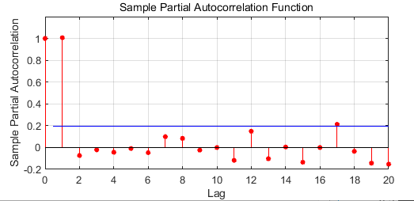
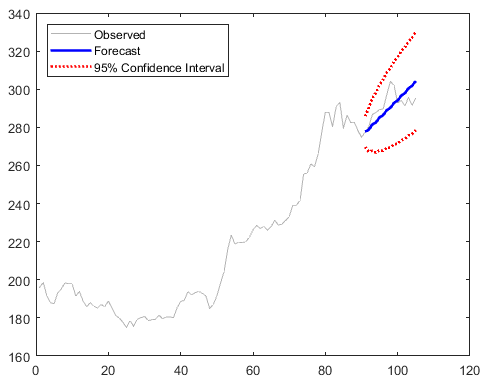

# 数据科学入门1.6：简单时间序列预测与总结

## Introduction to Data Science Part1.6: Time Series and Sumary
## 时间序列与ARIMA模型

刚才我们都是用几个independent variable x来与的dependent variable y。x和y都属于一次观测。如果我们只有一个变量就是y本身，然后不停的观测y的一个序列，然后我们想要预测未来的y值怎么玩呢？例如我们有一支股票他几个月以来每一天的收盘价，我们想预测明天的股票价格。

首先我们定义一下这个模型。对于一个随机事件，我们每个一段时间观测一次，或者每隔一段时间按顺序发生的一个随机事件，我们叫他随机序列。对于第t次观测值，我叫做 $y_t$ ，前一次就叫做 $y_{t-1}$ ，前一次的钱一次叫做 $y_{t-2}$ ，那么 $y_{t-k}$ 能够理解了吧。

我们首先搞个简单的模型叫线性自回归模型（auto=regressive model）

$$
y_t=c+\sum_{i=1}^{k}\beta_i*y_{t-i}+\epsilon
$$

这个能看懂吧，就是下一个y的观测值=之前k次的观测值的线性组合+上一个随机的误差。这个模型你想想你用我们之前学的知识可以做吧。

ok我们现在学一个更加复杂也是实际中用的更多的一个模型叫做ARIMA（auto-regeressive integrated moving average）。我这不是数学、也不是统计学课，我不将太复杂，但是我觉得基本的远离还是要熟悉一下：

一个ARIMA模型的表达式是(我移动了一下你们看着简单点)：

$$
(1-L)^dy_t=c+\sum_{i=1}^{p}\beta_iL^i(1-L)^dy_t+\left(1+\sum_{i=1}^{q}\theta_iL^i\right)\epsilon_t
$$

先讲几个算子：
1. lag算子：超简单就是$L^iy_t=y_{t-i}$
2. d差分算子：$(1-L)^dy_t$ y的d阶差分，d=1是 就是$y_t-y_{t-1}$，d是2的时候就是$(y_t-y_{t-1})-(y_{t-1}-y_{t-1})$，简单吧。

为什么这个重要呢就是因为，ARIMA模型中的AR之前介绍过了，I是integrated的意思，就是这个模型是加起来用的，他预测的是$(1-L)^Dy_t$，并不直接是y。

吗MA是什么意思呢？Moving Average的意思就是后面$\left(1+\sum_{i=1}^{q}\theta_iL^i\right)\epsilon_t$这一项代表模型预测与实际观测误差的一个线性组合。

为什么搞得这么纠结，当然是应为这样一般情况下更准一些，一本模型越复杂拟合的越好，你要记住的是p，d，q这3个超参数(我们后面会讲什么是超参数)。

好的我们做个例子，如我们  
>exp7 这里给出谷歌5个月的股价，我们来预测看看。

```matlab
%%fit the model
parcorr(exp7.price)
Mdl = arima(2,1,2);
model=estimate(Mdl,exp7.price(1:90))

%% forcast
[pred,ymse]=forecast(model,15,exp7.price(1:90))

% just plot
h1 = plot(exp7.price,'Color',[.7,.7,.7])
hold on
h2 = plot(91:105,pred,'b','LineWidth',2)
h3= plot(91:105,pred + 1.96*sqrt(ymse),'r:',...
		'LineWidth',2);
plot(91:105,pred - 1.96*sqrt(ymse),'r:',...
		'LineWidth',2);

legend([h1 h2 h3],'Observed','Forecast',...
		'95% Confidence Interval','Location','NorthWest');
hold off

```
首先我们先用parcorr这个函数看看，当前股价和过去几天的股价有没有什么关系，可以看到t-1和体关系很明显，后面的就不是很明显了，所以我们模型的p可以选1-2就够了，d一般都是选1，q的话和p选差不多一本也不错，其实p可以通过调用autocorr看在哪里cutoff来判断，不过这个数据不是很好参考意义不大。  

  

然后我们调用estimate来fit我们的模型。我这里要吐个槽，matlab不同工具箱，差不多的东西风格差异很大，这好蠢。我们用1-90填的数据来预测，再用forecast来预测，我们直接预测之后15天的股价走势。看看预测的还是挺准的。这个forecast返回两个东西，一个是预测值，实际上是一个期望值，还有一个是这个期望值对应的variance，然后你可以通过*1.96得到95%的置信区间，就是这个模型给出的分布，95%的概率在这+-1.96 * variance范围内。  


## 总结

ok各种简单的回归我们都学完了总结一下：
1. 首先如果可以把数据plot出来看看是什么规律，这个叫做exploratory data analysis，探索新分析
2. 然后根据前面探索的结果选择采用什么样的模型公式，一般情况下，简单的线性回归，多项式就可以了，如果你想不出来更好的就用这个原则。
3. 然后调用fit函数fit你的样本，得到一个模型。
4. 看看模型的adjrsqure，plot出来残差图，没啥问题的话就ok了。
5. 用模型的predict方法来预测吧。
