# 数据科学入门2.：机器学习介绍，以及更多回归

<!-- 
-->

## 机器学习的一些基本概念

OK，终于我门开始将机器学习了，不过实际上我门已近讲过了，如果大家还记得我门之前讲的线性回归的那些课程，那些就是机器学习。我们现在只不过是要学习一些更加复杂，以及更多类型的机器学习方法。

首先我门会开始介绍一些概念，事实上，整个课程中我们都会不断的引入一些概念，请大家注意哪些加粗了的字。

### 机器学习的种类

首先，我门可以发机器学习分为**监督学习**和**非监督学习**两类。但是要注意，机器学习问题并不只会有这两类，只是这两个是最常见的两种分法。

**监督学习（Supervised Learning）：** 就是我们的**模型**采用的训练数据是有**标签（label）**。就是所有的数据每一个样本除了**特征（feature）**以外，还有一个与之对应的标签。这个标签是这个样本的真实值（ground truth），也是我们模型要预测的目标。举个例子：

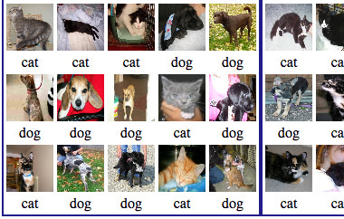  
*通过图片试别是猫还是狗*

比如用上面这一组照片数据训练一个模型，它可以判断照片里的是猫还是狗。可以看到这个训练数据中每一个照片下面都有一个字指出他是cat还是dog。下面的cat和dog，表明这个照片里面动物是啥，就是**标签**，我们根据照片要预测这个。而这个照片本身就是**特征**。用这一组数据训练出一个模型，就叫做**监督学习**。

监督学习的本质就是找到一个函数 $\hat y=f(x)$ ， $x$ 就是特征，$ \hat{y}$ 就是预测的目标，我们通过训练就是要找到一个f(x)可以把特征x隐射整标签y。

监督学习一般也可以分成两类，一个是**回归（regression）**，还有一个是**分类（classification）**。

**回归**： 就是之前讲过，他输出的预测值 $\hat{y}$ 是一个连续的数字，就是说 $\hat{y}$ 的取值值无穷多中的，比如预测明天的电量消耗，可以是100度也可以是100.25度。

**分类**：就是这个模型的输出值是一个有限的离散的量。例如个刚刚看到的猫狗，他只能给出这玩意是猫还是狗。有的分类给的是属于某个分类的概率，**但是，只要训练数据的标签是优先离散的，就是分类**。

这里再提一下，什么是**标签**，就是每个样本的真实值，**训练集**的里样本的标签所是已知的，用它来**训练(train，fit)**我们的模型。而**测试集**的样本对于模型来说标签是未知的，但是我们是知道的，所以可以评估这个模型的好坏。对于外来实际应用的时候，标签是没有的，就是我们要预测的。

还要说一下什么是**特征**，特征就是模型的输入，例如刚刚说的那个照片。特征里包含了有用的信息，这些信息可以帮我们**推测（inference）**出标签。对于电脑来说，他只认识数字，所以我们认为的特征，比如现状颜色图片声音这些，都要转换为数字，准确的说是向量或者矩阵。

**非监督学习（unsupervised learning）：**就是模型采用的训练数据是没有标签的，只有特征。那魔心怎么知道怎么学习呢？我们举几个例子

首先最典型的非监督学习就是**聚类（Clustering）**，例如下面这个例子：

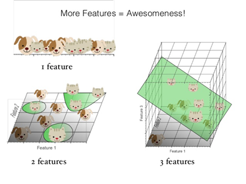

同样是判断一个东西是猫还是狗，但这一次我只给她图片，不给他标签，不告诉这个模型那个是猫还是狗。模型通过聚类分析，会把接近的分成一类。猫和毛长得都比较接近，狗也是这样。所以他能区分出这是两类物，但是不知道他们是什么动物。如果给他一个新的动物，他能把他归到其中某一类，但是他不知道猫狗这个概念。

其实除了监督学习，非监督学习还有别的机器学习种类，例如强化学习、异常检测、等等，这个课程暂时就不讲这些了。大家有时候听到深度学习概念，其实他只是机器学习的一种建立模型的算法，它可以用来实现上面各种类型的机器学习应用。

## 再讲一下回归

大家上次学了线性回归，和简单的回归以及它的基本原理，我们今天讲一下更加复杂的回归。首先大家要安装Matlab的统计与机器学习工具箱：Statistics and Machine Learning Toolbox。

然后我们看看下面这个问题：

>这里给出House Sales in King County, USA，就是2014年5月到2015年5月期间King County房屋交易的信息。有2万多条数据，还挺多的，King County华盛顿周，大城市西雅图就在King County。我们尝试建立一个模型预测房价。

首先这是一个什么机器学习问题？对了，是一个监督学习，回归问题。我们的特征是表格里面的bedrooms,floors,condition这些描述房屋的数据。而Price，也就是房价就是我们的标签。

### Regression learner基本操作

首先我们把数据导入到matlab里面。然后我们不写任何代码，打开统计与机器学习工具箱中的Regression Learner工具打开：

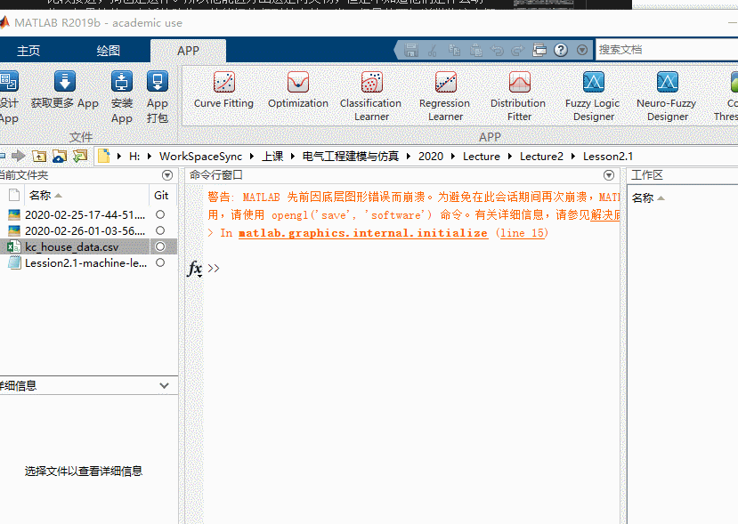

然后我们新建一个会话，在这里如下图，由于他是中文的，你要注意一下，那个响应就是我们的标签，我们选择Price。预测变量就是我们的特征，我们先都导入。然后可以看到，我们可以选择很多模型，然后可以选择特征，选好了我们就点训练，我这里选的全部模型，你们别这么选，这样非常耗时间。大家可能觉得有点莫名其妙你们先看看操作，我来给大家讲一下。

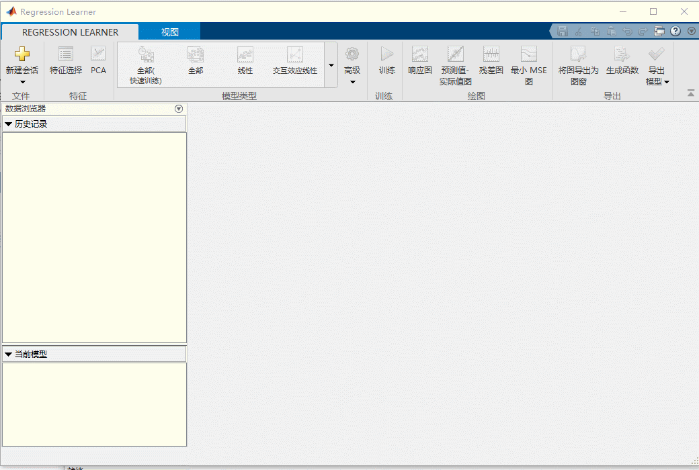

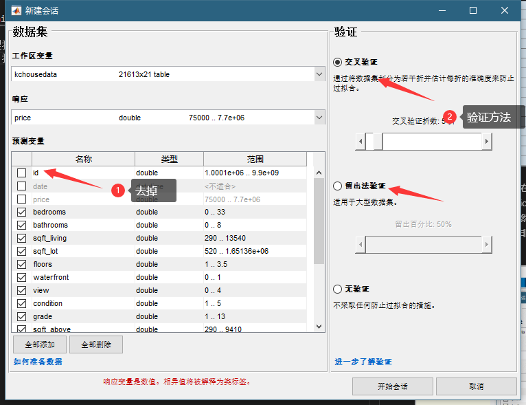

首先这里我门在选择特征的时候没有选id，那个只是个样本的标记，和房价没有任何关系，我们就去掉了，加上反而会影响我们预测。然后我们看到有个验证区域，这是为什么内？

### 过拟合问题bias variance tradeoff

我们再来将一些概念，还记得我们之前讲过的**过拟合over fitting**的问题吧？因为有些非线性的机器学习的模型很复杂，拟合能力很强，它可以很好拟合训练数据样本集，他在训练集上的误差可以降得非常低，就如下图，身高体重的关系：

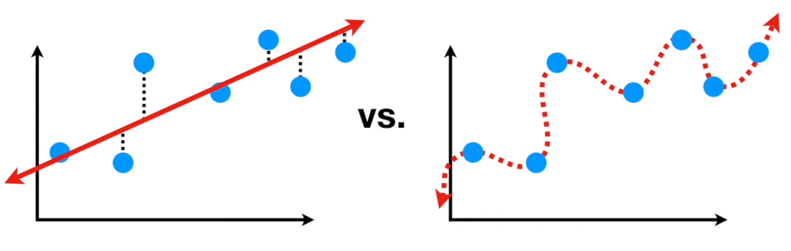

可以看到左边的一条直线这个模型很简单，所以面对蓝色的训练样本存在不少误差。但是右边这个扭曲的模型可以很好的拟合训练样本，误差为0

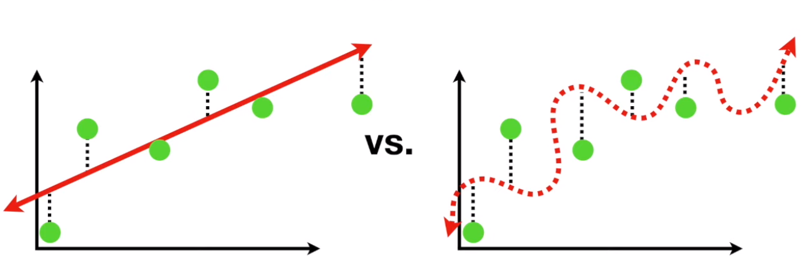

但是，如上图，如果我门给他一些新的数据让他判断的时候，左边模型还是有一些误差，但是和训练集上的误差相当，可以接受。但是右边那个扭曲的模型，就稀烂了，面对没见过的数据误差很大。这就是说右边这个模型出现了过拟合。一般来说月负责的模型越容易，拟合的性能越好越出现过拟合，这个就叫做**Bias variance trade off**。就是一个模型他如果有较强的Bias，就是它假设数据之间的关系越明显，例如上面直线模型假设身高体重是线性关系，那么他的训练你和的误差就越大，但是他的variance就小，就是他面对不同数据样本表现出来的预测性能变化不大。而一个模型bias小，它假设的关系少，那么它拟合的能力就强，训练样本误差就小，但是它面对不同的样本，性能变化就明显，可能会出现面对新数据性能很差的情况。

那我们是怎么避免这周情况呢？或者说我们是怎么在bias和variance之间找到一个平衡点的呢？有很多方法，比如把模型复杂度加到损失函数里面。我们这里用的是train/validation split的方法。就是把数据分为**训练集（train set）**和**验证集（validation set）**两部分。训练数据就用来训练，而测试数据单独留下来，用来对训练出来的模型进项验证。因为训练一般是一个迭代的过程，训练的越久模型在训练集上的误差就越小，但是可能在某个时候对验证集的误差开始上升了，这个就是一个过拟合的征兆，这个时候停止训练就可以了，如下图：

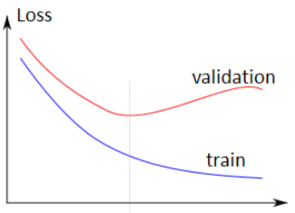

注意有时候我们还会加一个测试集，和验证集类似，这也是模型没见过的数据，但是他也不参与停止训练这个过程，这是和验证集最大的不同，我们就用测试集来评价这个模型的性能。在上面这个例子中，验证集就是测试集，因为这些模型都是直接训练到最优的。

再说下**交叉验证cross validation**，可以看到那个下面有个留出验证，这个就是我门刚刚说的，留出一部分数据作为验证集。那狡诈验证是什么意思呢？比如上面，我们把数据分成了5 folds，我们给这个每一分数据编个号，1-5。然后训练5次，第一次1-4训练，5验证，第二次1，2，3，5训练，4验证，如此，所有数据都尽力过了一次训练集和验证集，然后模型的性能用5个验证机的结果平均。这样应该更准确但是很慢，一本不会用在深度学习中。

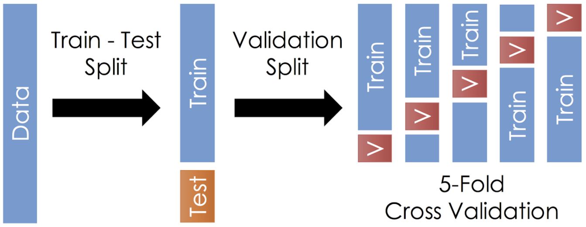

### 模型的选择与超参数选择

回到刚才的例子，下图中我门可以看到有很多模型可以选择

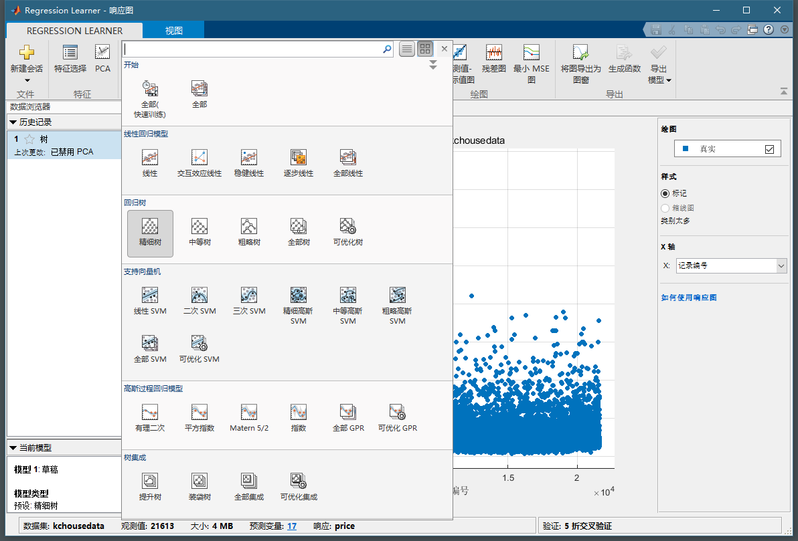

你们是不是都不知道这些模型是啥意思？没事，有时候做机器学习就是个黑盒，不用理解太多它内部的原理，只要知道怎么用就可以。我在这里也不多讲这些模型的原理。当然，如果你们知道其中的原理会更好一些，是一位后面还是简单的提一下。

我们可以选择一下看起来比较顺眼的模型，这个我们等会在具体讲选择的原则。然后注意选择一个模型以后，点击高级，会出现一个框，如下图。这个里面的叫做这个模型的**超参数hyper parameter**。超参数就是训练过程中不会改变的参数，你应该还记得什么是模型的参数吧。超参数是你根据经验设定好以后就确定的，超参数的选择一般是一个经验。当然他也需要你对这种模型有一定的理解。例如下面这个是一个**决策树**的超参数。一般来说超参数也可以决定这个模型的复杂程度，也就是决定他拟合训练数据的能力。这个不清楚怎么选可以自己探索试试。

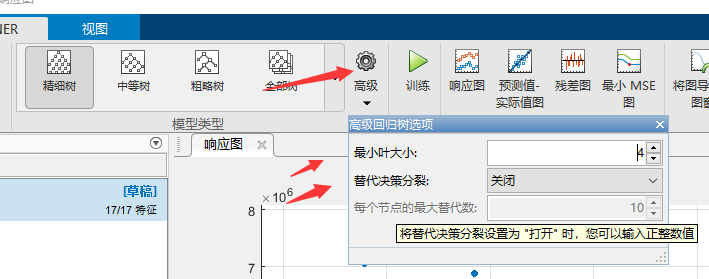

### 模型训练与评估

我们为了简单，模型选择全部（快速训练），点击训练，然后等那么一会，就能看到下面的结果：

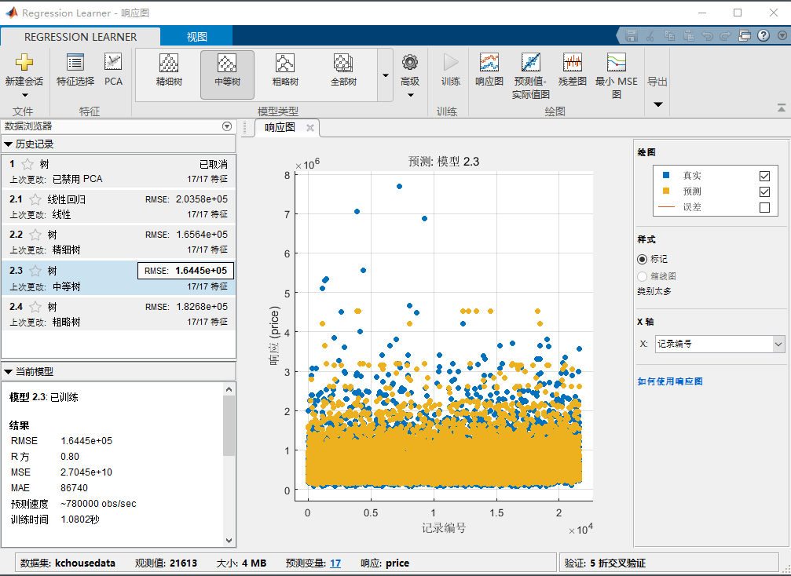

可以看到右边有没给模型的结果，那个RMSE就是root mean squared error， 是模型在测试集上的误差，这个越小越好。我们可以看到这个中等树的性能最好。在下面可以看到我们选中的模型的rsquare，是0.8这个已经挺高的了，说明我们模型还行。你可以选中不同的模型看看他的RMSE和rsquare来评价他。

然后这个还有更多评价的方式例如点击上上卖弄的预测值与试剂值图：

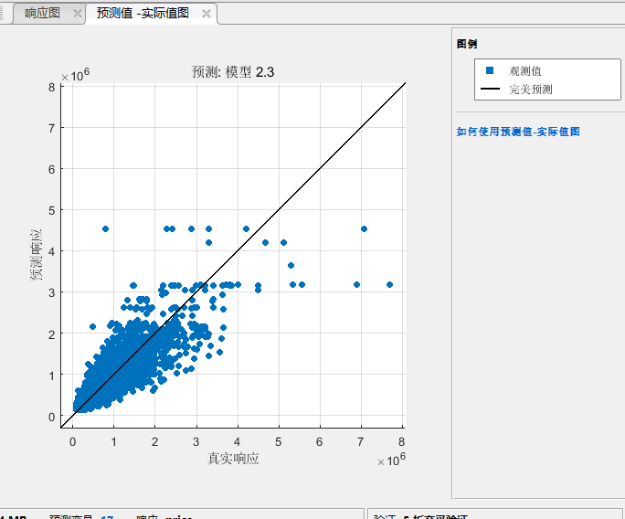

对于一个比较好的模型，那些蓝色的点应该尽量在黑色的线上，黑色的先代表了 $y=\hat{y}$。

然后还有残差图：

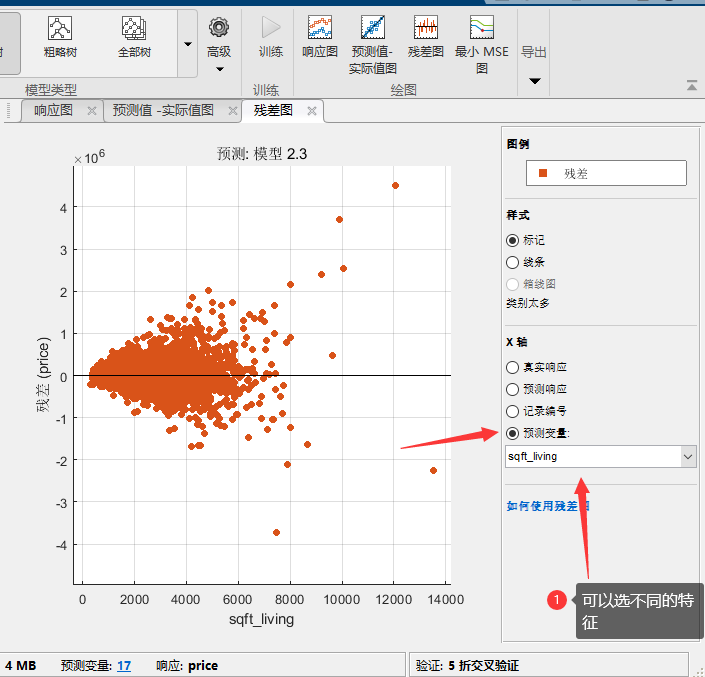

在这里我们一般把x轴选为预测变量，也就是特征，我们希望看到的是不同的特征的残差分布应该都符合，平均值为0，的一个正态分布，且不会这个变量变化。可以看到这个残差在不同的面积这个特征下，分布的variance变化还挺大，说明我们这个模型在预测面积比较大的房屋的时候预测的不是那么准，性能不太稳定。

### 模型的导出

现在我们有了个模型，那我们怎么用呢？可简单了我们在上面找到**导出模型**，点击导出模型。然后输入模型的名字，就可以在工作区看到这个模型了。

```matlab
%use the model to predict
predicted=trainedModel.predictFcn(kchousedata(5:8,:))

%print the real for compassion
real=kchousedata(5:8,"price")

```

可以看到输出：

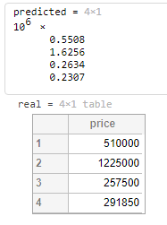

还是挺准的，注意我这里送进去的是一个表格的几行行作为测试。表格是自带标头的，如果你送向量进去注意里面元素的顺序要和这个表格对上也是可以的。

然后还可以将模型导出成函数，你就可以编写代码去训练他，从而实现如超参数搜索之类的任务。

### 特征的选取

然后我我们发现，我们特征选了17个，基本上所有的特征都选上了，这个不一定是好事。虽然来说特征越多信息也越多，可能模型会越准确。但是特征多了带来的第一个问题就是计算量变大了。如果你的数据样本很多特征也很多，训练一个模型可能要数小时甚至数天，关键是之前提到的超参数问题，你可能会要训练很多个超参数不一样的模型，从中选取最好的。而且，有些特征没啥用，至少和我们要预测的没有过关系，去掉以后还可以减少模型收到这些没用参数的影响，尤其是对于一些简单模型这个很有用。还有的特征之间有明显的关系，这种就是有信息的冗余，也是可以取消一些或者是采用PCA这种方法来提取新的特征。

先说一下特征的选取，首先我们找到响应图，一开始就有的：

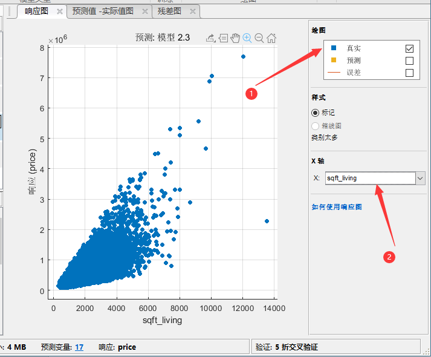

我们线选择只显示真实值，然后看到这个sqft—living生活面积和房价明显的关系，这个就是一个可以的特征。我们再看看建造年分和房价的关系：

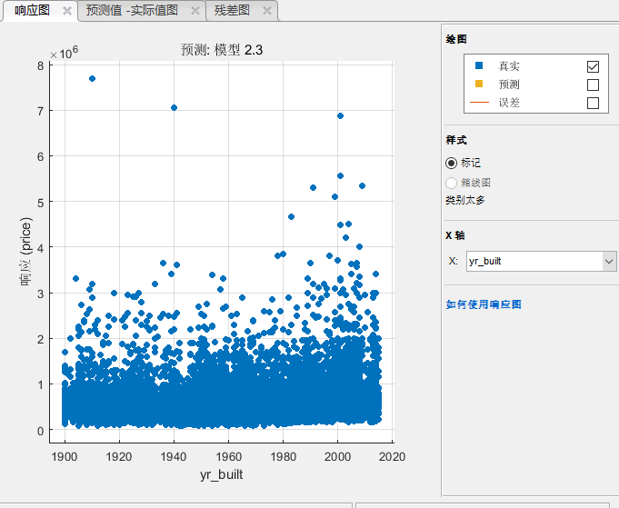

可以看到基本上是没啥关系的，这个估计没什么用。

你可以用`plotmatrix`来看看各种变量之间的相关性，之前教过的。要注意的是，不是这里显示的相关性不高就是不好的变量，因为有些模型非线性很强，他能发现一些不那么明显的关系，所以很扭曲的关系也是可以使用的，但是那种完全没噪声一样的没关系的可以不要。

我门现在去掉经纬度，建造年这些看看模型表现如何：我们发现去掉制造年分以后，效果变好了一点点，但是去掉经纬度以后效果变差了，尤其是决策数这种模型。经纬度和房价显然没有直接关系，所以线性的模型留着没啥用。但是决策树这种模型可以从今维度中得到很多信息，它通过经纬度的划分可以找到不同区域的房屋，某些区域的房屋加个自然就高。这就是了解你的模型和数据可以为你建模提供重要的知道。

以上这种通过预先判断特征和标签之间的关系决定这个标签有没有用的叫做**filter**类的特征选取。还有一种就是简单的把所有特征送进去，然后一个一个的去掉，如果去掉了模型性能没有变差，那么这个特征就是没用的，这种叫做wrapper类的特征选择方法，这种方法你可以编写程序自动的完成。

### PCA特征提取

有些时候有的特征之间是有联系的，但是之际请去掉某一个也不太好，例如卧式数量和面积是有关的，但是去掉一个以后模型性能下降明显。这个我们可以使用PCA来帮我们总这些特征中找到这些特征的主成分。它的原理就是下图：

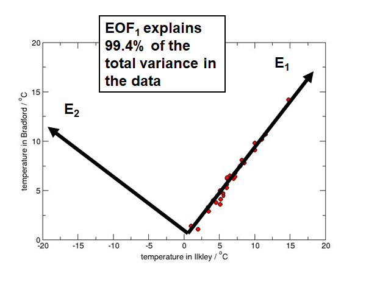

这个两个维度的特征，可以把它变换到新的坐标系下，E1E2。在这个坐标系下，原来数据大部分的变化都被保留再来E1上。而与他正交的E2，可以看到数据在这个轴上变化很小。所以数据99.4%的variance都在E1上表达了，因此E2的特征我们可以抛弃了。这样再将低维度的情况下可以保留原有数据的大部分信息。这个E1就是我们这个数据的第一主成分，E2就是第二主成分。

我们可以新的的特征解释多少，也可以指定降维到多少维度，就是去前多少个主成分。不过我们看到，大部分的模型结果都不行了，所以PCA也不是什么时候都是万能的，尤其是使用非线性很强的模型的时候，可以不用PCA，而选择合适的特征更加重要。

### 手动提取特征

有时候有些特征没有办法被送到模型里面去，因为模型只认识数字。例如例子中有个成交日期，它的类型是date，这个没有办法选择作为特征。但是我们直觉认为，成交日期也是会影响房价的，我们还是想用这个特征，于是我们就把这个变成一个可用的特征吧。

```matlab
kchousedata.soldOn=kchousedata.date.Year-2014+(kchousedata.date.Month/12)
```

上面这一行在这个数据表格里面夹了一列叫soldOn，他把日期辨证了一个数字，0-2代表2014-2015这中间的某一个月。原则上不同日期房价应该不一样。然后使用两种ensemble的树模型来训练，发现RMSE从1.403e5下降到了1.3869e5，提升还是比较明显的。

## 常见的回归模型的简介

这里并不是让你知道这些模型的原理，因为每个模型都可以将至少半小时，这个可没那个功夫。这里给你们讲一下他基本的intuition，你们大概知道什么情况选择什么模型，超参数怎么选择。

### 线性回归

这个我们之前就讲过好多了，就不多说了。线性回归是一个比较简单的模型，一般适用于数据特征和样本数都比较少的情况。线性回归属于bias很大的一种模型，因此如果样本的特征和标签之间线性关系比较明显的话，这个是个很好的模型，因为他的variance也很小。

### 回归决策树 regression tree

regression tree，是一种决策树模型，他用于分类比较多，当然它也可以用于回归。原理非常简单说一下：

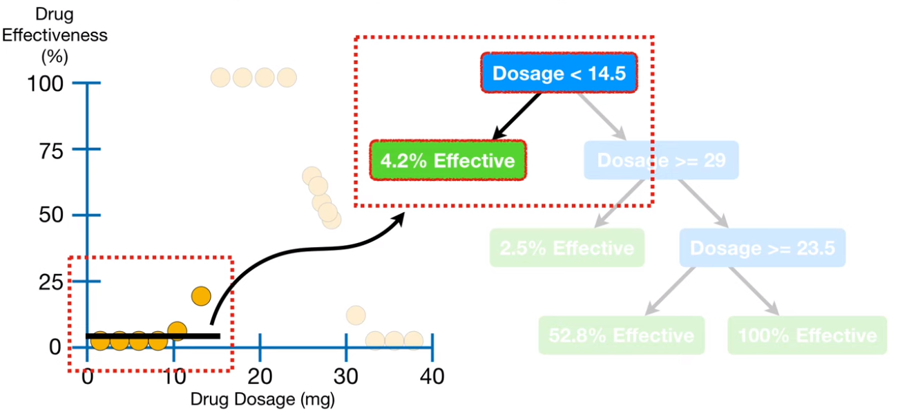

上面这个例子就是药量x和药效y的关系。决策树就是用一些条件把样本分开，图中蓝色的就是条件，绿色的是被分到这一类的样本对应的值。可以看出他把样本分类了，那怎么做回归内？他把这些绿色的叶子节点对应的样本对应的标签求个平均值就是对应的预测值了。所以虽然决策树做的是回归但是他的输出是不连续的。同时你也可以发现，只要条件足够多，决策树是可以把训练集里面的每一个样本都单独挑出来，这就没意思了，严重的过拟合了。所以决策树的超参数里面又一些限制条件用于限制树的复杂度。比如限制每个叶子节点最少包含的样本数，或者是树的深度等等。决策树是一类模型，有很多很多中，最常见的random forest，lsboosting，adaboosting之类的这都属于ensamble类型的树，大家可以在自己google一下。

### SVM regression

大家还会再那个模型选项里面看到SVM这种。SVM也是在分类里面用的比较多的，他是找到一个超平面（不仅仅是2维的平面，可能更高维度，低纬度直线或者是一个点）把样本分开。如果照这个超平面的目的原则是，这个平面到各个样本标签的距离最短不就得到了一个拟合。SVM的特点是它可以用一个叫kernel function的东西把样本维度提高。这样在低纬度找不到品面的时候在高维度空间可以找高，把第二度非线性为题变成一个高维度的线性问题。以上说的很简单哈。大家可以继续找Google详细学习。不过大家要知道的就是SVM regression有时候叫做SVR，是一个很强力的复杂模型，相比线性回归的话，所以线性回归搞不定的话可以试试。

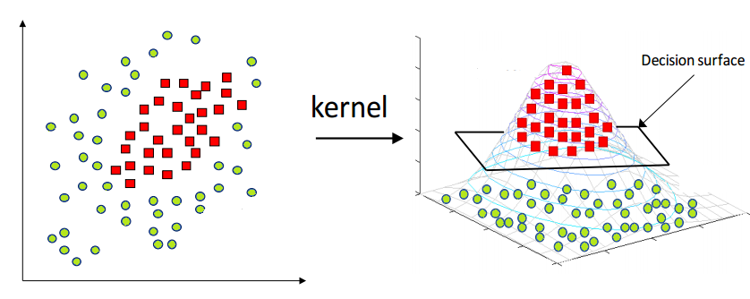


