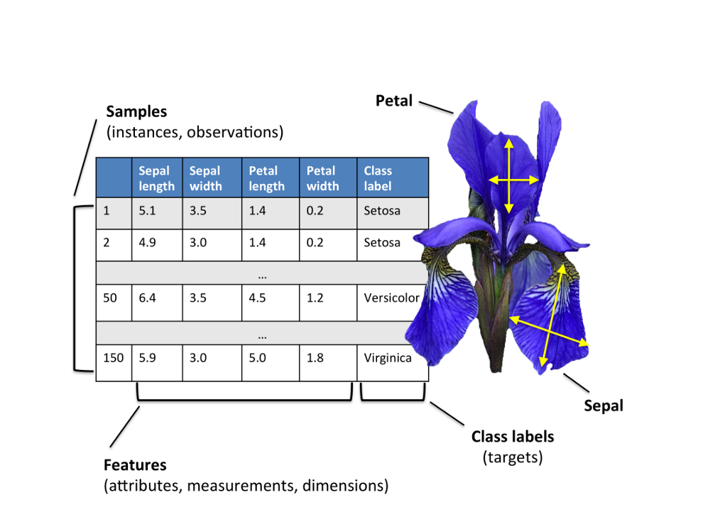
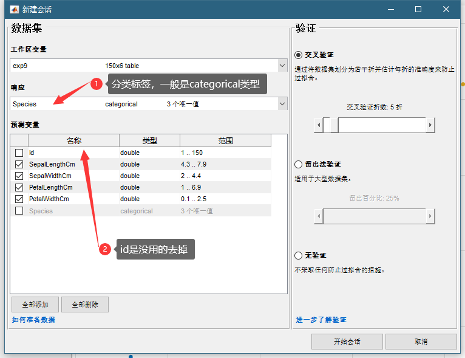
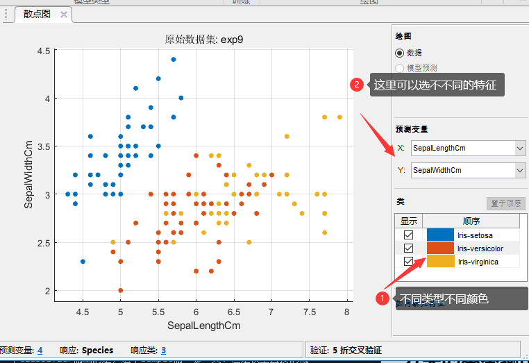
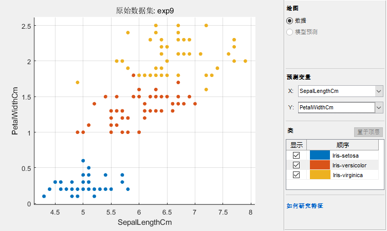
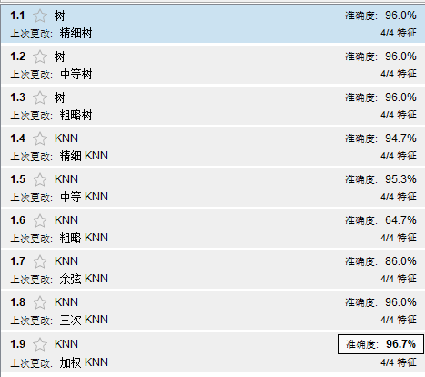
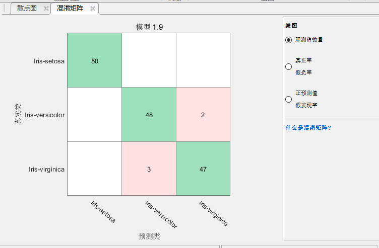
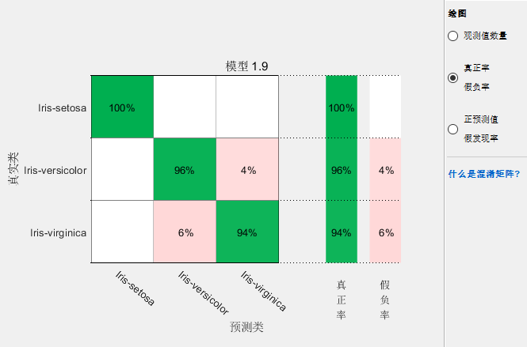
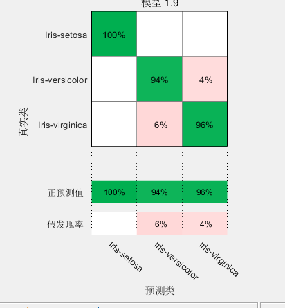
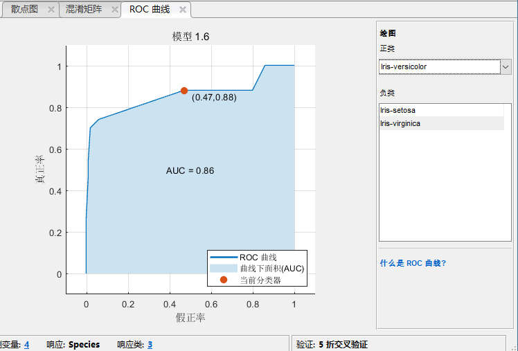

# 数据科学入门2.2.：简单的分类

<!-- keywords:建模与仿真;讲义;分类;MATLAB;机器学习; -->
<!-- description:初步介绍了分类这中机器学习的方法，介绍了如何在matlab中建立一个分类的模型，介绍了如何评估一个分类模型的好坏，还有一些非类中的重要概念，例如混淆矩阵相关的概念。 -->
<!-- coverimage: -->

就先前面说过的分类是属于一种监督学习方法，他和回归类似。最大的区别就是他的输出是离散的有限的。然后和回归不一样，我们以前讲回归目标是最小化MSE，二分类则不是最小化MSE，而实最小化一个别的分类误差。这个分类误差最易不同的模型会有些不一样，就像之前说的，你不需要太清楚模型的原理，不过知道还是会有好处。我们在讲一些具体的典型的模型的时候会讲一下这些模型优化的目标是什么。

## 分类和最大似然然估计

分类和回归不一样，他给出的事属于某个分类的概率。之前奖logistics regression得时候讲过这个时候要用最大似然估计。我们希望对于某个分类，模型给出来的概率分布得到观测值得概率最大。

对于机器学习，我们一般是用最小化一个误差这种方法来训练模型。对于观测值，它属于某个分类得情况只有0和1，就是属于和不属于某一个分类。我们可以把每个样本看成一个条件概率分布，我们希望我们的模型也和观测样本是同一个条件概率分布，那么我们就可以用某一个函数来测量这两个分布之间的距离，这两个分布之间得距离越小就说明他们越接近。这个距离我们一般用cross-entropy这个函数来表示。他是信息论里面一个概念，表示一种编码方式与这个信息本身之间得差距，这里比较复杂我们就不多讲了。

## Matlab Classifier learner
这里将一个简单的例子告诉大家怎么用matlab完成一个分类模型的建立：

>exp9 有一种类型的花叫iris，他有3中主要的类型：Versicolor，Setosa，Virginica，通过4个图特征，如下面的图可以将它们分开，做个模型试试吧。  
  
  

我们首把数据导入工作区，这个数据非常完美，不用做任何处理。再点击APP，启动Classification Learner。

这个大家都会操作我就不多说了，然后我们可以看到有很多classifiers可以选则，我们还是随便选一些，常用的一般就是KNN，SVM，决策树，Logistics Regression。在我们先选择之前我们先探索一下这个数据，在右边选散点图：

可以看到我们选了两个特征画散点图，为什么只有两个内？因为我2维的图看得比较清楚，3维的就看的不那么直观了，再比3为高得我们就没有办法画出来了。我们的数据又4个特征，我们只能选择2个话在一个平面上，看到有一个奇葩已经和另外两类分开了。

每个样本有4个特征，用一个4维的向量表示，向量所在的一个空间就是我们数据的特征空间。一般来说分来就是在这个空间中把这些点区分开。我们选两个特征画散点图就是从一个方向对这个特征进行投影，我们再换两个特征试试：

可以看到这回3个基本上都分开了。好我们训练一下看看： 

可以看到他给煮了每个模型的准确度？那那个模型最好呢？我们要评价一下。

## 分类模型的评价

之前说过，分类和回归不一样，他不是连续的数值，没有办法算MSE。例如我们给这三种花编号，1，2，3，对于1类型的花，我预测是3，和2都是错了，但是我如果用MSE的计算方法，2比3要做的少一些，这显然是不科学的。所以我们要有个更加科学的评价方式。

### confusion matrix 混淆矩阵

这个是分类最重要的评价法方式，我们继续上面的例子点击一个训练过的模型再点击混淆矩阵：

这个混淆矩阵使用观测值现实的，解释一下，左边纵轴是真相，下面横轴是我们预测出来的值，可以看到对角线上就是真相和预测值匹配上了的。可以看到setosa有50个，为我们全都判断对了，但是有48个versicolor我们判断对了，但是有2个我们的模型认为他是virginica。我们的模型还认为有3个virginica是versicolor。现在明白了混淆矩阵的意思了吧？

其实看这个样本数还不靠谱我们把右边的圆点切换到第2，3个试试：

这个可以看到假真绿（这什么鬼翻译，我打了半天打不出来）和贾福履，分别是True Positive Rate（TPR）和False Negative Rate（FRN）首先说。首先是所positive是什么意思，对分类A来说positive就是A，Negative就是不是A。TP是真相是A，你预测也是A，FN就是真相不是A但是你说他是A。可以看到TPR+FNR=1，这个很显然吧：

$$
TPR=\frac{TP}{P}=\frac{TP}{TP+FN}=1-FNR
$$
$$
FNR=\frac{FN}{P}
$$

TP+FN就是所有真的样本，就是你判断出来的真的，和你没判断出来的真的。TPR又叫做Sensitivity，Recall。

但是对于一个Classifier来说光有一个TPR是不够的，就好像你如果才所有的都是A这一类，你的TPR很高，但是那些不是A的你也认为他是A，也是一宗错误。所以我们还有个概念交False positive rate，FPT，如下面的图

这个可以看到我们对virginica的FPR是4%。false positive就是他不是virginica，我们错误的以为他是。就是本来不是positive的我们认为他是。FPR公式如下，和它对应的叫做True negative rate，也叫做specificity：

$$
FPR=\frac{FP}{N}=\frac{FP}{TN+FP}=1-TNR
$$

对于一个classifier来说要有搞得TPR，同时要有底的FPR（高得TNR），这两个是矛盾的。有句话交不放过一个坏人，也不冤枉一个好人。假设找坏人是目标，坏人就是positive，不放过一个坏人就是提高TPR，不冤枉好人就是降低FPR，显然你坏人标准越底，越容易抓住坏人页容易冤枉好人。

### 精确度

我们classification learner里面模型训练出来现时的accuracy是一个很粗略的概念，他是所有有分类的TPR+TNR求平均，这个得分并不是越高越好。你要根据你的需求选择。有时候你需要不放过一个好人，允许冤枉一些好的人时候就应该选TPR高一点的模型。如果不冤枉好人是你的重点你就应该选择FPR底的模型。

### ROC图

还有一个就是ROC图，这个表现得是一个模型在不同的阈值下，TPR和FPR的变化，可以看到确实时一个大另一个就小，对于不同的模型来说，分类的阈值是不一样的，所以什么改变roc图里面的TPR，FPR这个是matlab自己操作的，你不用操心，你只关心TPR，和FPR这连个数字合不合适就可以，这个点肯定是越接近左上角越好。

## 练习

大家可以把上次logistic regression里面做的泰坦尼克生存率的例子拿出来用今天学的方法再做一下。