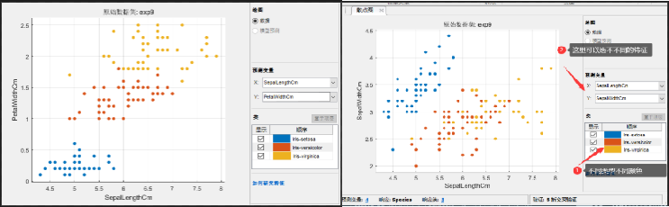
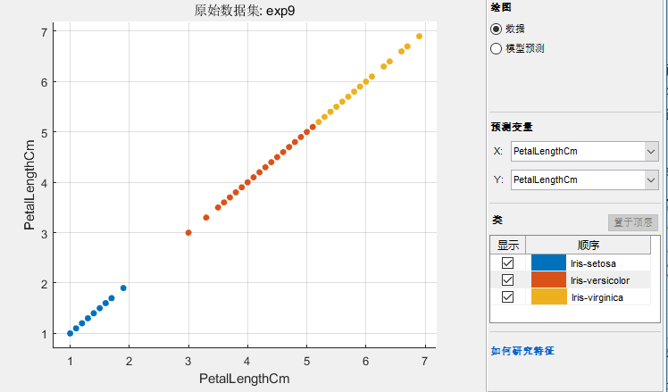
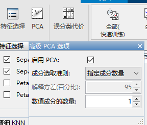
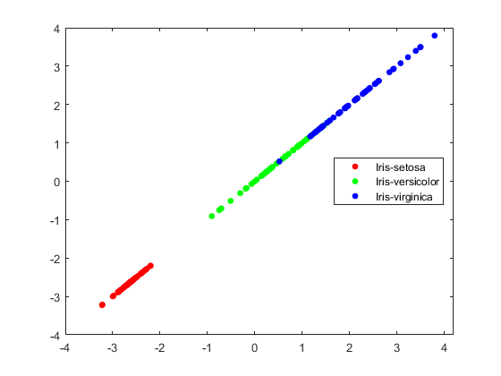
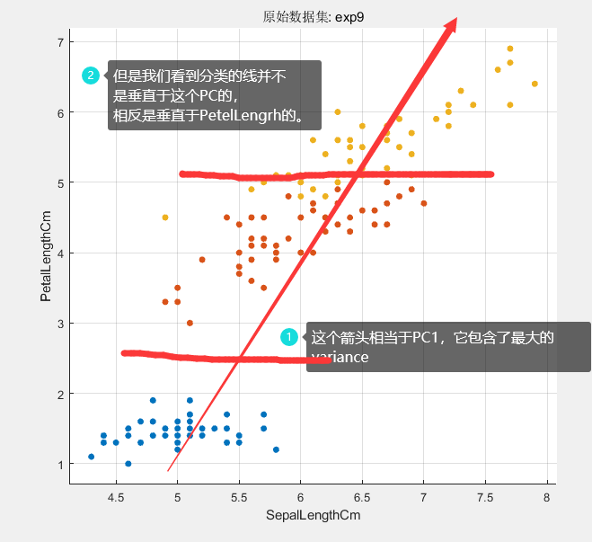

#  数据科学入门2.3：特征的选取和PCA

## 选取

之前回归的时候已经讲过一次怎么选择特征以及PCA了，这里讲一下不一样的地方。回归是通过特征和目标之间的关系判断这个特征有没有用，分类这一条依然管用，但是分类还有一个玩法，就是在特征空空间上看看那些特征可以直接把样本分的比较远.

还记得我们之前看的散点图把？



可以看到左边的三种颜色的点基本都分开了，二右边的黄色和红色就没有太分开，这样如果只允许选两个特征的话，左边那两个就要好于右边那两个。我试了一下，左边那两组训练出来的结果和4个特征基本没区别精确度可以到96.7%，而右边那两组特征最高只能到78%。

我们甚至可以看到，只选择PetalLength这一个特征的时候，三种也区分的很开，你们可以试试，这一个特征和4个特征比下降并不大。



## PCA

之前讲过PCA，这个例子其实比较和是，因为有的特征基本包括了大部分的variation，我们来试试。首先我们选择PCA，然后选择降维到1维，看看效果：



发现，还不如上面我们仅仅只保留1个petalLength特征效果好，但是很接近。这说明做数据科学一定要根据实际情况多试试，不要想当然。

我们在这里详细讲一下Matlab PCA怎么用：

```matlab
%% PCA
X=exp9{:,2:5}
[coeff,score,latent,tsquared,explained,mu] = pca(X)

% variance is latent and is explained
la=latent./sum(latent)*100
explained

% manual transform
sc=zscore(X)*coeff
% the transformed
score

%% plot
gscatter(score(:,1),score(:,1),exp9.Species)
```

上面这个代码只一个PCA的demo，很self explaining。原来的数据是X，要注意的是输出的coeff是变换的矩阵，输出应该是X*coeff。PCA输出的变换结果是score。你会发现这两个对不上。这一因为matlab把X标准化了以后在做的变换，就是把X里面每一个特征都减去他这个特征的品均值在除标准差。所以我们发现 score=zscore(X) * coeff。

然后我们可以看到latent代表了买个主成分（PC）的variance，其实这个和explained是一回事。最后我们如果想知道原来哪个变量对某个成分的贡献程度需要看coeff矩阵。如果你只打怎么变换的你就会发现，coeff每一列对应一个PC，其中第几个元素最大就说明原来哪个变量贡献大：

```
coeff = 4×4    
    0.3616    0.6565   -0.5810    0.3173
   -0.0823    0.7297    0.5964   -0.3241
    0.8566   -0.1758    0.0725   -0.4797
    0.3588   -0.0747    0.5491    0.7511
```

我们可以看到第一列里面0.8566，第三个变量最大，我们回头看数据发现就是PetelLength这个特征。然后我们画出图来看看：



可以看到这个分类还不如直接用petelLength，这是为啥呢？下面一个秃鹫解释了：



结论就是并不是所以并不是所有的variance都对分类有贡献的。