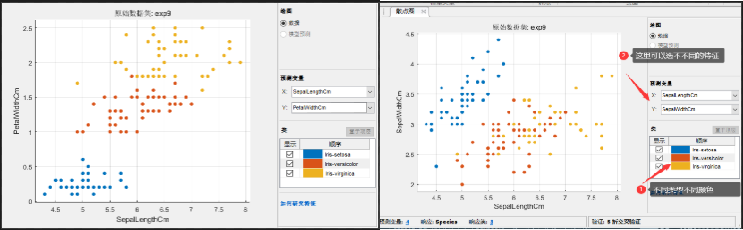
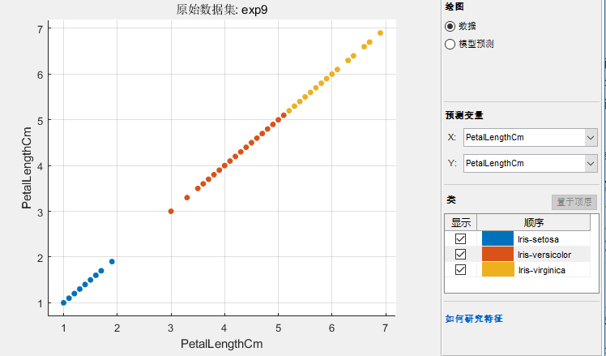
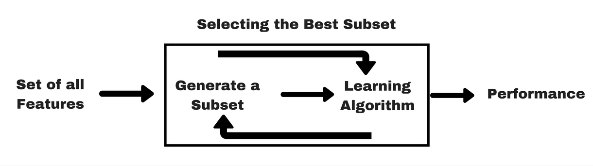
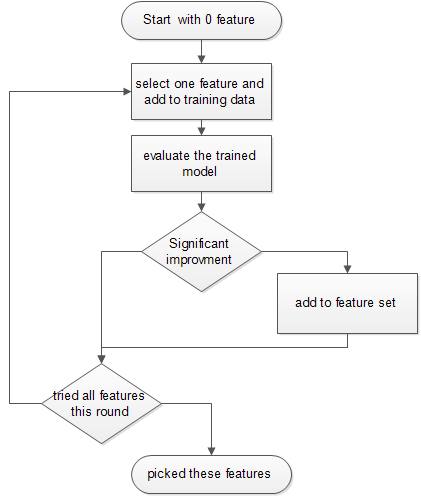
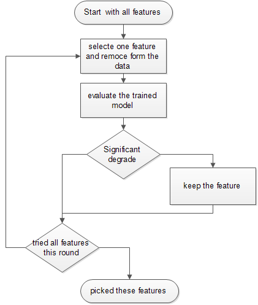
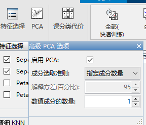
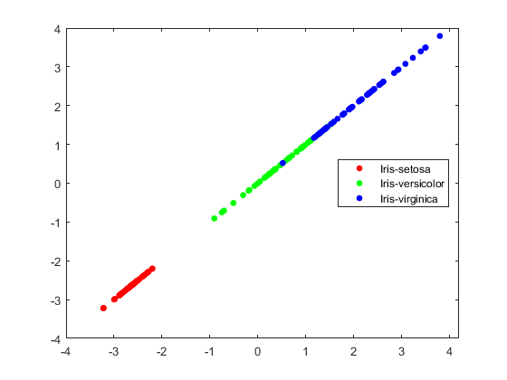
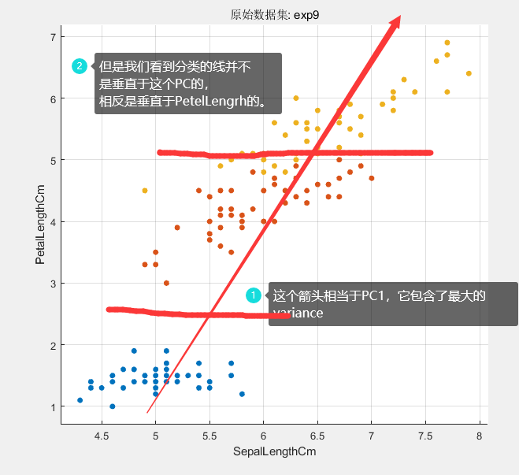

#  数据科学入门2.4：特征的选取和特征提取（PCA）

<!-- keywords:电气工程建模与仿真;机器学习;特征提取;特征选取;PCA;讲义;Matlab; -->
<!-- description:讲了很累起的输出是什么样子的，什么食One-hot编码。讲解了基本的分类模型大概怎么选择，超参数大概的意义，和一些分类模型的基本的原理 -->
<!-- coverimage: -->


## 为什么要选取或者提取特征

对机器学习来说最重要的就是数据，税局中最重要的就是特征。如果你的数据中有乱七八糟的，有干扰得东西，那么你训练出来的模型也会乱七八糟。所以我们在直接把数据送到模型里面去的之前我们经常需要处理一下我们的特征，去掉没用的，留下有用的，甚至制造出一些新的特征。特征提取或者选取得主要目的如下：

1. 减少计算得复杂度让模型训练起来更快
2. 减少过拟合得可能，提高泛化能力
3. 引入我们对数据得理解，提高模型精确度（feature extracting，feature creation）
4. 减少干扰，提高模型的精确度
5. 简化模型，让模型可以变得能够解读

## 特征的选取（Feature selection）

特征选取就是选择对你预测有用的特征，而扔掉没用的。通常有两类方法，一类叫作Filter，另一类叫做Wrapper。我们这里不讲具体的怎么实现这两种方法，应为他有很多种实现方法，我们就像一下他的基本概念，和最基本的一些例子，然后你自己就会用了。

### Filter Method


这个就是如上图，你一开始有所有得特征，然后你根据某个原则来选择有用的特征。例如我们讲过的可以通过correlation，就是相关系数来判断，相关系数接近于1得一本就是好特征，接近。得就不是好特征。这个大家都知道。但是这个只能判断两个连续变量之间的有没有关系。如果特征是类型变量，或者标签是类型的变量，那么我们就要用例如Anova或者Chi-testing之类的方法了，这个我们就不讲了，

还有一种方法就是EDA里面的把数据画出来，我们用眼睛看看，这个可以做到类似Anova的效果，不过更加简单直接。我们看下面的例子。

还记得我们之前看的散点图把？



可以看到左边的三种颜色的点基本都分开了，二右边的黄色和红色就没有太分开，这样如果只允许选两个特征的话，左边那两个就要好于右边那两个。我试了一下，左边那两组训练出来的结果和4个特征基本没区别精确度可以到96.7%，而右边那两组特征最高只能到78%。

我们甚至可以看到，只选择PetalLength这一个特征的时候，三种也区分的很开，你们可以试试，这一个特征和4个特征比下降并不大。



### Wrapper Methods

这个方法也比较好理解，就是一开始你有很多特征，然后你去选择几个训练模型，看下过怎么样，如果好就留下不好就换一组。



一般有几个套路哈，比如从只用一个特征开始，你尝试所有的特征，选择最好的一个留下，然后在开始尝试2个特征，再加入上一轮种第二好的，如果结果有提升就留下，没有提升或者提升很好就换一，直到你得到最好的一个2个特征得模型。然后你再尝试3个特征，同理，但是如果你增加特征，不管增加哪一个特征，结果提升都很小，那么就说你你现在得特征set，已经可以了结束选择。



或者和上面正好反过来，一开始你有所有的特征，然后一个一个去掉，当去掉某一个影响不大时，那他就可以被去掉，如果去掉某一个影响很大的时候，就说明他很重要要留下来。



上面只是两个方法举例，大家可以自己根据实际情况自己实现类似的特征选择的方法。还有一点就是有时候，深度学习的一些方法，对特征选择并不是太敏感，你可以用的domain knowledge把没用的特征去掉，然后使用剩下全部的特征训练。

当然以上都不是绝对的，机器学习建模有时候像一门艺术，不是技术，需要你玩的多了就有感觉了。

## 特征提取和PCA（Future extraction and PCA）

之前讲过PCA，这个例子其实比较合适，因为有的特征基本包括了大部分的variation，我们来试试。首先我们选择PCA，然后选择降维到1维，看看效果：



发现，还不如上面我们仅仅只保留1个petalLength特征效果好，但是很接近。这说明做数据科学一定要根据实际情况多试试，不要想当然。

我们在这里详细讲一下Matlab PCA怎么用：

```matlab
%% PCA
X=exp9{:,2:5}
[coeff,score,latent,tsquared,explained,mu] = pca(X)

% variance is latent and is explained
la=latent./sum(latent)*100
explained

% manual transform
sc=zscore(X)*coeff
% the transformed
score

%% plot
gscatter(score(:,1),score(:,1),exp9.Species)
```

上面这个代码只一个PCA的demo，很self explaining。原来的数据是X，要注意的是输出的coeff是变换的矩阵，输出应该是X*coeff。PCA输出的变换结果是score。你会发现这两个对不上。这一因为matlab把X标准化了以后在做的变换，就是把X里面每一个特征都减去他这个特征的品均值在除标准差。所以我们发现 score=zscore(X) * coeff。

然后我们可以看到latent代表了每个主成分（PC）的variance，其实这个和explained是一回事。最后我们如果想知道原来哪个变量对某个成分的贡献程度需要看coeff矩阵。如果你只打怎么变换的你就会发现，coeff每一列对应一个PC，其中第几个元素最大就说明原来哪个变量贡献大：

```
coeff = 4×4    
    0.3616    0.6565   -0.5810    0.3173
   -0.0823    0.7297    0.5964   -0.3241
    0.8566   -0.1758    0.0725   -0.4797
    0.3588   -0.0747    0.5491    0.7511
```

我们可以看到第一列里面0.8566，第三个变量最大，我们回头看数据发现就是PetelLength这个特征。然后我们画出图来看看：



可以看到这个分类还不如直接用petelLength，这是为啥呢？下面一个图就解释了：



结论就是并不是所以并不是所有的variance都对分类有贡献的。