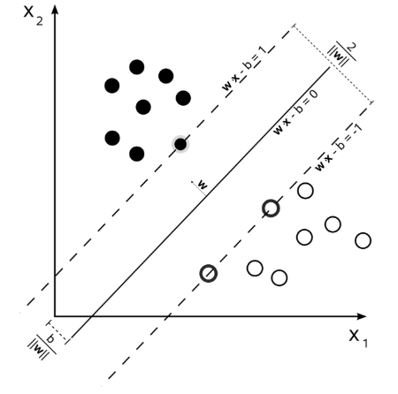
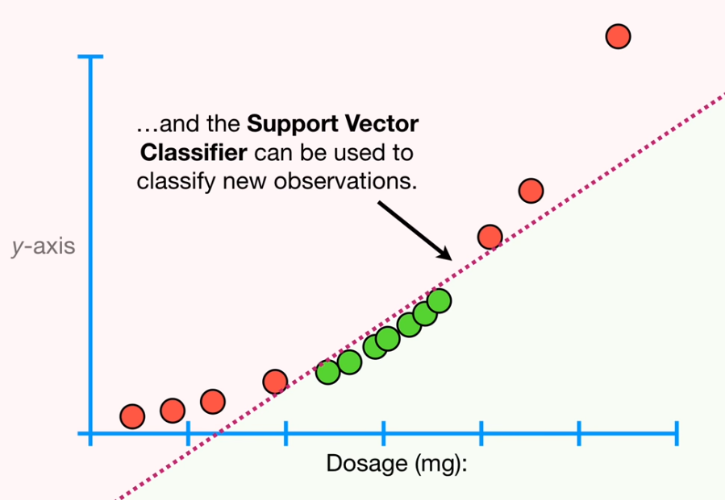
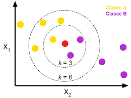
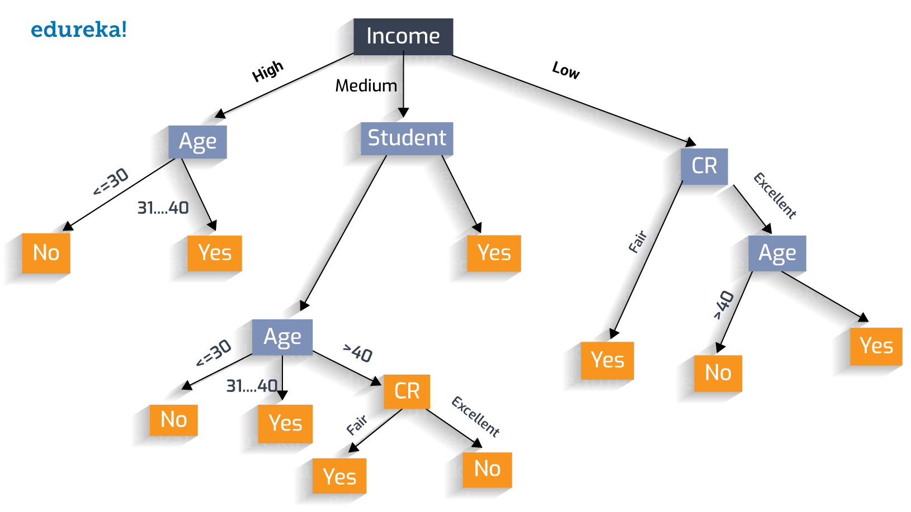

<!-- keywords:机器学习;分类;讲义;Matlab; -->
<!-- description:讲解了基本的分类模型大概怎么选择，超参数大概的意义，和一些分类模型的基本的原理 -->

# 数据科学入门2.4 分类模型的选择

## classifier的基本输出

回归的术赤很简单就是一个数字，代表预测的值，那么分类模型给出的这个东西属于哪一类是以什么形式给出来的呢？  

最终一个classifier输出的是，这个sample输一哪一类。但是模型直接的输出一般不是的。一般来说有两种，首先是对于binary classifier（只能把一个东西分为两类，比如是狗，不是狗）来说，他输出的一般是一个标量，代表它属于某一类的概率，如logistics regression里面他输出的是属于某一类的概率，就如同下面这个公式，以前出现过的：

$$
\ln(\frac{P-Class1}{P-Class2})=B1+B(2:n)*X
$$

这个输出如果>0那么就是Class1，如果小于0就是Class2.

对于SVM这种来说也是类似，他输出的也是一个数字，如果>0代表是一类，如果<0代表是另一类。

然后如果对于其他的可以输出多种类型的classifier来说，他们输出的可能是这个sample属于各个类的概率，如区分猫狗猪三类，他的输出可能是[0.1，0.1，0.8]。这个就是one-hot编码类型的输出。one-hot指的是标签的编码方式，比如在上面的例子中一个sample，他的标签是猪，那么她one-hot编码就是[0,0,1]。各个模型输出的预测[0.1，0.1，0.8]也表示模型认为这个sample最可能是猪，因为最后一个值最大，可以看到全部加起来是1，输一这个是以概率分布。我们页用下面这个公式表示这个模型输出的分类

$$
class=argmax(\hat{Y})
$$

就是Y中最大值的位置 $argmax([0.1，0.1，0.8])=3$ 。这种在分类为提的模型中，大家会进经常看到。

## 分类模型的选择

首先我们可以访问一下这里：

https://www.mathworks.com/help/stats/choose-a-classifier.html

为啥呢，因为matlab里面的classifier十有限制的，不是所有的数据都兼容的，所以你要先看看。

然后再就是如果你的数据较少尽量采用线性的模型和logistics regression。如果数据比较多可以使用knn和tree或者ensemble的模型。如果你的散点图画出来感觉用一条直线，或者曲线就可以比较干净的分开，就比较是和SVM的模型。

我们带式简单讲几个默芯的原理，对大家在机器学习的路上走得更远也是有帮助的：

### 多个分类是怎么实现的？

这个我之前讲过了，logistics regression是一种binary classifier，他只能分成两类，SVM也是。那多个分类怎么办呢？

这个时候又两种策略，一种是one-vs-rest（one-vs-all）。就是加入要分3类，A、B、C。那么我就做3个classifier，区分是A，不是A……这种。三个分类其中哪个给出来的概率最高就用哪个结果，比如他给出80%是A，20%事B，60%是C，那么最终结果就是A。

还有一种是one-vs-one的classifier。就是我搞C(n,2)个classifier，（A，B），（A，C）（B，C）。这种然后他们票，最多的赢。如果前两个都说是A，第3个是B，那么结果就是A。

两种有什么区别呢？首先第一种，存在一个问题，就是当种类比较多的时候，一个类的数据相比其他类型的数据可能要少很多，例如ABCDEF，6类，每种都是10个样本，A是10个，非A有50个，这样数据不平衡会影响模型的准确性。

如果是第二种的话，没有前面的问题，但是模型数量会增多，肯能会增加计算量，但也不一定哈，因为每个模型输入的数据也少了。

### logistic regression

之前讲过这个，这个是用的最大似然估计。分类器不是最小化的MSE，logistics regression是最大化likelihood。什么是likelihood呢？这么理解，样本是一个概率分布产生的，我们的模型是一个概率分布 $P_\theta$ ，调整这个概率分布的参数 $\theta$，使得模型的概率分布产生我们观测样本的概率最大。

$$
\hat{\theta}=L(X|\theta)=\sum_{i=1}^{n}logP(x_i|\theta)
$$

就是要找到一个 $\theta$ 让 $L(X|\theta)$ （likelihood function）最大。大家记住这个原理后面各种机器学习基本都用到这个原理。

### SVM，Support Vector Machine，支持向量机

SVM就是在样本中找到一个点、一个直线、一个面、或者是超平面（高于3维）
在样本的特征空间中把样本分成两类。为什么要交SVM呢？应为哪个超平面不是十有样本决定的，十有一组support vector（SV）决定的。这些样本就是最难区分的，处于边界上的点。SVM就是要让这个超平面到这些SV的距离最大。如果这个问题是可分的，可以找到无数个平面把样本分开，SVM找的是最优的，就是最大化到那个平面最近的点的距离。

对于不可分的问题SVM可以通过kernel函数把样本转换到高维度的空间中，如下面这个例子：

上面这两类在1维空间上就找不到一个点把他分开，这个时候我们加一个维度y轴=x^2，这样如下图，我们就可以把这些点分开了：

SVM的超参数有kernel的类型，不同的kernel可能会有自己的超参数，然后还有个Regularisation，用来设置模型对误差的容忍度，因为不会找到一个完美的平面把样本分开，肯定会有一些错误是被允许的，这个越高模型拟合训练数据的越好，但是容易过拟合。

### K-nearest neighbors

这个模型直接就能输出多个类型，不是binary的classifier。它是基于距离的一种分类器。和他的名字一样，一个未知的样本，他与哪个距离近就属于什么类型。K是找到离他最近的k个样本。就是这个样被周围，什么类型的点多那这个样本就是什么类型的。

具体的，先计算未知样本于一直样本是有点的距离，然后按照距离排序，选出最近的K个，这K个里面哪种类型的多那么这个点就是这个类型的。

可以看到K值会直接影响结果，k=3的话，这个未知点是紫色类，k=6的化他是黄色类。KNN的超参数有K，还有距离的算法，还有距离加权，比如距离比较远的点，他的vote要少一些，只能算半个点之类的。如上图，虽然有几个黄的，但是他好远，所以权重小，结果可能还是紫的。

KNN还可以用来做回归，就是把这K个点的标签秋平均就是回归的值。

### Decision Tree，ensemble of tree

这个好简单，就是根据一个特征，用它的范围把样本分类，比如>10是A类，5-10之间是B，小于5是C，然后再增加一个特征再分。就如同下图：

可以看到这个树很大，很详细。如果不加限制一个树可以把每个样本都分出来，这显然是过拟合了，所以要限制一个树的调价节点的个数和深度。树的深度、节点数就是书的超参数。

然后还有一种叫做ensemble的玩法，就是建立很多很多很小的树，每个都会输出一个分类，然后通过加权投票决定最后的分类，具体的就在这里多讲了。