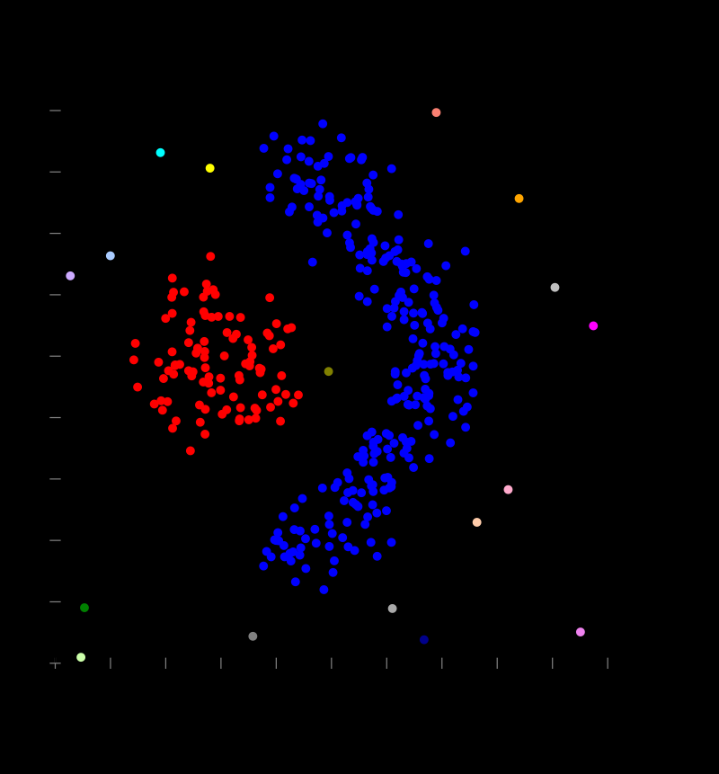
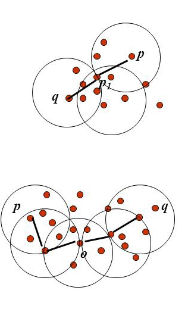
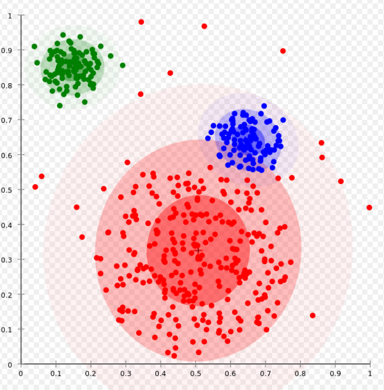

<!-- keywords:聚类;机器学习;讲义;Matlab;k-means; -->
<!-- description:这里讲了最基本的K-means聚类的方法和基本原理以及matlab中的用法。 -->

#  数据科学入门2.4：基本的聚类


## 啥是聚类

聚类是一种非监督学习，他和分类不一样，分类的训练数据中每个样本是有标签标注了他是属于哪一类的，我们明确的是知道有哪几类。而聚类不一样，我们只有一堆数据，并不知道这些训练数据分别属于哪一类别，甚至完全被不知道有哪些类别（有时候可以知道）。聚类就是根据这些样本的特征把比较像的归为一类。比如你上网易云音乐或者什么别的软件的时候，他的推荐算法会对你进行聚类，把你和某些人归为一类从而给你推荐这些人喜欢的歌曲。

聚类一般是基于样本在特征空间的距离的。还记得我们以前讲的一个样本的特征就是向量，这些向量可以构成一个特征空间。这个空间中距离比较近的样本我们认为他们就是一类。


聚类有很多种玩法例如:

1. Connectivity based   
   这种办法就是任务距离考的进地两个点就被连起来了，成为一个cluster，距离远的够不着得就是另一个cluster，这种方法一本不用指定有几个cluster，他会自动的得到cluster得数量，你要指定的时链接的最远距离

   

2. Density based  
   这种玩法时认为一个cluster是由足够密集得点组成的，你定义一个半径，和点数，如果某个样本在这个半径之内有这么个多点，那天就能成一个cluster，如果不能就单独一个cluster，这个也是不需要指定cluster个数的。



3. Distribution based  
   这种玩法是认为同一个cluster得点是同一个distribution产生的。我们定义几个distribution，让这些点为是某个distribution产生的概率最大化，就得到了cluster了。



4. Centroid based
   这个就是我们今天着重要讲的K-Means这种方法得原理。

我们今天只讲简单的K-means，其他的大家可以下去自学。

## k-means clustering的基本原理

之前讲过了k-means是基于距离的，Means就是平均，就是几个点距离的平均的意思，也就是这些点的中心（centroid），K是分为几类。我们们用1为数据举个例子：


1. 确定分为几类，k=？我们这里让k=3
2. 随便选择3个样本点作为3个类型的重心


3. 计算每个点到这些重心的距离，离哪个近就属于哪一类


4. 根据这个聚类的结果，重新计算每一个类型的重心，可以看到目前聚类结果不咋样


5. 用这个新的重心重复3-4步，直到重心不再变化位置


6. 评价这个聚类的得分：
$$
   se=\sum_{k=1}^{Clusters}\sum_{i=1}^{n}D_{ki}
$$

这个就是总的误差，就是每个点到他自身cluster重心的距离求和，再k一定的情况下，这个值越小越好。k-means即使取同一个k，由于初始的重心是随机的，每次算一遍结果也可能会不同。但要注意这个k只能在se只能在同一个k的情况下比较，显然随着k的增大，se会减小的，假如k=n，就是每个点自身就是一类，那中心就是本身，se=0。

### K如何取值

这个有很多种办法，最常见的就是根据我们的目标。比如把学生分为听话的和不听话的，那么K就是2，把明星分为男、女、不男不女，那么k=3。

有些事后我们啥也不知道，怎么办？那就用elbow method。这是怎么玩呢？我们就让k=2开始增加k的值，不断地做clustering，计算se，并且把他画出来。当se下降的最大到se下降平缓的时候那个拐点，就是我们要的k值。因为当增加k的时候误差减小的小，说明我们在分类并没有解释更多误差，增加k分类的意义不大。


这里可以看到，我们想要的k值就是3。

ok，在matlab里面k-measn很简单，大家可以把我们上次做的iris分类的例子去掉label，也就是species这个列，试试。

https://www.mathworks.com/help/stats/kmeans.html

这里是这个函数的介绍，我在罗嗦一点：

```
[idx,C,sumd,D] = kmeans(X,k)
```

1. 假设X是n*m矩阵，n行样本，m个特征
2. idx就是聚类结果，n*1，每一个代表每个样本的类型
3. C是重心，k个cluster的重心，k*m大小
4. sumd，是每个点到其所在cluster重心的距离求和。k*1个
5. D，是每个点到其所在cluster重心的距离， k*n个

要求完成聚类和elbow method，画图，好弱智把，可加入pca啥的。


