<!-- keywords:机器学习;讲义;Matlab;神经网络;深度学习; -->
<!-- description:深度学习，神经网络啥的是最近十分流行的一个东西。这里讲了什么食神经网络，神经网络的基本原理，以及使用matlab做一个shallow neural network，就是一个很浅的神经网络来解决回归问题。 -->
<!-- coverimage: -->


#  数据科学入门2.5. 人工神经网络和深度学习


## 为社么要深度学习？
很简单，因为传统的方法搞不定。具体一点说，我们以前学过机器学习方法有个一个特点，就是特征比较简单，比如房价相关例如房间大小，位置这些。这些样本特征个数比较有限一般也就几个多的也就十几个，而且特征与北与测量之间有比较明确的联系，比如房间大小，位置这些显然和房价有关。

但是如果这些特征很复杂，比如手写数字的试别，每个数字是一幅图像，是由像素构成的，你怎么描述他的特征？在下一节课会用传统机器学习方法实现一个手写字符的试别，这里需要我们根据我们一致的知识从图像中提取有意义的特征，比如字是宽还是瘦，圆滑还是直线这种。首先提取特征需要我们自己对这个数据本身的含义有清楚的认识，其次是这些数据确实有规则可以描述的特征的。如果让你判断猫和狗，估计你很难用嘴巴说几条用来区分猫狗的特征。

这个时候深度学习就有用了，深度学习最大的特点就是，不需要我们自己去找这些数据得特征了，我们直接把这些数据扔个一个深度学习的模型，然后他就可以自己从数据中找到特征。例如手写字符试别，或者是判断猫狗，只要给他一个照片，不需要总结例如颜色大小，研究的位置这些特征。他要的特征就是像素点，一幅照片几千几万的个像素点作为一个向量全部扔进去，他自己就可以告诉你这是个什么东西。

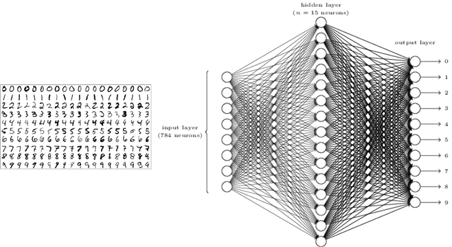

例如上面是最有名的MNIST数据，是机器学习的hello world例子。它用来是别手写字符就是输入一个28*28的图像，所以一个样本的特征是784个，每个特征就是一个像素点的亮度，对我们来说单个像素点的亮度这个个数字是几之间没有任何联系。

那深度学习是怎么找到其中的联系的内？就像她名字说的那样，深度学习的模型很有深度，意思就是模型很复杂，可以拟合很复杂的规律，只有这个规则存在，再给你足够大的数据的时候，这个模型时可以拟合出这个规律的。一个深度学习的模型轻松可以有上万甚至上百万个可优化的参数，所以他的你和冷厉非常强。这个数字是由像素构成的，所以显然是存在规律的。然后MNIST数据集一共有7万个这样的样本，所以数量也是足够大的。要注意由于深度学习你和能力很强，所以一定要足够多的数据才有效，数据少的情况下，她找到的仅仅是这一小部分数据的规律，不能拿来推广的。

还有一点要注意的是深度学习模型是一个黑盒模型。就是说他虽然找到了数据和目标之间的规律，你可以用这个模型来预测，但是你是不知道其中的原因的，一般来说你也很难从一个深度学习的模型找找到因果关系。

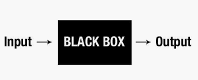

**总结一下，就是当特征很多，特征复杂，找不到特征和被预测目标之间的关系的时候，就交给深度学习。**

## 人工神经网络（ANN）基本原理

我们先看看什么启发了ANN，当然是生物的神经网络。

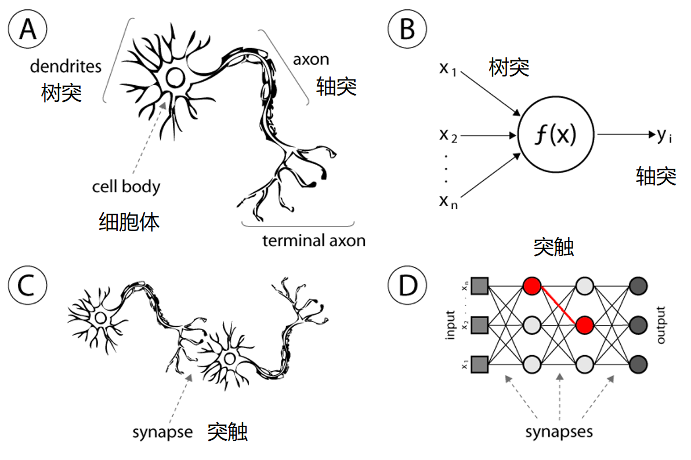

下面这个图可，A是一个真的神经元细胞，他有很多个树突，可以接受刺激，到细胞体处理之后，产生一个响应（Activation）传到轴突上再发给其他的细胞。B就是一个人工神经元，他很弱智，一样的他有很多个输入，可以输入一个向量，就像树突一样。然后他的细胞体就是一个函数f（X），是这个向量的函数，出书一个y，就是activation。

再看看C，D就是神经网络实际上就是把神经元连起来。对于ANN来说不是直接连的，他是有层次的，每一层的输出会变成系一层的输入。

我们在仔细看看一个神经元：

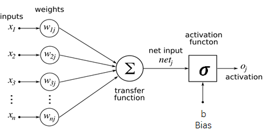

他就是一个函数，首先对每个输入 $x_i$ 乘上一个权重 $w_i$，然后在求和送到一个激活函数里面 $\sigma$。这个都是模拟真的神经原来的，首先一个神经元对不懂得输入敏感程度不一样，所以通过加权求和，这是一个闲心组合的运算，重然后通过一个激活函数实现一个非线性的响应。激活函数就是你对不同的输入大小反应的级别不一样。就像考试0-59分，你心情差不多，一旦过了60分你就好兴奋一样。

写成公式就是：

$$
o_j=\sigma(\sum_{i=0}^{n}x_i*w_{ij}+b_j)
\\
o_j=\sigma(W_j*X+b_j)
$$

第一个很好懂，第二个就是下称矩阵的形式了而已。解释一下，X是一个向量也就是一个特征，他又n个元素，j是指的一层中第j个神经元的意思，我们这里不管就看一个。每个x和他对应的w相乘求和加上一个b偏执，这就是一个线性的操作，在送到一个非线性的几何函数里就得到了第j个神经元的输出。

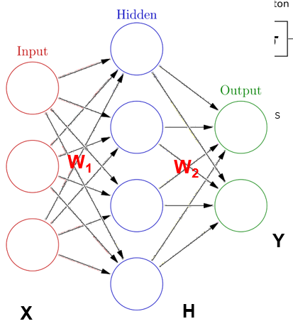

我再来考虑上面一个神经网络，其实很简单，第一列圈圈是输入不是神经元，H，Y是两层神经元。他们的权重分别是 $W_1, W_2$。那么第一层的输出就是：

$$
H=\sigma(W_1*X+B_1)
$$

这里W1是4 * 3，因为有4个神经元，每个神经元3个输入，就有3个权重。B1是 4 * 1,每个神经元一个偏置，输出是4*1，每个神经元一个输出。

对于下一层：

$$
Y=\sigma(W_2*H+B_2)
$$

大家知道这些矩阵的大小来吧？H是上一层的输出，也就是这一程的输入时4*1的，所以每个神经元有4个权重两个神经元，所以有：W2[2 * 4]，H [4 * 1]， B2 [2 * 1]，Y[2 * 1]。

对于一整个神经网络来说，我们得到了一个函数：

$$
\hat{y}=f(X,W,B)
$$

X时变量，W，B是我们通过训练优化的参数。上面讲的仅仅是一个简单的全连接feed forward的神经网络，他有26个可优化的参数，实际上还有更复杂的ANN，这里就不多讲了。

**简单总结就是，神经网络就是一个输入变量X的废县新的函数，和其他的模型差不多，就是可优化的参数很多很多，还具有很强的非线性特性。**

## 神经网络怎么学习的？

很简单之前说了神经网络就是一个可以优化的函数，假设我们要做一个回归，那么我们只要最小化这个函数输出的值和观测之之间的误差就可以了。还记得我们最早闲心回归讲的，我们的模型要最小化squared error对吧，一样，我们在这里也可以最小化这个：

$$
l=\frac{1}{n}\sum_{i=1}n(Y_i-\hat{Y_i})^2
$$

上面就是一个机器学习loss function，他就是我们之前算的MSE，我们只要最小化他就可以。这里用的时一个叫做梯度下降的防范，他就是找我们loss function的最小值。由于训练样本是已知固定，所以loss function是我们参数的函数，我们只要对参数求导，然后沿着梯度找到最小值就可以了。由于这个是个很复杂的函数，一定不是凸函数，所以存在很多局部最小，因此真真的梯度下降优化算法有很多小小改经，看起来就如下图，这个平面是家想的参数平面，实际上是个几千上万维度的超平面。具体的算法这里就不讲了。

**总结一下，神经网络模型就是个函数，它通过最小化一个损失函数来学习。损失函数就是模型预测结果与是机关则结果的误差的和。优化是通过梯度下降来找损失函数在参数空间上的最小值。**

## Matlab浅神经网络工具箱例子

首先，这里要说一下Matlab做神经网络啥的非常的不爽，这里不推荐做太多复杂的玩法。但是一些十分简单的模型可以玩一下，也就点一下鼠标。

我们这里还是拿出之前讲过的King County的数据，在Lesson 2.1里面，导入。注意，我们要用的神经网络工具箱,bi，必须要把特征和标签分别放在两个矩阵里面。首先我们准备一下：

```matlab
x_train=kchousedata{:,4:21}
y_train=kchousedata{:,3}
```

去除我们要的列用来训练。点击APP里面免得Neural net fitting，这个就是回归。

如下如，我们选择特征和标签数据：

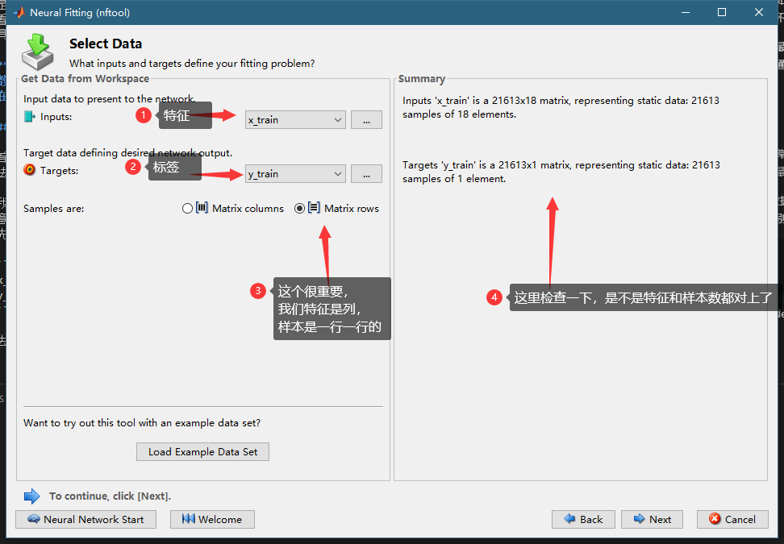

然后做train validation test split，把数据分为三份，一班这个默认的就可以。


这里要注意，Train就是你的模型训练的数据，其他的数据对你的模型来说都是新鲜的。validation是用来防止过拟合的，Train的loss会一直下降，偶尔会小涨一点，但是总的u其实是一直下降的。但是如果validation的loss开始上上了，就代表这个模型虽然你和训练数据更好了，但是对于位置的数据表现变差了，这个时候训练就停止了。而test是用来最后计算这个模型的性能的，因为validation最小的时候我们停止训练了，所以validation的loss也是训练过过程中最小值。所以最后需要一个和训练过程一点关系集合来计算性能指标。

下一步我们来指定网络的超参数。这里只有一个。。。

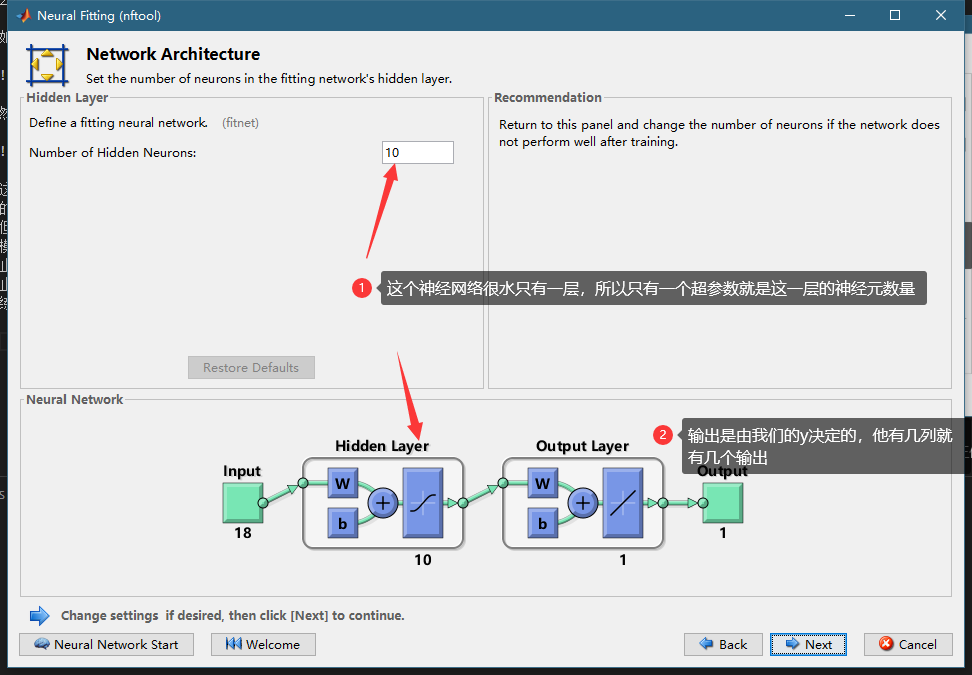

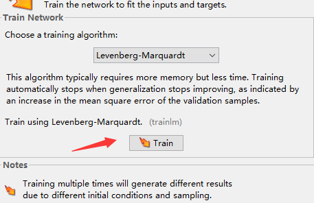

最后点击训练就可以了。那个上面的算法就是梯度下降的算法，这里随意，比正经这么简单的网络印象不大。

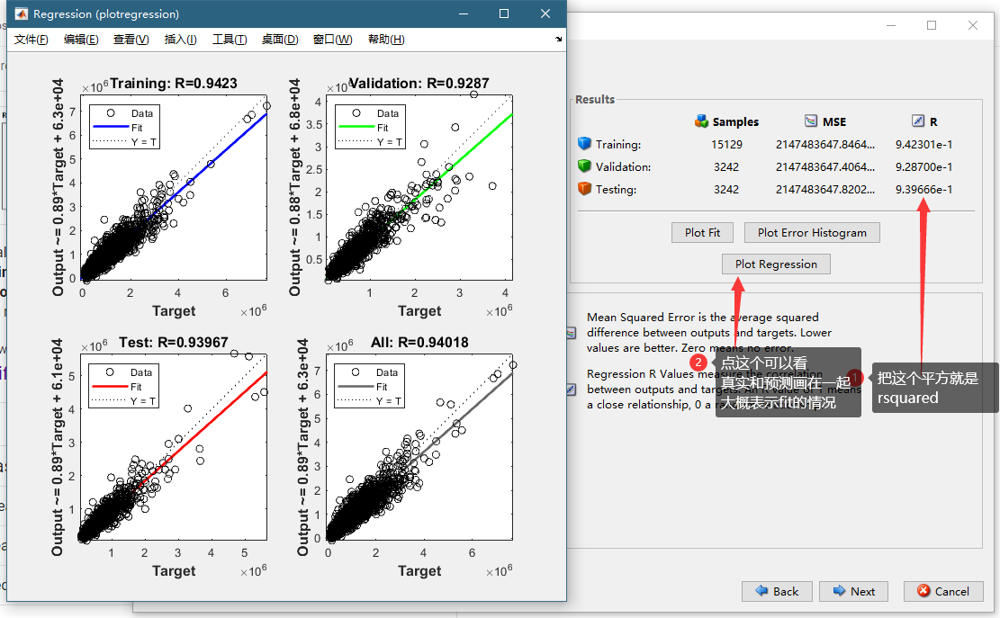

这里可以看到最后的结果，可以看到我们关注的是R，也就是原来rsquared的square root。可以看到我们test的R0.94，平对方以后大概是0.88，比原来简单机器学习模型略好一点点。

在下一页可以选择数据就行预测，我就不展示了。

在下一页可以生成一个脚本，这个是已经训练好的模型forward通道，也就是预测方向，的代码。用这个代码你可以用来做越策，不过你也可以不用这个代码预测，因为后面有个net对象可以做更简单。但是这个代码你可以看看。可以看到神经网络好简单，就是几个权重的矩阵，相乘相加送到激活函数里面，一层一层的，神经网络一点也不神秘。代码为就不贴出来了，里面一大半都是权重的矩阵常数，大家自己试试看。

在下一页可以到处我们的模型，首先可以到处训练用的代码：

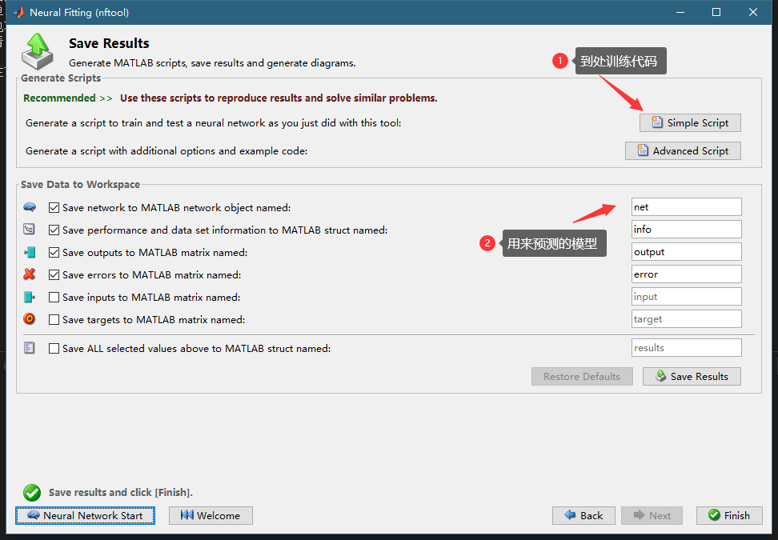

```matlab
x = x_train';
t = y_train';

% Choose a Training Function
% For a list of all training functions type: help nntrain
% 'trainlm' is usually fastest.
% 'trainbr' takes longer but may be better for challenging problems.
% 'trainscg' uses less memory. Suitable in low memory situations.
trainFcn = 'trainlm';  % Levenberg-Marquardt backpropagation.

% Create a Fitting Network
hiddenLayerSize = 10;
net = fitnet(hiddenLayerSize,trainFcn);

% Setup Division of Data for Training, Validation, Testing
net.divideParam.trainRatio = 70/100;
net.divideParam.valRatio = 15/100;
net.divideParam.testRatio = 15/100;

% Train the Network
[net,tr] = train(net,x,t);

% Test the Network
y = net(x);
e = gsubtract(t,y);
performance = perform(net,t,y)

% View the Network
view(net)
```
这个代码很有用，你可以把它封装成一个函数，然后写个循环变化其中的`hiddenLayerSize`这个超参数，来测试不同的超参数对网络性能的影响，可以用退火算法，粒子群算法啥的来找一个性能最好的hiddenLayerSize。

然后那个导出的`net`对象可以用来预测，记得要点save result 那个按钮，用下面的语法，注意这里转置了一下，因为非常反人类的，这个网络认为每一列是一个sample：

```matlab
y_hat=net(x_train(123,:)')
```

更多的，其实也没啥更多可，可以参考： https://www.mathworks.com/help/deeplearning/gs/fit-data-with-a-neural-network.html

## 神经网络时间序列

因为之前讲的时间序列预测的模型很简单，这里我们再看看神经网络怎么时间序列，其实也是非常简单的，和上面的步骤没啥区别。注意如果你要什么LSTM登山读写学习的模型Matlab也可以搞，但不是这个工具箱，是另一个完全不同的东西，我们不讲，因为强烈不推荐使用Matlab的深度学习功能。特别不靠谱。

首先我们导入前面的exp8数据，就是那个风力发电的数据，然后第2列也就是输出功率作为Y，其他的作为X。我们的任务和以前一样，用这4个数据预测其中的第一个，也就是输出功率未来的值。

我们先处理一下数据让他从没10分钟变成每小时

```matlab
xs_train=exp8{1:6:end,3:5}
ys_train=exp8{1:6:end,2}
```

我们打开Nerual Net Time series这个app，有3个类型的引用可以选，第一个是我们选的，他是利用x，y过去的值来预测，下一个y的值，第二个是只有y来预测未来的y，最后一个是x预测外来的y，可以用下面3公式表示：

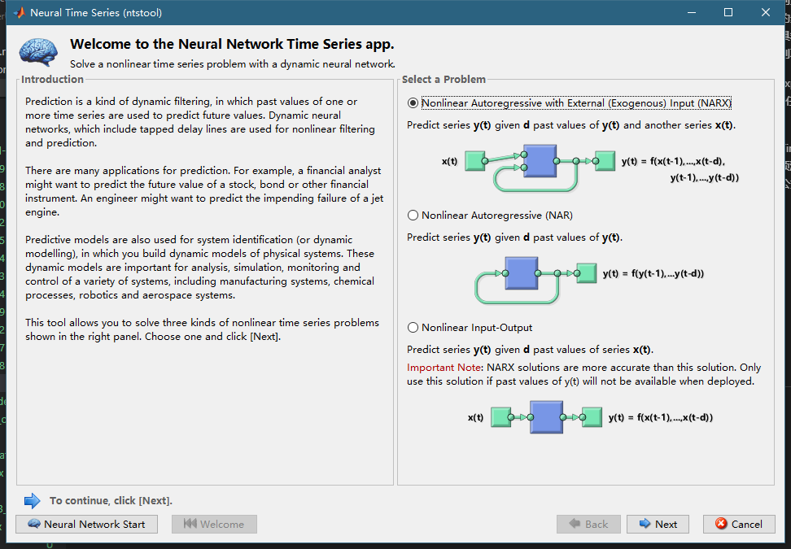

$$
\hat{y}{_{t+1}}=f(y_t,y_{t-1},,,x_t,x_{t-1},,,)
\\
\hat{y}{_{t+1}}=f(y_t,y_{t-1},,,)
\\
\hat{y}{_{t+1}}=f(x_t,x_{t-1},,,)
$$

选择我们处理好的数据

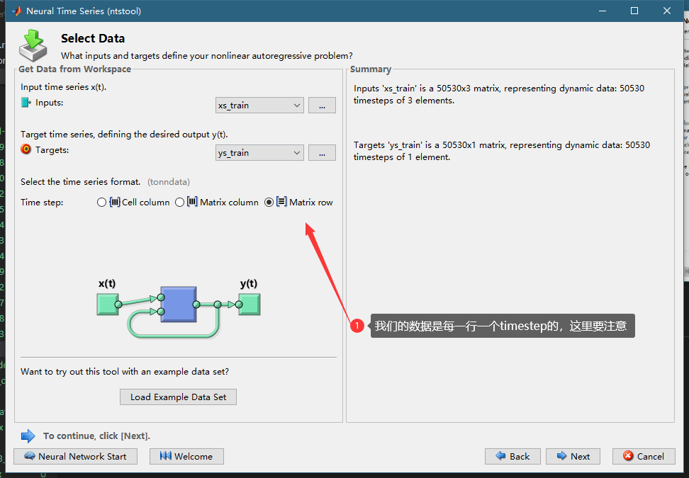

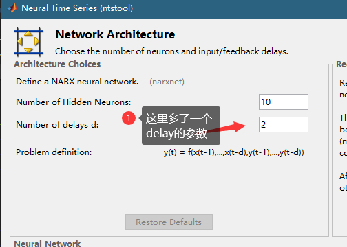

者的这个delay的参数代表用多少过去数据预测外来，我们这里由于是每十分钟的数据，我们之前按照6的间隔重采样了，所以是每小时的数据，我们希望用一天的数据来，24个delay。

之后和以前我们的玩法一样，训练，查看性能，到处代码。不过这里代码推荐你仔细看看，应为有一个巨大的坑。我在这个肯独立莫巴顿打了2个小时才搞定。

```matlab
X = tonndata(xs_train,false,false);
T = tonndata(ys_train,false,false);
```

在那个他声称的训练的代码里面，最开始有这么两行。因为这个网络的模型和以前的不一样，他的输入是cell，不是矩阵，如果你的x有个特征，他把所有的特征放到一个cell里面去了，所以有个tonndata这个函数对矩阵数据进行处理，你在后买你做预测的时候也要这么做，

ok，那这个模型怎么用呢，也是十分纠结的。我们这个模型用了 $X_t...X_{t-23},Y_t...Y_{t-23}$ 来预测 $Y_{t+1}$，他只能预测未来一步，如果我们要预测未来n步怎么办呢，首先我们要让这个模型close loop，这样他输出的Y就可以作为输入，用预测来作为已知的过去的Y，就是下面这样。

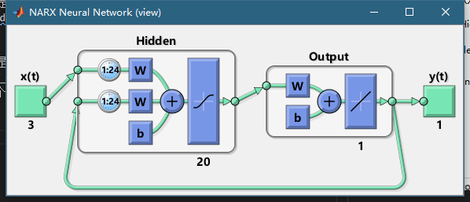 

然后我们需要准备数据，假设我们要预测未来n个点 $Y_{t+1}...Y_{t+n-1}$，首先我们要有未来n个X输入， $X_{t+1}...X_{t+n}$，同时我们还要过去的24个点 $X_t...X_{t-23},Y_t...Y_{t-23} $。这个时候我们还要用过去的点初始化网络的参数。

下面的代码解释的很清楚了：

```matlab
% make it closse loop so we can predict multiple steps into the future
net4 = closeloop(net3)

% you have to init the nn with at least 24 (delays) 
[Xs,Xi,Ai,Ts] = preparets(net4,xs_test(1:24),{},ys_test(1:24));

% feed it wiht the new data and the init state
yhat = net4(xs_test(25:end),Xi,Ai);
```

这个preparets就是准备网络需要的参数的，xs_test(1:24)，ys_test(1:24)就是过去24个点 $X_t...X_{t-23},Y_t...Y_{t-23} $，xs_test(25:end)，就是未来要预测的点的X，Ai就是初始化的网络的参数，Xi实际上就是xs_test(1:24)，ys_test(1:24)把这两个合成一个cell数组了。注意这里面的变量都是cell数组，大家可通过下面的代码从矩阵直接得到：

```matlab
%the stupid narxnet only takes cell array as input, 
% it crush all the x features into a cell! how stupid and inconsitent
xs_train=exp8{1:6:end-1000,3:5}
ys_train=exp8{1:6:end-1000,2}

xs_train=tonndata(xs_train,false,false)
ys_train=tonndata(ys_train,false,false)


% the first 24 of the test is not the test it is know data
% prediction start from 25
xs_test=exp8{end-1144:6:end,3:5}
ys_test=exp8{end-1144:6:end,2}

xs_test=tonndata(xs_test,false,false)
ys_test=tonndata(ys_test,false,false)
```

课程的代码里面又从训练到预测的完整代码，大家可以参考一下。我在这里要说matlab玩这个真实非常的麻烦，不方便，预测的结果如下，也不怎么样。

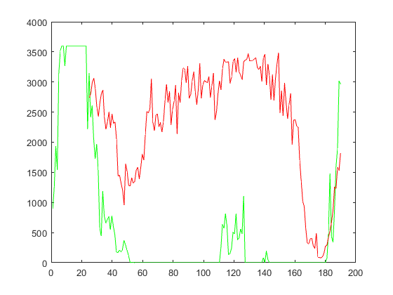