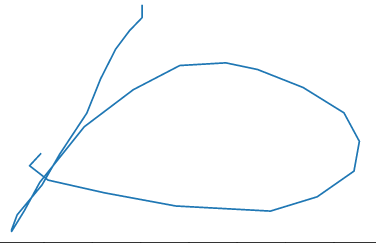

<!-- keywords:分类;机器学习;讲义;深度学习;Matlab;Feature engineering; -->
<!-- description:这里讲了什么是深度学习，什么是神经网络。但是在我们开始真正的深度学习之前我们线在处理一个问题，这个问题如果用深度学习很简单就可以解决，但是在那之前，我们先尝试一下如果不用深度学习，我们要怎么搞？这里给他加较少一个新概念：feature engineering -->
<!-- coverimage: -->


# 数据科学入门2.7.1 深度学习开始之前-Feature engineering

这一课是optional的，可以补上，主要目的是让大家有个对比，如果一个问题不用深度学习要怎么解决。再传统机器学习经历的基础上，你再去看深度学习会更加清楚他的意义和特点。

## 任务描述

我们首先玩一个手写字母识别的例子，这个不是我做的，这个是matlab machine learning onramp里面的交材，在附件里面有。我觉得做的挺好的，比deep learning onramp好1000倍。


这个手写字符并不是图像，而是手写板里存下来的笔迹。就是一个时间一个x，y坐标连起来就是一个字。我们首先要把这些笔迹读取进来，然后对每个笔迹生成一些特征，在用这些特种用一些分类算法比如KNN，SVM来判断他是那个字。

## 代码解释

### 读取数据与预处理

读取数据Matlab有一套流水线，可以用datastore来操作，你告诉他尧都区那个文件夹，他会一股脑地把他们都读进来，并且在读取的过程中还会执行你指定的一些操作。

我们先打开preparedata这个脚本：

```matlab
letterds = datastore("Data\*.txt");
```

这个制定了我们的datastore要读取的所有文件，

```matlab
procletds = transform(letterds,@preprocess);
letfeatds = transform(procletds,@extractfeatures);
```
这里制定了两个变形的函数，他把一个datastore里面的数据进行转换得到一个新的datastore。这里有两个函数一个事对数据预处理一下，另一个是生成特征的。

```
letterdata = readall(letfeatds);
letterdata.Character = categorical(extractBetween(letterds.Files,"_","_"))
```

这里`letterds.Files,"_","_")`是吧每个文件名里面的两个下划线之间的，也就是这个文件对应的字母取出来，放到Character这个列里面，就得到了我们的标签。

这里讲一下preprocess这个我们写的处理数据的函数：

```matlab
% 把每个字母书写的时间归一化到0-1，相当于每个字母都是在相同的时间内写你的 [0 1]
data.Time = (data.Time - data.Time(1))/(data.Time(end) - data.Time(1));
% 由于手写板自身问题字母变瘦了，这里把他还原，x*1.5
data.X = 1.5*data.X;
% 把字母放到正中间，很简单x，y分别减去他们的平均值，这里同时去掉nan这种不正常的电
data.X = data.X - mean(data.X,"omitnan");
data.Y = data.Y - mean(data.Y,"omitnan");
% 这里同把x，y等比例缩小，是所有的字母所占的面积事1
scl = 1/sqrt(range(data.X)*range(data.Y));
data.X = scl*data.X;
data.Y = scl*data.Y;
% 以上就去掉了不同的人写的偏，写的大小，写的快慢对识别的影响

% 这里求x，y的对时间的微分，就是dx/dt，dy/dt，就是笔迹变化剧烈程度，这个算是一种特征提取
data.dXdT = [NaN;diff(data.X)./diff(data.Time)];
data.dYdT = [NaN;diff(data.Y)./diff(data.Time)];
% 由于手写板有时候时间有时候出错了，会有相同的电，导致导数无限大，这是给他去掉
data.dXdT(isinf(data.dXdT)) = NaN;      % Infinite value => same values in data.Time
data.dYdT(isinf(data.dYdT)) = NaN;      % => derivative calculation is meaningless
% 对这个倒数进行一个平均滤波，让他平滑一点这样我们就完整了最简单的一个特征提取，后面的特征提取大多在这个基础上继续提取
n = round(0.1*numel(data.Time));
data.dXdT = movmean(data.dXdT,n);
data.dYdT = movmean(data.dYdT,n);
```

### 真正的特征提取

这里我们从笔记中提取有意义的特征，例如这个字母哪里比较尖，哪里比较圆，手稿还是矮胖，等等我们认为对识别这个字母有用的信息：

```matlab
% x和y之间的Correlations，表示了这个字整体趋势事往上飘还是往下降，还是比较平衡
c = corrcoef(letter{:,2:end},"Rows","pairwise");

% 找局部最大最小值的参数，这个用来提取这个字符笔迹哪里比较比较陡峭
mp = 0.1;
derivscale = 2;
% Calculate features
feat = [range(letter.Y)/range(letter.X),...                             % 这个字符的高宽比
    mad(letter.X), mad(letter.Y),...                                    % 这个字，上下左右片那一边
    mean(letter.dXdT,"omitnan"),mad(letter.dXdT),...                    % 笔迹导数的平均值和中位值，变现了这个字母在不同方向是是比较平缓还是比陡
    mean(letter.dYdT,"omitnan"),mad(letter.dYdT),...                    %   for X' & Y'
    c(1,2:end),c(2,3:end),c(3,4:end),c(4,end),...                       % 之前的相关放到这里来
    nnz(islocalmin(letter.X,"MinProminence",mp)),...                    % 找到x，y的，还有dx，dy的局部最大最小值
    nnz(islocalmax(letter.X,"MinProminence",mp)),...                    %   min/max for X & Y
    nnz(islocalmin(letter.Y,"MinProminence",mp)),...
    nnz(islocalmax(letter.Y,"MinProminence",mp)),...
    nnz(islocalmin(letter.dXdT,"MinProminence",derivscale*mp)),...      % number of local
    nnz(islocalmax(letter.dXdT,"MinProminence",derivscale*mp)),...      %   min/max for X' & Y'
    nnz(islocalmin(letter.dYdT,"MinProminence",derivscale*mp)),...
    nnz(islocalmax(letter.dYdT,"MinProminence",derivscale*mp))];

% 把我们找到的特征放到一个表里面，可以看到一个字母笔迹被我们提取出了25个特征
feat = array2table(feat,"VariableNames",...
    ["AspectRatio",...
    "MADX","MADY","AvgU","MADU","AvgV","MADV",...
    "CorrXY","CorrXP","CorrXU","CorrXV",...
    "CorrYP","CorrYU","CorrYV","CorrPU","CorrPV","CorrUV",...
    "NumXMin","NumXMax","NumYMin","NumYMax",...
    "NumUMin","NumUMax","NumVMin","NumVMax"]);
```

总结一下，要用传统机器学习，第一步是读取数据，然后是提取特征。特征的提取不是随便乱弄几个数字，而是基于我们对这个数据的认识，比如对笔迹的理解，然后觉得其中那些特征和她属于哪个字母有关然后设计一个算法把他提取出来。这个是和后面深度学习最大的区别。

### fit模型

我们在打开lettermodels这个脚本，这个就很简单了我就不解释，他就是fit一个模型，然后在用这个模型预测，然后计算一下进去额度和画出混淆矩阵，之前我们都讲过的。


## 总结

这个例子很好，大家把这个代码泡一泡，再看看准确度什么的，大概熟悉一下一个完整的机器学习的应用是怎么做出来的。后面大家在和深度学习对比一下，就能深刻的体会到深度学习的优势了。
