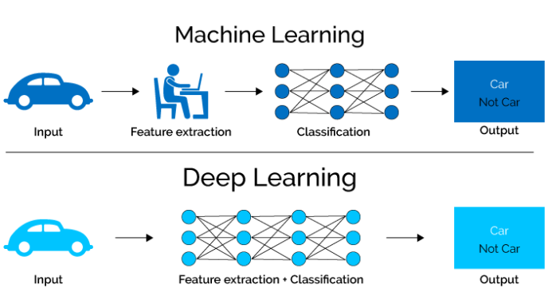
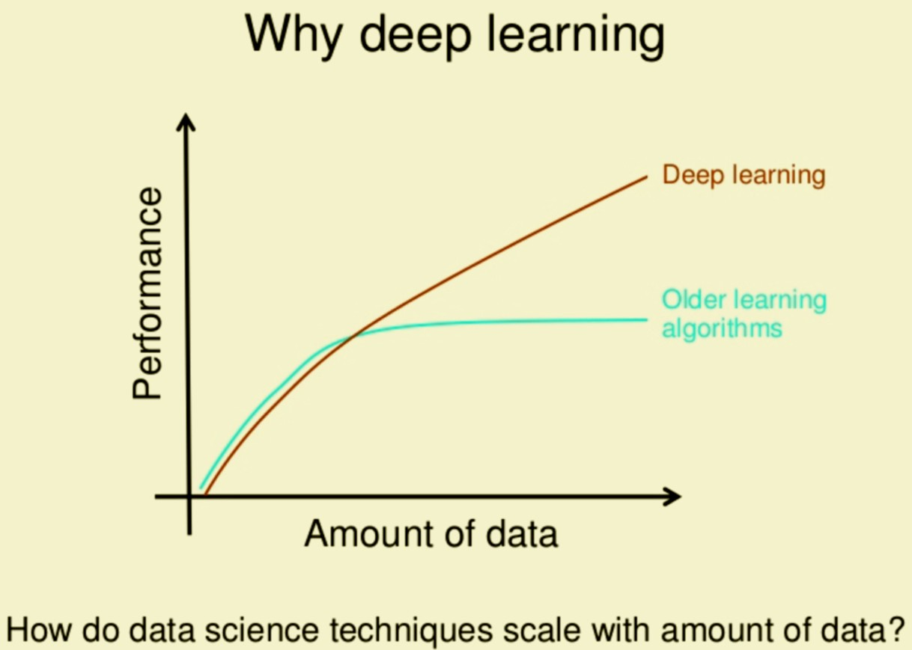

# 深度学习和神经网络

<!-- keywords:分类;机器学习;讲义;深度学习;Matlab;Python;TensorFlow; -->
<!-- description:这里我们把刚刚讲的一个传统学习的例子用深度学习重新做了一遍，大家可以更加清楚的认识到深度学习和传统机器学习的区别。同时也可以学到如何简单的用python+tensorflow keras做一个简单的深度学习的应用。 -->
<!-- coverimage: -->

## 为啥要深度学习

还记得我们上一课学的手写字符识别的例子吗？我们花了很大的功夫提取了25个特征，这些特征的提取都是建立在我们对这个手写字母形状特征的理解上的。如果我们对我们的数据不太了解，想不出办法提取这些特征，或者是数据没有什么明显的特征让我们提取，比如一个猫狗的照片，里面有几千几万个像素这种情况怎么办？你想从照片种中提取，什么眼睛的颜色，眼睛大小，耳朵长短这些特征都是很困难。就算你提取出来了（真的很难），用这些特征也比较难分辨出猫和狗来（最难的还是前面一部）。

这个时候我们就可以用深度学习了。深度学习的好书是，优于他模型比较复杂，或者是他模型的bias非常非常低，它将有可能从这些复杂的特征中自动的提取出有用的特征来，完全不需要人来操心就如同下图:

可以看到换成深度学习以后你要做的事情好像变得更简单了，模型自动就完成了特征提取的工作。

但是并不是深度学习就是能随便用的。深度学习表现好还有一个条件，数据要足够大。搞个说过深度学习的模型的bias很低，他是很容易在形成over fitting问题的。这个时候就需要用大量的数据，来帮忙了。当数据足够多的时候，它能够是模型更有效的提取一些general的特征，在这些数据中都存在的共性问题，而不是努力去区分这些训练样本。

就如同下图一样，当数据足够大的时候，深度学习才能发挥出它的优势超过传统的学习。

注意这里说的数据大，不仅仅是值得样本数量多，同时还值得feature size也要大一些。两个是相辅相成的。如果你的feature size很小，那么每个样本的信息量就少，样本多了有很多冗余数据。如果样本少了，但是feature size大，那么模型的泛化能力很差，因为整个样本集覆盖的特征空间很小。

当然，我又要说一个常说，这些都不是绝对的，其实有些传统模型效果也挺不错的，而且也可以随着数据增加获得更好的效果。不过传统模型多半需要你投入更多的心思去tune，而深度学习多半要无脑一些。

## 这个手写字符识别的思路

请参考这个jupyter notebook，我写的已经挺清楚的了。这里我玩钱没有做特征提取，只用了一点数据与茱丽，把数据处理成一样长度的，可以这样才可以被送到神经网络里面。然后就是个很简单的全连接。

这个和mnist比最大的不同，他不是用一个字母的图片来识别，而是用一个写这个子的trace就是轨迹。应为一个字写在图像上，有痕迹的部分不多，大部分是白纸，这样的话可以认为一个字符是一个稀疏矩阵表示的。我这个方法就是用一个稀疏矩阵去做的特征。

**具体的代码** 请参考：[Train your first neural network: basic classification](https://www.limfx.pro/ReadArticle/314/train-your-first-neural-network-basic-classification)

## 课程代码

https://github.com/JushenAndFriends/sim-modeling

