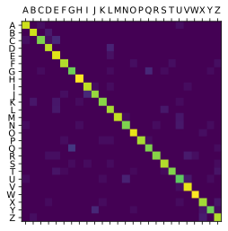

 
<!-- keywords:Deep learning;TensorFlow;Keras;Python;Hand Written letters;jupyter notebook -->
<!-- description:In this notebook you will make a program that recognize hand written letters. But this is not a image recognition app, at least not a typical one. The letter data is in form of trace. A trace registered by digital tablet. -->
<!-- coverimage: -->


 # Train your first neural network: basic classification


 In this notebook you will make a program that recognize hand written letters.
 But this is not a image recognition app, at least not a typical one.
 The letter data is in form of trace. A trace registered by digital tablet, the time and x, y
 coordinates. This method is original by me and will not be found else where.
 the feature used here is significantly smaller than the image input.
 ## You will learn
 1. read data from csv file using pandas
 2. data pre-processing and basice feature engineering. this is a "deep" learning
 model, so very minimum of feature enginerring.
 3. neural network model define and traning, evaluation and prediction
 4. visualizion result and plot confusion matrix
 **You will learning a lot in this single notebook**

 You see in python every non-basic function is in python modules that you must import
 before you use it.


```python

# TensorFlow and tf.keras deep learning frameworks
import tensorflow as tf
from tensorflow import keras

# Helper libraries
# numpy gives you matrix like operations
import numpy as np
# matplotlib let you plot figures
import matplotlib.pyplot as plt
# this is a module written by us for this program specifically,
# as you should keep you code clean and readable. This are reusable functions.
import dataLoader as dl
# sklearn provides many useful functions related to ML.
from sklearn.model_selection import train_test_split
from sklearn.metrics import confusion_matrix

# just check you have tf 2.0
print(tf.__version__)

```

    2.1.0
    


```python
# see the dataloader file for details
features,labels=dl.readData(r"..\Lesson2.6-before-deep-learning\machinelearning_course_files\Data")

```

```python
# I paste the dataloader file here


#%% import
import os
import pandas as pd
import matplotlib.pyplot as plt
import numpy as np
import re
#%%test


#%% def
def readData(fileDir):
    # first create empty features and labels for later filling
    features=np.empty((1,60))
    labels=[]
    for file in os.listdir(fileDir):
        #read files and get the features and label and append them to the output
        filePath=os.path.join(fileDir, file)
        feature=getFeature(filePath).reshape((-1,60))
        # samples are in rows, feature are in columns
        features=np.concatenate((features,feature),axis=0)
        label=getLabel(file)
        labels.append(label)
    # the first row of the feature are empty, drop it.
    return (features[1:,:],labels)


def getFeature(filePath):
    # read the csv file as a table
    data=pd.read_csv(filePath)
    # drop duplicated rows, as the time many have duplication and when doing interpolation this will cause problems
    data.drop_duplicates(inplace=True)
    # drop nan rows
    data.dropna(inplace=True)
    # fix the aspect ration
    data.loc[:,"X"]=data.loc[:,"X"]*1.5
    # center the trace
    data.loc[:,"X"]=data.loc[:,"X"]-data.loc[:,"X"].mean()
    data.loc[:,"Y"]=data.loc[:,"Y"]-data.loc[:,"Y"].mean()
    dataArray=data.to_numpy()
    # interpolation over Time axis, making a trace sampled at equal interval, and scale them to same length. 
    # so all letter has a trace length of 2*30. Every sample must have the same number of features.
    # Time is dropped as we tranformed the data as all the letters are written with same duration. 
    # But the speed variation in the written trace is kept, as we use a interpolation.
    newX=np.interp(np.linspace(dataArray[0,0],dataArray[-1,0],30),
        dataArray[:,0], data.loc[:,"X"])
    newY=np.interp(np.linspace(dataArray[0,0],dataArray[-1,0],30),
        dataArray[:,0], data.loc[:,"Y"])
    # 2*30->1*60
    feature=np.concatenate((newX,newY),axis=None)
    return feature


def getLabel(fileName):
    # using a regex to get the letter from the file name.
    matchstr='(.*?)_(.)_(.*?).txt'
    letter=re.match(matchstr,fileName).group(2)
    return letter

# the NN only accept numeric input, so the Y letters have to be presented in numbers
def letter2Number(letter):
    a2z=getAlphabet()
    return a2z.index(letter)             

def number2Letter(index):
    a2z=getAlphabet()
    return a2z[index]

def getAlphabet():
    alpha = 'A'
    test_list=[]
    for i in range(0, 26): 
        test_list.append(alpha) 
        alpha = chr(ord(alpha) + 1)
    return test_list

```

 Plot a trace to see if we get everything right.
 **NOTE: **Here we plot the trace of the features and get a letter which looks the same as
 the hand written letter in the data. So this is just data cleaning no feature engineering.
 But the data is changed, and the Time is discared, so you can call it sort of feature engineering.


```python
plt.plot(features[5,0:30],features[5,30:])
plt.suptitle="Real: "+labels[5]
plt.show()

```


 Split the data into train and test using sklearn with 20% for test set.


```python
X_train, X_test, y_train, y_test = train_test_split(features, labels, test_size=0.2, random_state=42)


```

 ## Build the network
 Build a NN with Keras is the most simple thing in this notebook.
 The NN has 2 hidden layer, the numbers are choose randomly.
 The input has to match the feature size 60.
 The output is 26 to match the one hot encoded target. A softmax is used to regulate the
 out put to a probability distribution.
 ## Train it
 1. the optimizer is adam, this is a gradient decent optimizer, use this if you don't know which to use.
 2. the Loss is important `sparse_categorical_crossentropy`, this will encoder your categorical target as one hot than using
 cross entropy for the loss. cross entropy is common in classification and one hot target. It is like maximum likelihood method.


```python

model = keras.Sequential([
    keras.Input(shape=(60)),
    keras.layers.Dense(128, activation=tf.nn.relu),
    keras.layers.Dense(50, activation=tf.nn.relu),
    keras.layers.Dense(26, activation=tf.nn.softmax)
])

model.compile(optimizer='adam',
              loss='sparse_categorical_crossentropy',
              metrics=['accuracy'])
```


```python
# as I said, keras accept only numeric input the the Y have to be in a nparray of numbers.
# yes keras accept nparray not python list.
y=[]
for letter in y_train:
    y.append(dl.letter2Number(letter))
y_train2=np.asarray(y)

y=[]
for letter in y_test:
    y.append(dl.letter2Number(letter))
y_test2=np.asarray(y)

```


```python
# batch size is random
# 1000 epoch will almost hit the limit in this data set
model.fit(X_train, y_train2,batch_size=1500, epochs=1000)

```
    Epoch 999/1000
    3099/3099 [==============================] - 0s 6us/sample - loss: 0.1736 - accuracy: 0.9513
    Epoch 1000/1000
    3099/3099 [==============================] - 0s 6us/sample - loss: 0.1738 - accuracy: 0.9519
    
    <tensorflow.python.keras.callbacks.History at 0x1f59c63c128>
```python
# keras models have building evaluation for accuracy
test_loss, test_acc = model.evaluate(X_test, y_test2)
print('Test accuracy:', test_acc)

# make a prediction of the whole test set
y_hat=model.predict(X_test)

# calculate the accuracy by yourself, it is allway better knowing how numbers are calculated
y_hat=np.argmax(y_hat,axis=1)
acc=sum((y_hat==y_test2).tolist())/y_hat.size
print('Test accuracy:', acc)
y_hat_letters=[]
for num in y_hat:
    y_hat_letters.append(dl.number2Letter(num))

```

    775/775 [==============================] - 0s 135us/sample - loss: 0.5824 - accuracy: 0.8684
    Test accuracy: 0.8683871
    Test accuracy: 0.8683870967741936
    

 Show the final result, change test sample to see the result
 Calculate the confution matrix using sklearn and plot it.


```python
test_sample=55
plt.plot(X_test[test_sample,0:30],X_test[test_sample,30:])
result="Real: "+y_test[test_sample] + " Predicted: "+ y_hat_letters[test_sample]
print(result)
plt.suptitle=result
plt.show()

```

    Real: B Predicted: B
    


```python
con_mat=confusion_matrix(y_test, y_hat_letters,labels=dl.getAlphabet(),normalize="true")
plt.matshow(con_mat)
plt.xticks(np.arange(26),dl.getAlphabet())
plt.yticks(np.arange(26),dl.getAlphabet())
plt.show()


```




