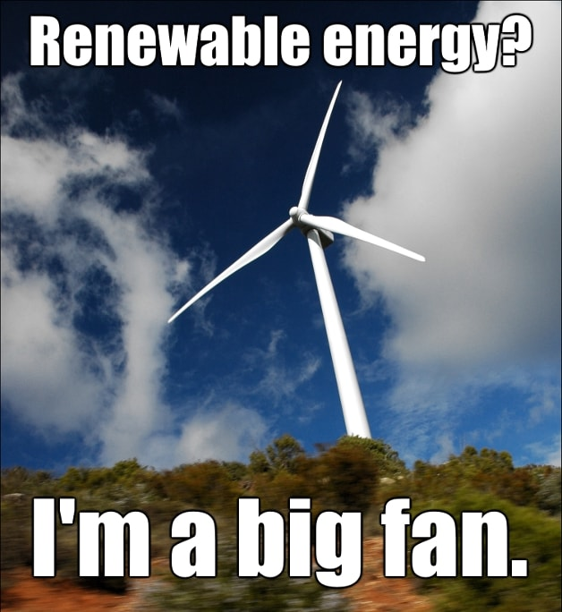

<!-- keywords:建模与仿真;作业;数据科学;可再生能源;电力预测; -->
<!-- description:这个是建模与范哥和你数据科学方向大作业，目的啊是通过各种点理发店以及消费数据，以及天气数据，对新能源发电和电力消费进行预测，评估拿各种新能源特点。 -->
<!-- coverimage: -->

# 电力消耗、生产与天气数据分析与预测

研究发现，电力生产与消耗的预测是最近最热门的机器学习应用领域，这个对新型可再生能源来说有重要的意义。

这里给出4年西班牙电力消耗、生产、点假、以及天气数据，其中还包含了西班牙电网公司对这些数据的预测。

这个题目的数据很大，也很复杂，特别适合开展大数据，深度学习之类的方法，由于数据特征要素很多，需要大家对特征有一定的理解，针对不同的任务选择何时的特征和模型。

数据有很多列，但是每一列的标题已经十分明确了，给出一些解释

**energy_dataset.csv**
* time：Datetime index localized to CET
* generation biomass：生物质发电 in MW
* generation fossil brown coal/lignite：褐煤发电量 in MW
* generation fossil coal-derived gas：煤气发电量 in MW
* generation fossil gas：天然气发电量 in MW
* generation fossil hard coal: 煤发电量 in MW
* generation fossil oil：石油 generation in MW
* generation fossil oil shale：页岩十有 generation in MW
* generation fossil peat：泥煤发电 in MW
* generation geothermal：地热发电geothermal generation in MW
* generation hydro pumped storage aggregated：抽水储能发电 in MW
* generation hydro pumped storage consumption：抽水储能耗电 in MW
* generation hydro run-of-river and poundage：河流水电，没水库的那种 in MW
* generation hydro water reservoir：水库水电发电量 generation in MW
* generation marine：海洋，估计是潮汐，海浪一类 generation in MW
* generation nuclear：nuclear generation in MW
* generation other：other generation in MW
* generation other renewable：other renewable generation in MW
* generation solar：solar generation in MW
* generation waste：烧垃圾发电 generation in MW
* generation wind offshore：海上风电 generation in MW
* generation wind onshore：陆地风电 generation in MW
* forecast solar day ahead： 预测一点后太阳能 solar generation
* forecast wind offshore eday ahead: forecasted offshore wind generation
* forecast wind onshore day ahead:forecasted onshore wind generation
* total load forecast:预测电力需求 demand
* total load actual:实际电力需求  demand
* price day ahead:forecasted price EUR/MWh
* price actual:price in EUR/MWh

**weather_features.csv**

* dt_isodate:time index localized to CET
* city_name:"name of city
* temp:温度单位是K in k
* temp_min：最低温度minimum in k
* temp_max：maximum in k
* pressure：pressure in hPa
* humidity:humidity in %
* wind_speed: wind speed in m/s
* wind_deg: 风向
* rain_1h： rain in last hour in mm
* rain_3h： rain last 3 hours in mm
* snow_3h： show last 3 hours in mm
* clouds_all：云量cloud cover in %
* weather_id：天气代码Code used to describe weather
* weather_main：Short description of current weather
* weather_descriptionLong: description of current weather
* weather_icon:Weather icon code for website

利用一下数据，大家进行研究，写一篇大论文，具体工作比作限制，但是提供以下几个方向可供参考：

1. 对数据进行清理，并开展exploratory data analysis，用图形、表格、动画展示你觉得有用的各种病情数据，并给出初步的分析。
2. 分析找出影响电价、电力需求、电力生产量的各种因素，什么样的天气会对上面那些量产生什么样的改变。
3. 预测24小时以后的电力需求、生产和电价，看看准确性是否能超过数据中给出的预测值
4. 预测一天内的电价和电力需求
5. 评估一下那种新能源形式最适合未来大力发展

数据下载：  
[energy_dataset.csv ](https://www.kaggle.com/nicholasjhana/energy-consumption-generation-prices-and-weather/download/MHik95D0lGGSjy4Is5fH%2Fversions%2FwikrWs9LyycjifcrKeCH%2Ffiles%2Fenergy_dataset.csv?datasetVersionNumber=1)   
[weather_features.csv](https://www.kaggle.com/nicholasjhana/energy-consumption-generation-prices-and-weather/download/MHik95D0lGGSjy4Is5fH%2Fversions%2FwikrWs9LyycjifcrKeCH%2Ffiles%2Fweather_features.csv?datasetVersionNumber=1)

本题灵感来源：https://www.kaggle.com/nicholasjhana/energy-consumption-generation-prices-and-weather  
这上面有很多人已经完成的分析，可以参考，请勿剽窃

联系人：郑玮 qq 330839459